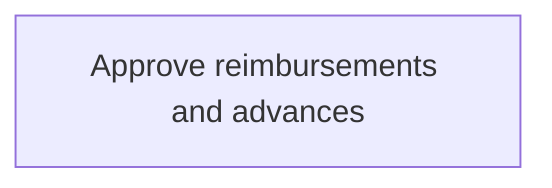
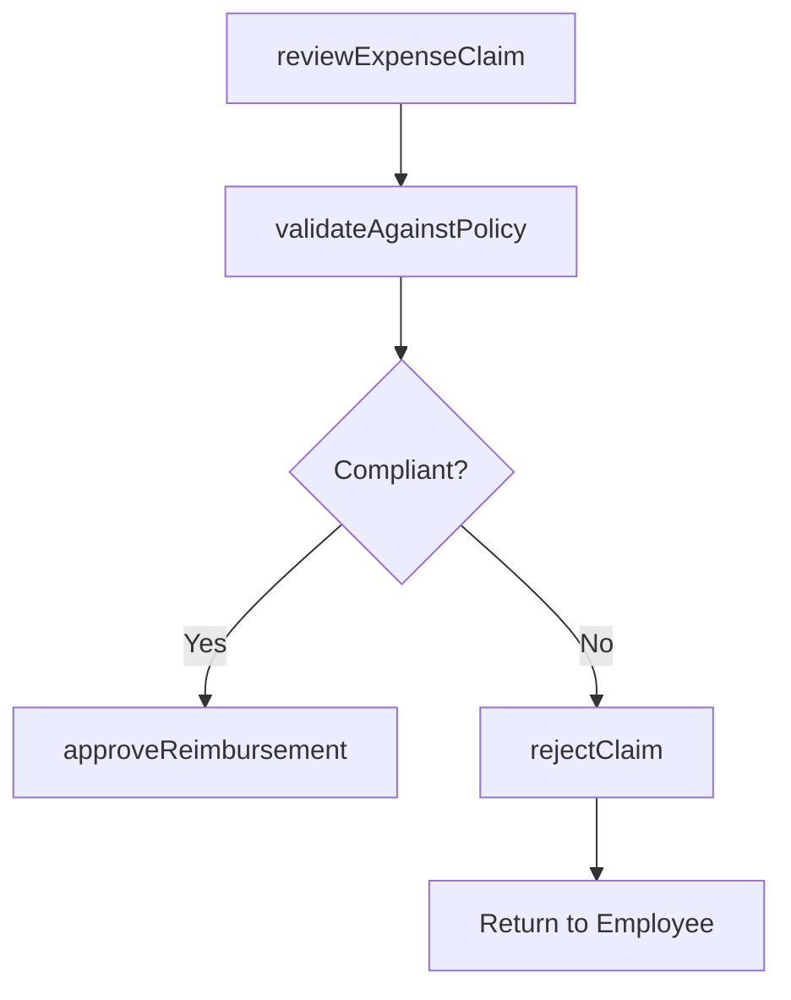

# Approve reimbursements and advances

> Business-as-Code definition for expense approval workflows. Models the review, validation, and authorization of employee expense reimbursement claims and cash advance requests against policy limits and budget availability.

## Overview

Reviewing and authorizing employee expense reimbursement claims and cash advance requests against organizational policies, spending limits, and budget availability. Approvers verify that submitted expenses are legitimate, properly documented with receipts, and fall within approved categories and per diem rates. The process supports multi-level approval routing for high-value claims and includes automated policy validation to accelerate routine approvals while flagging exceptions for manual review.

## Process Hierarchy



## GraphDL

```yaml
approve:
  object: Reimbursements And Advances
  actor: ExpenseApprover
  result: ApprovalDecision
```

## Actions

| Action | Description |
|--------|-------------|
| reviewExpenseClaim | Examine submitted expense report for completeness and compliance |
| validateAgainstPolicy | Check claim amounts against policy limits and eligible categories |
| approveReimbursement | Authorize the expense claim for payment processing |
| rejectClaim | Deny a non-compliant expense claim with documented reason |
| approveAdvance | Authorize a cash advance request for an employee |

## Events

| Event | Description |
|-------|-------------|
| expenseClaimReviewed | Expense report examined by approver |
| policyValidated | Claim checked against expense policy rules |
| reimbursementApproved | Expense claim authorized for payment |
| claimRejected | Expense claim denied with documented reason |
| advanceApproved | Cash advance request authorized |

## Searches

| Search | Description |
|--------|-------------|
| getPendingApprovals | List expense claims awaiting approval by approver |
| getApprovalHistory | Retrieve approval decisions by employee or period |

## Process Flow



## RACI Matrix

| Activity | Responsible | Accountable | Consulted | Informed |
|----------|-------------|-------------|-----------|----------|
| reviewExpenseClaim | Manager | APManager | PolicyAdministrator | Employee |
| approveReimbursement | Manager | APManager | Finance | Employee |
| rejectClaim | Manager | APManager | HRDepartment | Employee |

## Related Processes

| Process | Relationship |
|---------|-------------|
| 9.6.2.1 Establish expense reimbursement policies | Upstream - policies define approval criteria and limits |
| 9.6.2.4 Process reimbursements and advances | Downstream - approved claims proceed to payment |
| 9.6.2.2 Capture and report relevant tax data | Parallel - approved expenses classified for tax reporting |
| 9.6.2.5 Manage personnel accounts | Downstream - approved advances create open employee balances |

## Related Departments

| Department | Role |
|-----------|------|
| Line Management | Reviews and approves employee expense claims |
| Accounts Payable | Validates policy compliance for submitted claims |
| Finance | Monitors budget impact of approved reimbursements |

## Related Occupations

| Occupation | Involvement |
|-----------|-------------|
| Department Manager | Primary approver for direct report expenses |
| Expense Administrator | Validates policy compliance |

## KPIs

| KPI | Description | Unit |
|-----|-------------|------|
| Approval Cycle Time | Average days from submission to approval decision | Days |
| Rejection Rate | Percentage of expense claims rejected | % |
| Auto-Approval Rate | Percentage of claims approved automatically by rules engine | % |

## Usage

```typescript
import { approveReimbursementsAndAdvances } from '@headlessly/approve-reimbursements-and-advances'

const approvals = approveReimbursementsAndAdvances()

// Approve a reimbursement claim
const decision = await approvals.approveReimbursement({
  reportId: 'EXP-2025-00321',
  approverNotes: 'Verified client meeting receipts'
})

// Review pending approvals for a manager
const pending = await approvals.getPendingApprovals({
  approverId: 'MGR-1122',
  sortBy: 'submissionDate',
  includeOverdue: true
})
```
