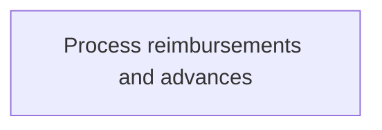
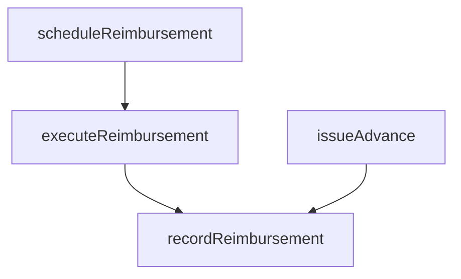

# Process reimbursements and advances

> Business-as-Code definition for reimbursement and advance payment execution. Models the payment processing of approved expense claims and cash advances through payroll integration or direct deposit.

## Overview

Executing payment of approved employee expense reimbursement claims and cash advance requests through payroll integration or direct deposit. This process schedules approved claims for the next payment cycle, validates bank account details, disburses funds to employees, and records the transactions in the general ledger. For cash advances, the process tracks outstanding balances and sets up recovery schedules to offset future expense reports against the advance amount.

## Process Hierarchy



## GraphDL

```yaml
process:
  object: Reimbursements And Advances
  actor: PayrollProcessor
  result: ReimbursementPayment
```

## Actions

| Action | Description |
|--------|-------------|
| scheduleReimbursement | Queue approved expense claims for the next payment cycle |
| executeReimbursement | Process payment to employee via payroll or direct deposit |
| issueAdvance | Disburse cash advance to employee account |
| recordReimbursement | Post reimbursement transaction to the general ledger |

## Events

| Event | Description |
|-------|-------------|
| reimbursementScheduled | Approved claim queued for payment |
| reimbursementExecuted | Payment deposited to employee account |
| advanceIssued | Cash advance disbursed to employee |
| reimbursementRecorded | Transaction posted to general ledger |

## Searches

| Search | Description |
|--------|-------------|
| getReimbursementQueue | List approved claims pending payment |
| getPaymentConfirmation | Retrieve payment confirmation for a specific claim |

## Process Flow



## RACI Matrix

| Activity | Responsible | Accountable | Consulted | Informed |
|----------|-------------|-------------|-----------|----------|
| scheduleReimbursement | APClerk | APManager | Payroll | Employee |
| executeReimbursement | PayrollProcessor | APManager | Treasury | Employee |
| issueAdvance | PayrollProcessor | APManager | Manager | Employee |
| recordReimbursement | APClerk | APManager | Controller | InternalAuditor |

## Related Processes

| Process | Relationship |
|---------|-------------|
| 9.6.2.3 Approve reimbursements and advances | Upstream - approved claims trigger payment processing |
| 9.6.2.5 Manage personnel accounts | Downstream - payments affect employee account balances |
| 9.6.2.2 Capture and report relevant tax data | Parallel - tax data captured from processed reimbursements |
| 9.3 Perform general accounting and reporting | Downstream - reimbursement entries posted to general ledger |

## Related Departments

| Department | Role |
|-----------|------|
| Payroll | Processes reimbursement payments to employees |
| Accounts Payable | Manages reimbursement scheduling and recording |

## Related Occupations

| Occupation | Involvement |
|-----------|-------------|
| Payroll Processor | Executes reimbursement and advance payments |
| AP Clerk | Records transactions in the general ledger |

## KPIs

| KPI | Description | Unit |
|-----|-------------|------|
| Reimbursement Processing Time | Average days from approval to payment | Days |
| Payment Accuracy Rate | Percentage of reimbursements paid correctly | % |
| Advance Recovery Rate | Percentage of outstanding advances recovered within 60 days | % |
| Electronic Payment Rate | Percentage of reimbursements paid via direct deposit | % |

## Usage

```typescript
import { processReimbursementsAndAdvances } from '@headlessly/process-reimbursements-and-advances'

const reimbursements = processReimbursementsAndAdvances()

// Execute a reimbursement payment
const payment = await reimbursements.executeReimbursement({
  reportId: 'EXP-2025-00321',
  method: 'direct-deposit',
  payPeriod: '2025-03-31'
})

// Issue a cash advance for an upcoming business trip
const advance = await reimbursements.issueAdvance({
  employeeId: 'EMP-4421',
  amount: 2500,
  purpose: 'Q2 client site visits',
  recoverySchedule: 'next-expense-report'
})
```
