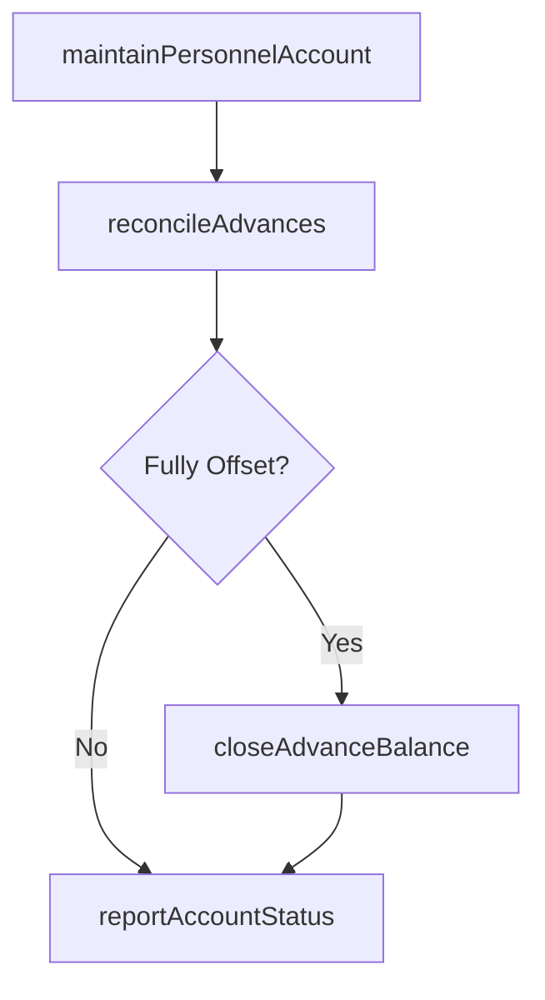

# Manage personnel accounts

> Business-as-Code definition for personnel account management within expense reimbursements. Models the maintenance of individual employee accounts tracking outstanding advances, reimbursement balances, and account reconciliation.

## Overview

Maintaining individual employee accounts that track outstanding cash advances, reimbursement balances, and expense-related receivables. This process reconciles advance disbursements against submitted expense reports, monitors aging of unreconciled balances, and initiates payroll deductions for overdue advances. Account administrators ensure that employee balances are accurate, produce periodic balance reports for management review, and coordinate with payroll to offset outstanding amounts upon employee termination or transfer.

## Process Hierarchy


## GraphDL

```yaml
manage:
  object: Personnel Accounts
  actor: AccountAdministrator
  result: PersonnelAccountBalance
```

## Actions

| Action | Description |
|--------|-------------|
| maintainPersonnelAccount | Update employee account records for reimbursements and advances |
| reconcileAdvances | Match outstanding advances against submitted expense reports |
| closeAdvanceBalance | Clear an advance balance when fully offset by expenses |
| reportAccountStatus | Generate personnel account balance reports |

## Events

| Event | Description |
|-------|-------------|
| personnelAccountUpdated | Employee reimbursement account records refreshed |
| advancesReconciled | Outstanding advances matched against submitted expenses |
| advanceBalanceClosed | Advance fully offset and account balance cleared |
| accountStatusReported | Personnel account report generated |

## Searches

| Search | Description |
|--------|-------------|
| getPersonnelBalance | Retrieve current account balance for an employee |
| getOutstandingAdvances | List unreconciled advances by employee or department |

## Process Flow



## RACI Matrix

| Activity | Responsible | Accountable | Consulted | Informed |
|----------|-------------|-------------|-----------|----------|
| maintainPersonnelAccount | AccountAdministrator | APManager | Payroll | Employee |
| reconcileAdvances | AccountAdministrator | APManager | Controller | Employee |
| closeAdvanceBalance | AccountAdministrator | APManager | Payroll | InternalAuditor |
| reportAccountStatus | AccountAdministrator | APManager | Controller | CFO |

## Related Processes

| Process | Relationship |
|---------|-------------|
| 9.6.2.4 Process reimbursements and advances | Upstream - payments affect personnel account balances |
| 9.6.2.3 Approve reimbursements and advances | Upstream - approved advances create open balances |
| 9.3 Perform general accounting and reporting | Downstream - personnel balances reported on financial statements |
| 7.3 Manage employee payroll | Related - payroll offsets used to recover outstanding advances |

## Related Departments

| Department | Role |
|-----------|------|
| Accounts Payable | Maintains personnel accounts and reconciles advances |
| Payroll | Coordinates payment offsets for outstanding advances |

## Related Occupations

| Occupation | Involvement |
|-----------|-------------|
| Account Administrator | Maintains and reconciles employee reimbursement accounts |

## KPIs

| KPI | Description | Unit |
|-----|-------------|------|
| Outstanding Advance Aging | Average age of unreconciled advances | Days |
| Reconciliation Rate | Percentage of advances reconciled within 30 days | % |
| Total Outstanding Balance | Aggregate unreconciled advance balance across all employees | Currency |
| Write-Off Rate | Percentage of advances written off as unrecoverable | % |

## Usage

```typescript
import { managePersonnelAccounts } from '@headlessly/manage-personnel-accounts'

const accounts = managePersonnelAccounts()

// Reconcile outstanding advances for an employee
const balance = await accounts.reconcileAdvances({
  employeeId: 'EMP-4421',
  asOfDate: '2025-03-31'
})

// Report account status for all employees with outstanding balances
const report = await accounts.reportAccountStatus({
  minimumBalance: 100,
  agingBuckets: [30, 60, 90],
  includeDepartment: true
})
```
