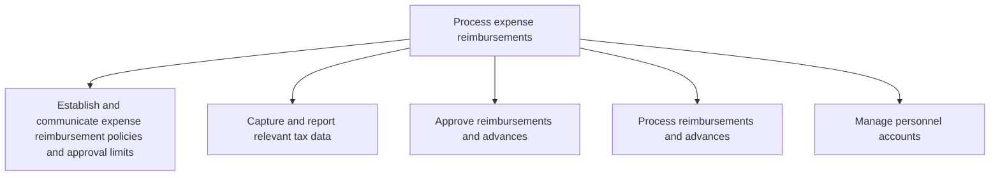
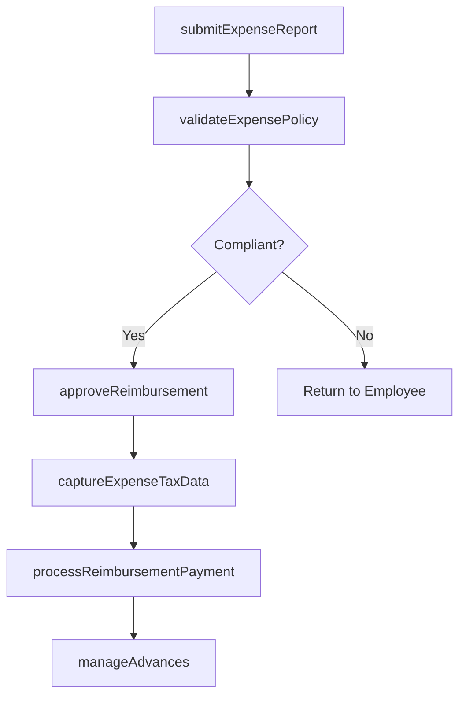

# Process expense reimbursements

> Business-as-Code definition for expense reimbursement processing. Models the policy establishment, submission review, approval, payment, and tax reporting workflows for employee business expense claims and travel advances.

## Overview

Processing reimbursements to employees for the expenses incurred during the course of business. Approve and process advancements and reimbursements for employee expenses on the organization's behalf. Capture and report relevant tax data and manage personal accounts.

## Process Hierarchy



## GraphDL

```yaml
process:
  object: Expense Reimbursements
  actor: ExpenseAdministrator
  result: ReimbursementPayment
```

## Actions

| Action | Description |
|--------|-------------|
| submitExpenseReport | Employee submits expense claim with receipts and justification |
| validateExpensePolicy | Check expense report against reimbursement policies and limits |
| approveReimbursement | Manager or delegate authorizes the expense reimbursement |
| processReimbursementPayment | Execute payment to the employee via payroll or direct deposit |
| captureExpenseTaxData | Extract and report tax-relevant data from expense transactions |
| manageAdvances | Issue, track, and reconcile cash advances to employees |

## Events

| Event | Description |
|-------|-------------|
| expenseReportSubmitted | Employee expense claim received for review |
| expensePolicyValidated | Expense report checked against policy rules |
| reimbursementApproved | Expense reimbursement authorized by approver |
| reimbursementPaymentProcessed | Payment issued to employee account |
| expenseTaxDataCaptured | Tax-relevant expense data extracted and reported |
| advanceReconciled | Cash advance balanced against submitted expenses |

## Searches

| Search | Description |
|--------|-------------|
| getExpenseReports | List submitted expense reports by employee, status, or date range |
| getReimbursementStatus | Track reimbursement payment status for a specific claim |
| getExpenseAnalytics | Query expense spending by category, department, or policy |
| getOutstandingAdvances | Retrieve unreconciled employee cash advances |

## Process Flow



## RACI Matrix

| Activity | Responsible | Accountable | Consulted | Informed |
|----------|-------------|-------------|-----------|----------|
| submitExpenseReport | Employee | ExpenseAdministrator | Manager | Finance |
| validateExpensePolicy | ExpenseAdministrator | APManager | HRPolicy | Employee |
| approveReimbursement | Manager | APManager | Finance | Employee |
| processReimbursementPayment | PayrollSpecialist | APManager | Treasury | Employee |

## Sub-Processes

| ID | Name | Description |
|----|------|-------------|
| 9.6.2.1 | Establish and communicate expense reimbursement policies and approval limits | Explaining policies and procedures related to reimbursements requests by employees. Set policies reg |
| 9.6.2.2 | Capture and report relevant tax data | Collecting and reporting all pertinent information regarding the taxes paid by the organization's em |
| 9.6.2.3 | Approve reimbursements and advances | Permitting expense reimbursement requests from employees. |
| 9.6.2.4 | Process reimbursements and advances | Paying for expense reimbursement requests from employees. (Follow Approve reimbursements and advance |
| 9.6.2.5 | Manage personnel accounts | Maintaining accounts of individuals who are connected with business. |

## Related Processes

| Process | Relationship |
|---------|-------------|
| 9.6.1 Process accounts payable AP | Parallel - expense reimbursements complement vendor payables |
| 9.6.3 Manage corporate credit cards | Parallel - credit card charges may overlap with expense claims |
| 9.9.2 Process taxes | Downstream - tax-relevant expense data feeds tax processing |

## Related Departments

| Department | Role |
|-----------|------|
| Accounts Payable | Processes and pays approved reimbursement claims |
| Human Resources | Defines expense policies and per diem rates |
| Finance | Monitors expense budgets and spending trends |
| Tax | Ensures proper tax treatment of reimbursed expenses |

## Related Occupations

| Occupation | Involvement |
|-----------|-------------|
| Expense Administrator | Reviews and processes expense claims |
| AP Clerk | Executes reimbursement payments |
| Financial Analyst | Analyzes expense trends and policy compliance |

## KPIs

| KPI | Description | Unit |
|-----|-------------|------|
| Reimbursement Cycle Time | Average days from submission to payment | Days |
| Policy Compliance Rate | Percentage of claims conforming to expense policy | % |
| Processing Cost per Claim | Average cost to process a single expense report | Currency |
| Outstanding Advance Balance | Total unreconciled cash advances | Currency |

## Usage

```typescript
import { processExpenseReimbursements } from '@headlessly/process-expense-reimbursements'

const expenses = processExpenseReimbursements()

// Submit an expense report for review
const report = await expenses.submitExpenseReport({
  employeeId: 'EMP-4421',
  lineItems: [
    { category: 'airfare', amount: 850, currency: 'USD', receipt: 'rcpt-001.pdf' },
    { category: 'hotel', amount: 420, currency: 'USD', receipt: 'rcpt-002.pdf' }
  ],
  tripPurpose: 'Client site visit - Q1 review'
})

// Approve and process the reimbursement
const payment = await expenses.processReimbursementPayment({
  reportId: report.id,
  method: 'payroll-deduction',
  payPeriod: '2025-03-31'
})
```
