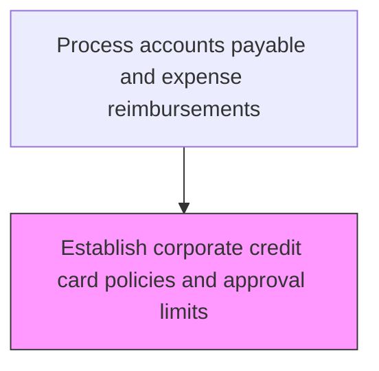
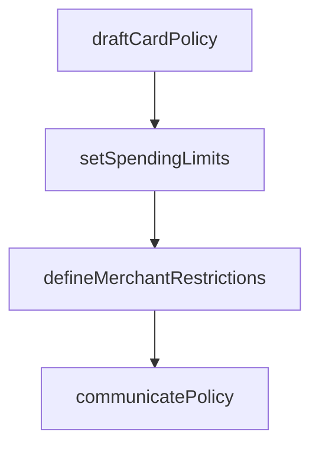

# Establish corporate credit card policies and approval limits

> Business-as-Code definition for corporate credit card policy establishment. Models the creation and communication of card usage policies, merchant category restrictions, spending limits, and approval hierarchies.

## Overview

Developing and maintaining the policies, procedures, and spending parameters that govern the use of corporate credit cards across the organization. This process defines eligible expense categories, merchant category code restrictions, cardholder responsibilities, and receipt documentation requirements. Approval hierarchies are established to set default and role-based credit limits, ensuring that spending authority aligns with job function and organizational risk tolerance.

## Process Hierarchy



## GraphDL

```yaml
establish:
  object: Corporate Credit Card Policies And Approval Limits
  actor: CardPolicyManager
  result: CreditCardPolicy
```

## Actions

| Action | Description |
|--------|-------------|
| draftCardPolicy | Create corporate credit card usage policies and restrictions |
| setSpendingLimits | Define default and role-based spending limits |
| defineMerchantRestrictions | Specify allowed and blocked merchant category codes |
| communicatePolicy | Distribute card policy to all cardholders and managers |

## Events

| Event | Description |
|-------|-------------|
| cardPolicyDrafted | Corporate card policy created or revised |
| spendingLimitsSet | Default and role-based limits defined |
| merchantRestrictionsApplied | Merchant category restrictions configured |
| policyCommunicated | Card policy distributed to stakeholders |

## Searches

| Search | Description |
|--------|-------------|
| getCardPolicies | Retrieve active credit card policies |
| getSpendingLimits | Query current spending limits by role or department |

## Process Flow



## RACI Matrix

| Activity | Responsible | Accountable | Consulted | Informed |
|----------|-------------|-------------|-----------|----------|
| draftCardPolicy | CardPolicyManager | CFO | LegalCounsel | APManager |
| setSpendingLimits | CardPolicyManager | CFO | Controller | DepartmentHeads |
| defineMerchantRestrictions | CardPolicyManager | APManager | Procurement | Cardholders |
| communicatePolicy | CardPolicyManager | APManager | HRDepartment | AllCardholders |

## Related Processes

| Process | Relationship |
|---------|-------------|
| 9.6.3.2 Process corporate credit card requests | Downstream - policies govern card issuance decisions |
| 9.6.3.5 Approve/Change credit limits | Downstream - policies define limit change procedures |
| 9.6.2.1 Establish expense reimbursement policies | Parallel - card and expense policies must align |
| 9.8.2.1 Design and implement control activities | Consumer - card controls designed per policy requirements |

## Related Departments

| Department | Role |
|-----------|------|
| Finance | Sets spending parameters and approves policy |
| Accounts Payable | Administers card program policy |
| Procurement | Advises on merchant category restrictions |

## Related Occupations

| Occupation | Involvement |
|-----------|-------------|
| Card Policy Manager | Drafts and maintains card usage policies |
| AP Manager | Approves card program policies and spending limits |

## KPIs

| KPI | Description | Unit |
|-----|-------------|------|
| Policy Compliance Rate | Percentage of card transactions within policy | % |
| Policy Acknowledgment Rate | Percentage of cardholders acknowledging current policy | % |
| Policy Update Frequency | Number of policy revisions published per year | Count |
| Blocked Transaction Rate | Percentage of transactions declined by merchant category restrictions | % |

## Usage

```typescript
import { establishCorporateCreditCardPoliciesAndApprovalLimits } from '@headlessly/establish-corporate-credit-card-policies-and-approval-limits'

const cardPolicy = establishCorporateCreditCardPoliciesAndApprovalLimits()

// Draft updated card usage policy
const policy = await cardPolicy.draftCardPolicy({
  effectiveDate: '2025-04-01',
  defaultLimit: 5000,
  blockedMCCs: ['7995', '5933']
})

// Set role-based spending limits
const limits = await cardPolicy.setSpendingLimits({
  analyst: 2500,
  manager: 10000,
  director: 25000,
  vp: 50000
})
```
