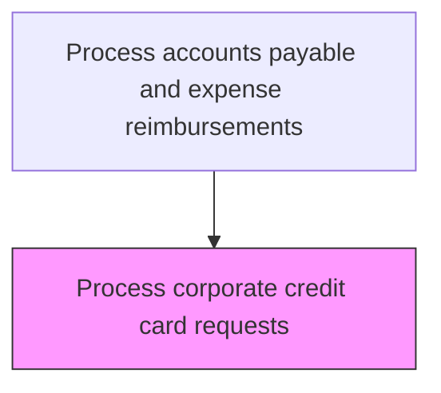
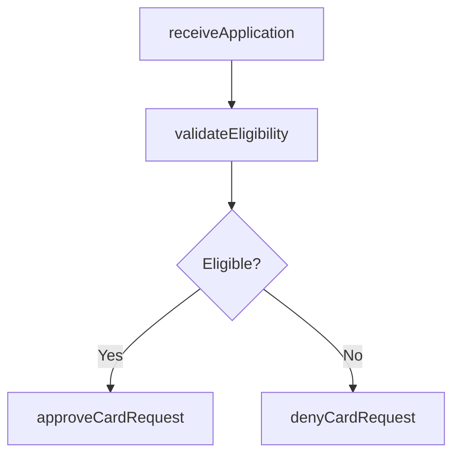

# Process corporate credit card requests

> Business-as-Code definition for credit card request processing. Models the intake, eligibility validation, approval, and fulfillment of employee applications for corporate credit cards.

## Overview

Receiving, evaluating, and processing employee applications for corporate credit cards based on eligibility criteria, job requirements, and policy guidelines. The card administrator validates employment status, verifies manager approval, checks that the applicant's role qualifies for a corporate card, and determines the appropriate credit limit tier. Approved applications are forwarded to the card ordering process, while denied requests are returned to the applicant with documented rationale and appeal instructions.

## Process Hierarchy



## GraphDL

```yaml
process:
  object: Corporate Credit Card Requests
  actor: CardAdministrator
  result: CardRequestDecision
```

## Actions

| Action | Description |
|--------|-------------|
| receiveApplication | Accept employee application for a corporate credit card |
| validateEligibility | Check applicant against eligibility criteria and policy |
| approveCardRequest | Authorize the card application for issuance |
| denyCardRequest | Reject a card application with documented rationale |

## Events

| Event | Description |
|-------|-------------|
| applicationReceived | Card application submitted by employee |
| eligibilityValidated | Applicant eligibility confirmed against criteria |
| cardRequestApproved | Card application authorized for issuance |
| cardRequestDenied | Card application rejected |

## Searches

| Search | Description |
|--------|-------------|
| getPendingRequests | List card applications awaiting review |
| getRequestHistory | Retrieve card application history by employee |

## Process Flow



## RACI Matrix

| Activity | Responsible | Accountable | Consulted | Informed |
|----------|-------------|-------------|-----------|----------|
| receiveApplication | CardAdministrator | APManager | HRDepartment | Applicant |
| validateEligibility | CardAdministrator | APManager | HRDepartment | Manager |
| approveCardRequest | APManager | CFO | Manager | Applicant |
| denyCardRequest | APManager | CFO | HRDepartment | Applicant |

## Related Processes

| Process | Relationship |
|---------|-------------|
| 9.6.3.1 Establish corporate credit card policies | Upstream - policies define eligibility criteria |
| 9.6.3.3 Order corporate credit cards | Downstream - approved requests trigger card ordering |
| 9.6.3.5 Approve/Change credit limits | Related - initial limit determined during request processing |

## Related Departments

| Department | Role |
|-----------|------|
| Accounts Payable | Processes card applications and determines eligibility |
| Human Resources | Validates employment status and role eligibility |
| Line Management | Provides manager approval for card requests |

## Related Occupations

| Occupation | Involvement |
|-----------|-------------|
| Card Administrator | Reviews and processes card applications |
| AP Manager | Makes final approval decisions on card requests |

## KPIs

| KPI | Description | Unit |
|-----|-------------|------|
| Request Processing Time | Average days from application to decision | Days |
| Approval Rate | Percentage of card requests approved | % |
| Eligibility Validation Accuracy | Percentage of decisions made without post-issuance corrections | % |
| Application Backlog | Number of card requests pending review | Count |

## Usage

```typescript
import { processCorporateCreditCardRequests } from '@headlessly/process-corporate-credit-card-requests'

const requests = processCorporateCreditCardRequests()

// Approve a card request with a specific limit
const decision = await requests.approveCardRequest({
  applicationId: 'CCREQ-2025-0089',
  approvedLimit: 5000
})

// List pending card requests for review
const pending = await requests.getPendingRequests({
  sortBy: 'submissionDate',
  includeManagerApproval: true
})
```
