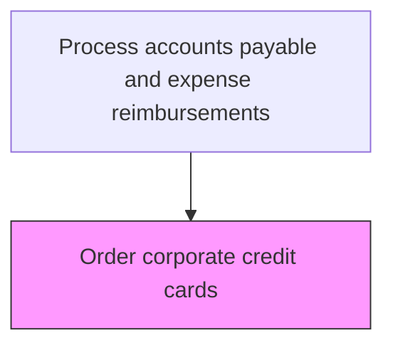
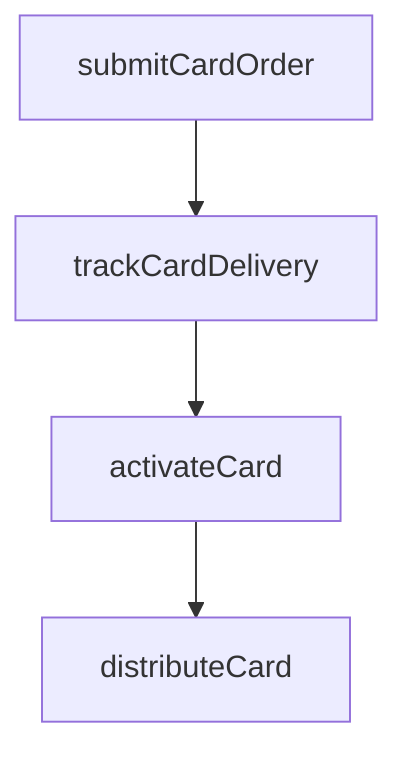

# Order corporate credit cards

> Business-as-Code definition for corporate credit card ordering. Models the card ordering, activation, and distribution process with the card issuing bank for approved cardholder requests.

## Overview

Placing and fulfilling card orders with the issuing bank for approved corporate credit card requests, including new card issuance, replacements, and renewals. This process coordinates with the card issuer to submit cardholder details, configure the card with the approved credit limit and merchant restrictions, track shipment and delivery, and activate the card for use. Secure handling procedures ensure cards are distributed only to authorized cardholders with proper identity verification.

## Process Hierarchy



## GraphDL

```yaml
order:
  object: Corporate Credit Cards
  actor: CardAdministrator
  result: IssuedCard
```

## Actions

| Action | Description |
|--------|-------------|
| submitCardOrder | Place card order with issuing bank for approved applicant |
| trackCardDelivery | Monitor card shipment and delivery status |
| activateCard | Enable the new card for transaction processing |
| distributeCard | Deliver the activated card to the cardholder |

## Events

| Event | Description |
|-------|-------------|
| cardOrderSubmitted | Order placed with issuing bank |
| cardDeliveryTracked | Card shipment status updated |
| cardActivated | New card enabled for transactions |
| cardDistributed | Card delivered to cardholder |

## Searches

| Search | Description |
|--------|-------------|
| getPendingOrders | List card orders awaiting delivery |
| getCardDeliveryStatus | Track delivery status by order reference |

## Process Flow



## RACI Matrix

| Activity | Responsible | Accountable | Consulted | Informed |
|----------|-------------|-------------|-----------|----------|
| submitCardOrder | CardAdministrator | APManager | CardIssuer | Cardholder |
| trackCardDelivery | CardAdministrator | APManager | MailRoom | Cardholder |
| activateCard | CardAdministrator | APManager | ITSecurity | Cardholder |
| distributeCard | CardAdministrator | APManager | Security | Cardholder |

## Related Processes

| Process | Relationship |
|---------|-------------|
| 9.6.3.2 Process corporate credit card requests | Upstream - approved requests trigger card ordering |
| 9.6.3.4 Manage corporate credit card accounts | Downstream - issued cards become active accounts |
| 9.6.3.1 Establish corporate credit card policies | Upstream - policies define card types and limit tiers |

## Related Departments

| Department | Role |
|-----------|------|
| Accounts Payable | Coordinates card ordering with issuing bank |
| Security | Validates secure delivery and activation procedures |
| IT Security | Ensures secure card activation and credential handling |

## Related Occupations

| Occupation | Involvement |
|-----------|-------------|
| Card Administrator | Manages card ordering, tracking, and activation |
| Security Officer | Oversees secure card delivery and identity verification |

## KPIs

| KPI | Description | Unit |
|-----|-------------|------|
| Card Issuance Time | Average days from approval to card delivery | Days |
| Activation Rate | Percentage of delivered cards activated within 7 days | % |
| Order Accuracy | Percentage of card orders fulfilled without errors | % |
| Delivery Success Rate | Percentage of cards delivered on first attempt | % |

## Usage

```typescript
import { orderCorporateCreditCards } from '@headlessly/order-corporate-credit-cards'

const orders = orderCorporateCreditCards()

// Submit a card order to the issuing bank
const card = await orders.submitCardOrder({
  employeeId: 'EMP-3321',
  cardType: 'corporate-travel',
  approvedLimit: 5000,
  shippingAddress: 'office'
})

// Track delivery status of a pending order
const status = await orders.trackCardDelivery({
  orderId: card.orderId,
  includeShippingDetails: true
})
```
