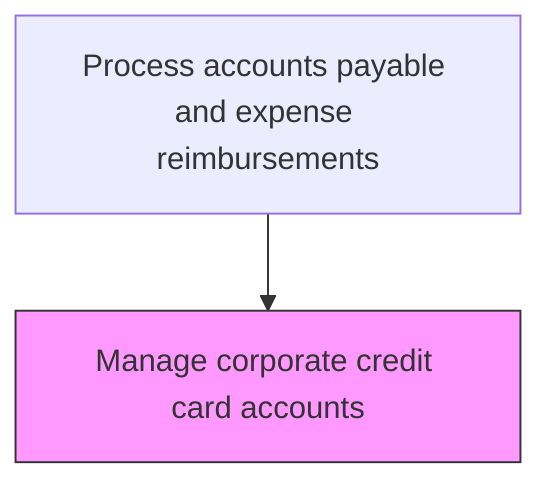
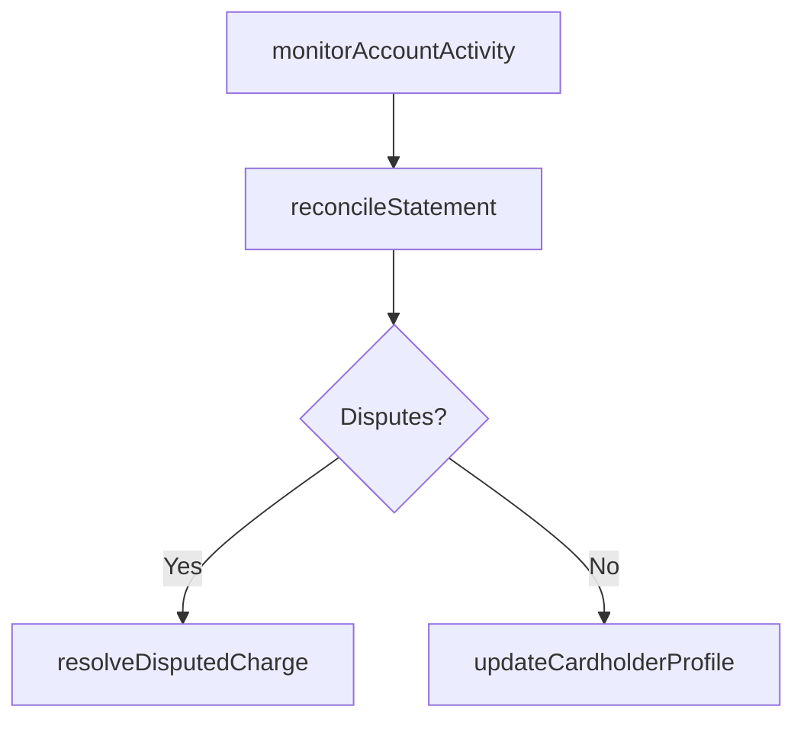

# Manage corporate credit card accounts

> Business-as-Code definition for corporate credit card account management. Models the ongoing administration of active card accounts including statement reconciliation, balance monitoring, and cardholder profile updates.

## Overview

Administering the ongoing lifecycle of active corporate credit card accounts, including monthly statement reconciliation, spending pattern monitoring, and cardholder profile maintenance. Card account managers match transactions against receipts and expense reports, investigate and resolve disputed charges with the card issuer, update cost center assignments when employees transfer, and flag anomalous spending patterns that may indicate misuse or fraud. This process ensures accurate financial reporting and policy compliance across the card portfolio.

## Process Hierarchy



## GraphDL

```yaml
manage:
  object: Corporate Credit Card Accounts
  actor: CardAccountManager
  result: AccountStatus
```

## Actions

| Action | Description |
|--------|-------------|
| reconcileStatement | Match monthly card transactions against receipts and expense reports |
| monitorAccountActivity | Track card usage patterns and flag anomalies |
| updateCardholderProfile | Modify cardholder information such as department or cost center |
| resolveDisputedCharge | Investigate and resolve disputed card transactions |

## Events

| Event | Description |
|-------|-------------|
| statementReconciled | Monthly statement matched and posted |
| accountActivityMonitored | Card usage review completed |
| cardholderProfileUpdated | Cardholder information modified |
| disputedChargeResolved | Card transaction dispute settled |

## Searches

| Search | Description |
|--------|-------------|
| getAccountSummary | Retrieve account balance and activity summary |
| getUnreconciledTransactions | List card transactions without matching receipts |

## Process Flow



## RACI Matrix

| Activity | Responsible | Accountable | Consulted | Informed |
|----------|-------------|-------------|-----------|----------|
| reconcileStatement | CardAccountManager | APManager | Cardholder | Controller |
| monitorAccountActivity | CardAccountManager | APManager | FraudAnalyst | ITSecurity |
| resolveDisputedCharge | CardAccountManager | APManager | CardIssuer | Cardholder |
| updateCardholderProfile | CardAccountManager | APManager | HRDepartment | Cardholder |

## Related Processes

| Process | Relationship |
|---------|-------------|
| 9.6.3.3 Order corporate credit cards | Upstream - ordered cards become managed accounts |
| 9.6.3.5 Approve/Change credit limits | Parallel - limit changes affect account management |
| 9.6.3.6 Cancel/Deactivate credit card | Downstream - account issues may trigger deactivation |
| 9.6.3.1 Establish corporate credit card policies | Upstream - policies govern account management rules |

## Related Departments

| Department | Role |
|-----------|------|
| Accounts Payable | Manages card accounts and reconciliation |
| Finance | Reviews spending patterns and budget alignment |
| Security | Investigates anomalous transactions and potential fraud |

## Related Occupations

| Occupation | Involvement |
|-----------|-------------|
| Card Account Manager | Reconciles statements and manages ongoing account operations |
| Fraud Analyst | Investigates suspicious card activity |

## KPIs

| KPI | Description | Unit |
|-----|-------------|------|
| Reconciliation Timeliness | Percentage of statements reconciled within 5 business days | % |
| Dispute Resolution Time | Average days to resolve a disputed charge | Days |
| Unreconciled Transaction Rate | Percentage of card transactions without matching receipts | % |
| Anomaly Detection Rate | Number of flagged suspicious transactions per month | Count |

## Usage

```typescript
import { manageCorporateCreditCardAccounts } from '@headlessly/manage-corporate-credit-card-accounts'

const accounts = manageCorporateCreditCardAccounts()

// Reconcile a monthly statement
const reconciled = await accounts.reconcileStatement({
  cardId: 'CC-2025-00412',
  statementPeriod: 'March-2025'
})

// List unreconciled transactions across all accounts
const unreconciled = await accounts.getUnreconciledTransactions({
  agingDays: 30,
  minimumAmount: 100,
  sortBy: 'amount'
})
```
