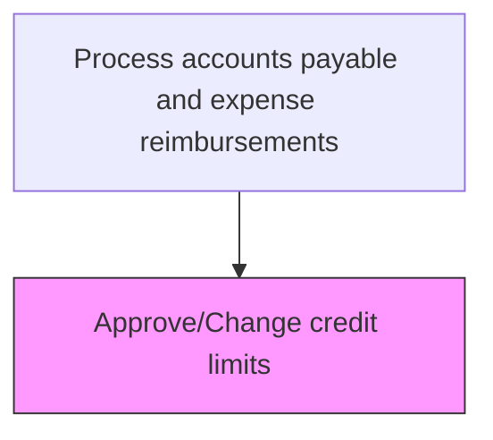
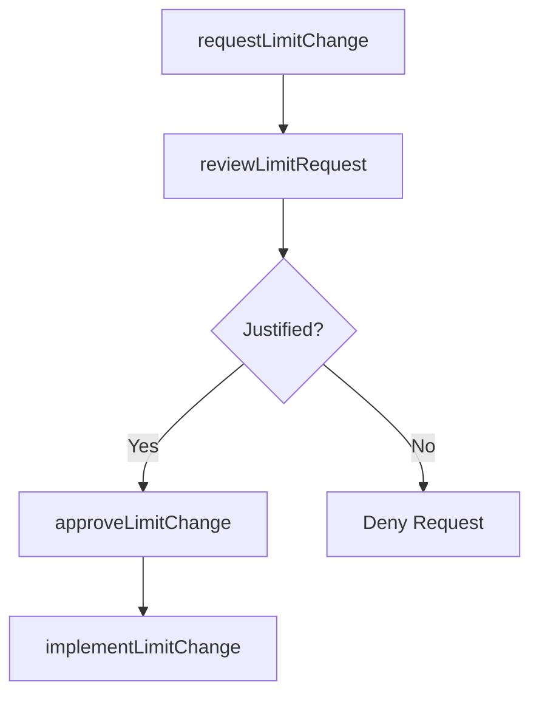

# Approve/Change credit limits

> Business-as-Code definition for credit limit approval and modification. Models the review, authorization, and implementation of credit limit changes for corporate cardholders based on business needs and spending patterns.

## Overview

Reviewing, authorizing, and implementing modifications to corporate credit card spending limits based on business justification, spending history, and role changes. This process handles both temporary limit increases for specific business trips or projects and permanent limit adjustments due to promotions, role changes, or ongoing business needs. Each request is evaluated against the organization's risk tolerance and approved limit tiers before being implemented with the card issuing bank.

## Process Hierarchy



## GraphDL

```yaml
approve/change:
  object: Credit Limits
  actor: CardPolicyManager
  result: CreditLimitChange
```

## Actions

| Action | Description |
|--------|-------------|
| requestLimitChange | Submit a request to increase or decrease a cardholder credit limit |
| reviewLimitRequest | Evaluate the business justification and spending history |
| approveLimitChange | Authorize the credit limit modification |
| implementLimitChange | Apply the approved limit change with the card issuer |

## Events

| Event | Description |
|-------|-------------|
| limitChangeRequested | Credit limit modification request submitted |
| limitRequestReviewed | Limit change request evaluated |
| limitChangeApproved | Credit limit modification authorized |
| limitChangeImplemented | New credit limit applied with card issuer |

## Searches

| Search | Description |
|--------|-------------|
| getPendingLimitChanges | List credit limit change requests awaiting approval |
| getLimitChangeHistory | Retrieve limit change history for a cardholder |

## Process Flow



## RACI Matrix

| Activity | Responsible | Accountable | Consulted | Informed |
|----------|-------------|-------------|-----------|----------|
| requestLimitChange | Cardholder | Manager | CardAdministrator | APManager |
| reviewLimitRequest | CardPolicyManager | APManager | Manager | Cardholder |
| approveLimitChange | APManager | CFO | Controller | Cardholder |
| implementLimitChange | CardAdministrator | APManager | CardIssuer | Cardholder |

## Related Processes

| Process | Relationship |
|---------|-------------|
| 9.6.3.1 Establish corporate credit card policies | Upstream - policies define limit change procedures and tiers |
| 9.6.3.4 Manage corporate credit card accounts | Parallel - limit changes affect account management |
| 9.6.3.2 Process corporate credit card requests | Related - initial limits set during card issuance |

## Related Departments

| Department | Role |
|-----------|------|
| Accounts Payable | Processes limit change requests and coordinates with card issuer |
| Finance | Approves limit changes based on budget impact |
| Line Management | Provides business justification for limit change requests |

## Related Occupations

| Occupation | Involvement |
|-----------|-------------|
| Card Policy Manager | Reviews and approves limit change requests |
| Card Administrator | Implements approved limit changes with the issuing bank |

## KPIs

| KPI | Description | Unit |
|-----|-------------|------|
| Limit Change Processing Time | Average days from request to implementation | Days |
| Limit Utilization Rate | Percentage of credit limit typically utilized | % |
| Temporary Limit Reversal Rate | Percentage of temporary increases reverted on schedule | % |
| Limit Change Denial Rate | Percentage of limit change requests denied | % |

## Usage

```typescript
import { approveChangeCreditLimits } from '@headlessly/approve-change-credit-limits'

const limits = approveChangeCreditLimits()

// Approve a permanent limit increase
const change = await limits.approveLimitChange({
  cardId: 'CC-2025-00412',
  currentLimit: 5000,
  newLimit: 10000,
  justification: 'Increased international travel'
})

// Review pending limit change requests
const pending = await limits.getPendingLimitChanges({
  sortBy: 'requestDate',
  includeSpendingHistory: true
})
```
