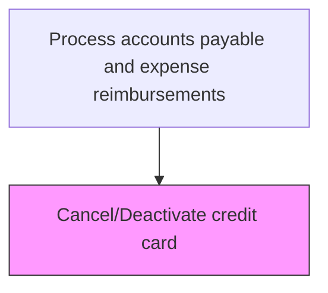
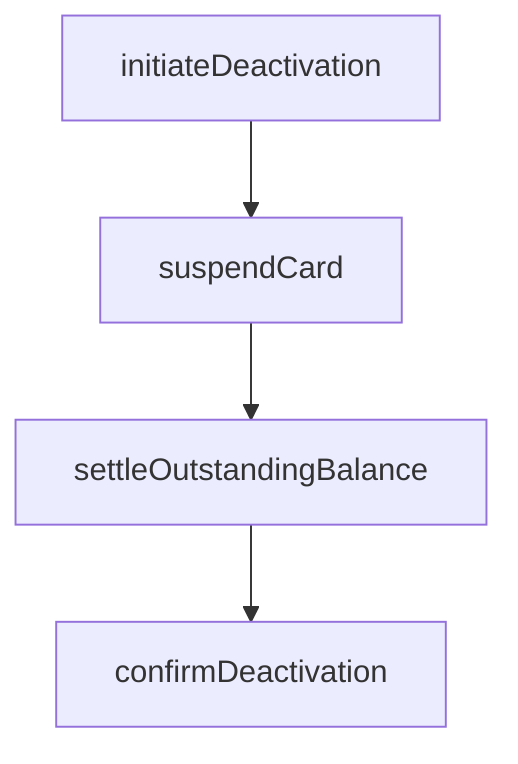

# Cancel/Deactivate credit card

> Business-as-Code definition for credit card cancellation and deactivation. Models the suspension, deactivation, and account closure process for corporate credit cards due to termination, fraud, or policy violation.

## Overview

Suspending, deactivating, or permanently canceling corporate credit cards due to employee termination, role change, suspected fraud, or policy violation. This process coordinates with the card issuing bank to immediately block transaction processing, settles any outstanding balances or pending authorizations, and closes the account in the card management system. Emergency deactivation procedures enable same-day blocking for fraud cases, while standard deactivation follows the employee offboarding timeline to ensure all legitimate charges are captured before account closure.

## Process Hierarchy



## GraphDL

```yaml
cancel/deactivate:
  object: Credit Card
  actor: CardAdministrator
  result: DeactivationConfirmation
```

## Actions

| Action | Description |
|--------|-------------|
| initiateDeactivation | Start the card cancellation process with documented reason |
| suspendCard | Temporarily block card from processing transactions |
| settleOutstandingBalance | Clear any remaining charges on the account |
| confirmDeactivation | Verify card is permanently disabled with the issuer |

## Events

| Event | Description |
|-------|-------------|
| deactivationInitiated | Card cancellation process started |
| cardSuspended | Card temporarily blocked from transactions |
| outstandingBalanceSettled | Remaining charges cleared |
| deactivationConfirmed | Card permanently disabled |

## Searches

| Search | Description |
|--------|-------------|
| getDeactivatedCards | List recently deactivated cards by reason and date |
| getPendingDeactivations | List cards with deactivation in progress |

## Process Flow



## RACI Matrix

| Activity | Responsible | Accountable | Consulted | Informed |
|----------|-------------|-------------|-----------|----------|
| initiateDeactivation | CardAdministrator | APManager | HRDepartment | Cardholder |
| suspendCard | CardAdministrator | APManager | CardIssuer | SecurityTeam |
| settleOutstandingBalance | CardAdministrator | APManager | Controller | Cardholder |
| confirmDeactivation | CardAdministrator | APManager | CardIssuer | InternalAudit |

## Related Processes

| Process | Relationship |
|---------|-------------|
| 9.6.3.4 Manage corporate credit card accounts | Upstream - account closure follows account management |
| 9.6.3.1 Establish corporate credit card policies | Upstream - policies define deactivation triggers |
| 7.9 Manage employee offboarding | Related - employee termination triggers card deactivation |

## Related Departments

| Department | Role |
|-----------|------|
| Accounts Payable | Executes card deactivation process |
| Human Resources | Triggers deactivation for terminated employees |
| Security | Initiates emergency deactivation for fraud |

## Related Occupations

| Occupation | Involvement |
|-----------|-------------|
| Card Administrator | Processes card deactivation requests |

## KPIs

| KPI | Description | Unit |
|-----|-------------|------|
| Deactivation Turnaround | Average hours from request to card deactivation | Hours |
| Outstanding Balance Clearance | Percentage of deactivated cards with zero balance within 30 days | % |
| Emergency Block Response Time | Average minutes from fraud report to card suspension | Minutes |
| Post-Termination Transaction Rate | Number of transactions attempted after employee termination | Count |

## Usage

```typescript
import { cancelDeactivateCreditCard } from '@headlessly/cancel-deactivate-credit-card'

const deactivation = cancelDeactivateCreditCard()

// Initiate emergency deactivation for suspected fraud
const result = await deactivation.initiateDeactivation({
  cardId: 'CC-2025-00412',
  reason: 'employee-termination',
  immediateBlock: true
})

// Check pending deactivations and outstanding balances
const pending = await deactivation.getPendingDeactivations({
  includeOutstandingBalance: true,
  reason: 'all'
})
```
