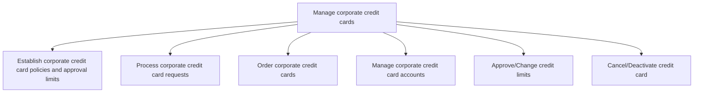
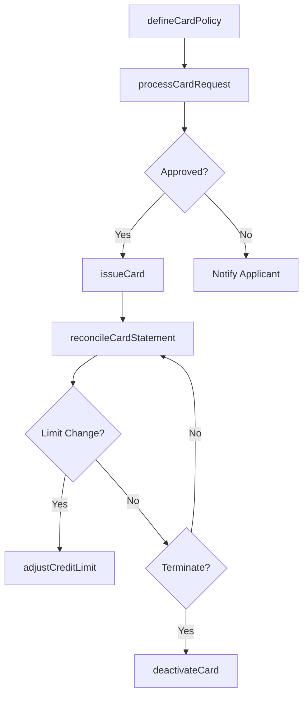

# Manage corporate credit cards

> Business-as-Code definition for corporate credit card program management. Models the policy establishment, card issuance, account management, credit limit governance, and deactivation of corporate credit cards.

## Overview

Handling and authoring credit cards to business entities or for corporate purchases.

## Process Hierarchy



## GraphDL

```yaml
manage:
  object: Corporate Credit Cards
  actor: CardProgramAdministrator
  result: CorporateCardAccount
```

## Actions

| Action | Description |
|--------|-------------|
| defineCardPolicy | Establish corporate card usage policies, spending limits, and merchant restrictions |
| processCardRequest | Review and approve employee applications for corporate credit cards |
| issueCard | Order and distribute a new corporate credit card to an approved cardholder |
| adjustCreditLimit | Modify credit limits based on role changes or business requirements |
| reconcileCardStatement | Match card transactions against receipts and expense reports |
| deactivateCard | Cancel or suspend a corporate credit card |

## Events

| Event | Description |
|-------|-------------|
| cardPolicyDefined | Corporate card policy established or updated |
| cardRequestProcessed | Card application reviewed and decision issued |
| cardIssued | New corporate credit card activated and distributed |
| creditLimitAdjusted | Cardholder credit limit modified |
| cardStatementReconciled | Monthly card statement matched and posted |
| cardDeactivated | Corporate credit card cancelled or suspended |

## Searches

| Search | Description |
|--------|-------------|
| getActiveCards | List active corporate cards filtered by department, cardholder, or limit |
| getCardTransactions | Retrieve transaction history for a specific card or cardholder |
| getCardSpendAnalytics | Query spending patterns by merchant category or department |
| getPendingCardRequests | List card applications awaiting approval |

## Process Flow



## RACI Matrix

| Activity | Responsible | Accountable | Consulted | Informed |
|----------|-------------|-------------|-----------|----------|
| defineCardPolicy | CardProgramAdministrator | CFO | LegalCounsel | AllCardholders |
| processCardRequest | CardProgramAdministrator | APManager | HRDepartment | Applicant |
| issueCard | CardProgramAdministrator | APManager | CardIssuer | Cardholder |
| deactivateCard | CardProgramAdministrator | APManager | Security | Cardholder |

## Sub-Processes

| ID | Name | Description |
|----|------|-------------|
| 9.6.3.1 | Establish corporate credit card policies and approval limits | Developing procedures for using company credit cards. Set or approve credit limits. |
| 9.6.3.2 | Process corporate credit card requests | Handling applications credit card applications for business expenses. |
| 9.6.3.3 | Order corporate credit cards | Obtaining credit cards for business-related expenses. |
| 9.6.3.4 | Manage corporate credit card accounts | Handling credit card accounts of business customers. |
| 9.6.3.5 | Approve/Change credit limits | Authorizing changes to the available credit advances. |
| 9.6.3.6 | Cancel/Deactivate credit card | Blocking an existing credit card to disable all future transactions. |

## Related Processes

| Process | Relationship |
|---------|-------------|
| 9.6.2 Process expense reimbursements | Parallel - card charges may replace or supplement expense claims |
| 9.6.1 Process accounts payable AP | Downstream - card statement payments flow through AP |
| 9.8 Manage internal controls | Parallel - card policies are part of internal control framework |

## Related Departments

| Department | Role |
|-----------|------|
| Accounts Payable | Administers the card program and processes statements |
| Finance | Sets spending limits and monitors card program costs |
| Human Resources | Validates employee eligibility for corporate cards |
| Security | Manages fraud detection and card suspension |

## Related Occupations

| Occupation | Involvement |
|-----------|-------------|
| Card Program Administrator | Manages card lifecycle from issuance to deactivation |
| AP Manager | Oversees card statement reconciliation and payment |
| Fraud Analyst | Monitors transactions for unauthorized or suspicious activity |

## KPIs

| KPI | Description | Unit |
|-----|-------------|------|
| Card Utilization Rate | Percentage of issued cards with monthly activity | % |
| Policy Violation Rate | Percentage of transactions flagged for policy non-compliance | % |
| Statement Reconciliation Time | Average days to reconcile monthly card statements | Days |
| Fraud Incident Rate | Number of fraudulent transactions per thousand card transactions | Per 1000 |

## Usage

```typescript
import { manageCorporateCreditCards } from '@headlessly/manage-corporate-credit-cards'

const cards = manageCorporateCreditCards()

// Process a new card request
const request = await cards.processCardRequest({
  employeeId: 'EMP-3321',
  requestedLimit: 5000,
  department: 'Engineering',
  justification: 'Travel and software subscriptions'
})

// Deactivate a card for a departing employee
const deactivated = await cards.deactivateCard({
  cardId: 'CC-2025-00412',
  reason: 'employee-termination',
  effectiveDate: '2025-03-31'
})
```
