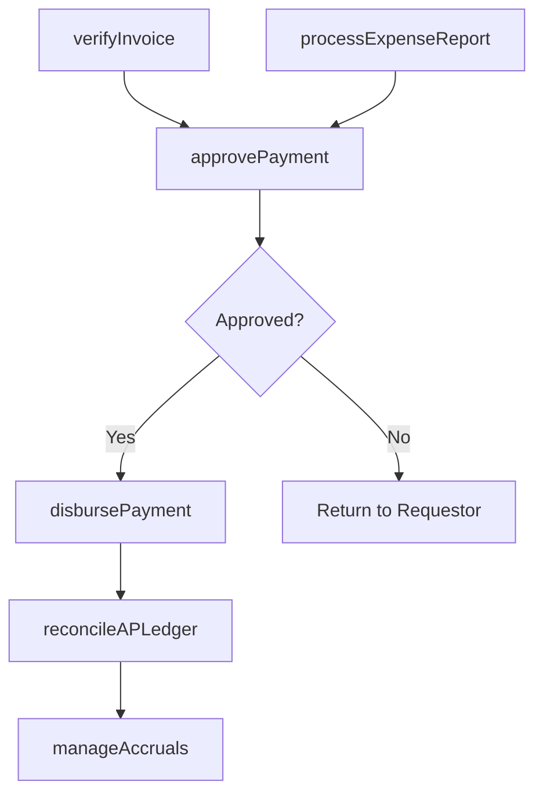

# Process accounts payable and expense reimbursements

> Business-as-Code definition for accounts payable and expense reimbursement processing. Models invoice verification, payment approval, disbursement, expense reporting, and corporate card management as programmable APIs.

## Overview

Handling bills and reimbursements to be made. Make payments for goods or services taken or used on behalf of the organization.

## Process Hierarchy

```mermaid
graph TD
    A[Process accounts payable and expense reimbursements]
    A --> B[Process accounts payable (AP)]
    A --> C[Process expense reimbursements]
    A --> D[Manage corporate credit cards]
```

## GraphDL

```yaml
process:
  object: Accounts Payable And Expense Reimbursements
  actor: APManager
  result: PaymentVoucher
```

## Actions

| Action | Description |
|--------|-------------|
| verifyInvoice | Match vendor invoices against purchase orders and receiving documents |
| approvePayment | Route payment requests through authorization workflow |
| disbursePayment | Execute vendor payments via check, ACH, or wire transfer |
| processExpenseReport | Validate and reimburse employee business expenses |
| reconcileAPLedger | Match AP subledger balances to the general ledger |
| manageAccruals | Record and reverse period-end expense accruals |

## Events

| Event | Description |
|-------|-------------|
| invoiceVerified | Vendor invoice matched and validated against purchase order |
| paymentApproved | Payment authorized per delegation-of-authority policy |
| paymentDisbursed | Vendor payment executed and recorded in the AP ledger |
| expenseReportProcessed | Employee expense reimbursement validated and paid |
| apLedgerReconciled | AP subledger balanced with the general ledger |
| accrualsManaged | Period-end accruals recorded or reversed |

## Searches

| Search | Description |
|--------|-------------|
| getOpenInvoices | List unpaid vendor invoices by due date, vendor, or amount |
| findPayments | Search payment history by vendor, date range, or check number |
| getExpenseReports | Retrieve employee expense reports by status or submitter |
| getAPAgingReport | Get accounts payable aging summary by vendor and bucket |

## Process Flow



## RACI Matrix

| Activity | Responsible | Accountable | Consulted | Informed |
|----------|-------------|-------------|-----------|----------|
| verifyInvoice | AP Clerk | AP Manager | Procurement | Vendor |
| approvePayment | Department Manager | AP Manager | Controller | Treasury |
| disbursePayment | AP Specialist | AP Manager | Treasury | Controller |
| processExpenseReport | AP Clerk | AP Manager | Employee | Department Manager |

## Sub-Processes

| ID | Name | Description |
|----|------|-------------|
| 9.6.1 | Process accounts payable (AP) | Processing payments of operating expenses and other supplier charges. This includes the development  |
| 9.6.2 | Process expense reimbursements | Processing reimbursements to employees for the expenses incurred during the course of business. Appr |
| 9.6.3 | Manage corporate credit cards | Handling and authoring credit cards to business entities or for corporate purchases. |

## Related Processes

| Process | Relationship |
|---------|-------------|
| 9.3 Perform general accounting and reporting | Downstream - AP entries post to the general ledger |
| 9.7 Manage treasury operations | Parallel - payment disbursements affect cash position |
| 4.3 Procure materials and services | Upstream - purchase orders trigger vendor invoicing |

## Related Departments

| Department | Role |
|-----------|------|
| Accounts Payable | Primary owner of invoice processing and vendor payments |
| Procurement | Provides purchase orders and goods receipt confirmations |
| Treasury | Manages cash availability for payment disbursement |
| Internal Audit | Reviews AP controls and policy compliance |
| All Departments | Submit expense reports for reimbursement |

## Related Occupations

| Occupation | Involvement |
|-----------|-------------|
| Accounts Payable Manager | Oversees invoice processing, payment runs, and vendor relations |
| AP Specialist | Day-to-day invoice matching, coding, and payment processing |
| Expense Administrator | Reviews and processes employee expense reimbursements |

## KPIs

| KPI | Description | Unit |
|-----|-------------|------|
| Invoice Processing Cost | Average cost to process a single vendor invoice | USD |
| Days Payable Outstanding | Average number of days to pay vendor invoices | Days |
| Early Payment Discount Capture | Percentage of available early-pay discounts taken | % |
| Expense Report Cycle Time | Average days from expense submission to reimbursement | Days |

## Usage

```typescript
import { processAccountsPayableAndExpenseReimbursements } from '@headlessly/process-accounts-payable-and-expense-reimbursements'

const ap = processAccountsPayableAndExpenseReimbursements()

// Verify and match a vendor invoice
const voucher = await ap.verifyInvoice({
  invoiceNumber: 'INV-2025-8834',
  vendorId: 'VND-00412',
  purchaseOrder: 'PO-2025-1100'
})

// Process an employee expense report
await ap.processExpenseReport({
  employeeId: 'EMP-2045',
  reportId: 'EXP-2025-0391',
  reimbursementMethod: 'direct-deposit'
})
```
