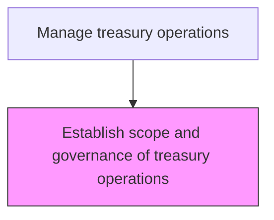
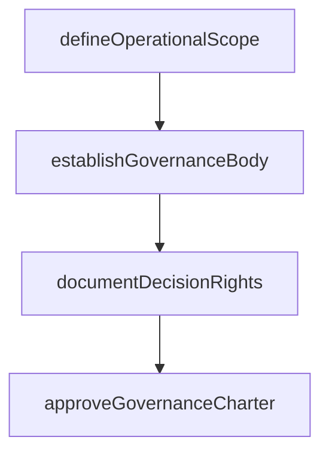

# Establish scope and governance of treasury operations

> Business-as-Code definition for treasury governance establishment. Models the definition of treasury scope, authority boundaries, and governance structures including committee charters and decision rights.

## Overview

Defining the organizational scope, authority boundaries, and governance structures for treasury operations. This includes selecting the authoritative body responsible for investments and trading in bonds, currencies, financial derivatives, and other instruments. The process establishes committee charters, decision rights, and escalation paths to ensure treasury activities operate within a clearly mandated framework that aligns with enterprise risk appetite.

## Process Hierarchy



## GraphDL

```yaml
establish:
  object: Scope And Governance Of Treasury Operations
  actor: Treasurer
  result: GovernanceCharter
```

## Actions

| Action | Description |
|--------|-------------|
| defineOperationalScope | Delineate the boundaries and responsibilities of treasury operations |
| establishGovernanceBody | Form treasury governance committee with defined authority |
| documentDecisionRights | Specify approval authorities and delegation limits |
| approveGovernanceCharter | Formalize and approve the treasury governance framework |

## Events

| Event | Description |
|-------|-------------|
| operationalScopeDefined | Treasury operations boundaries documented |
| governanceBodyEstablished | Treasury committee formed with charter |
| decisionRightsDocumented | Approval authorities specified |
| governanceCharterApproved | Treasury governance framework formalized |

## Searches

| Search | Description |
|--------|-------------|
| getGovernanceCharter | Retrieve current treasury governance charter |
| getDecisionAuthorities | Query approval authorities by transaction type |

## Process Flow



## RACI Matrix

| Activity | Responsible | Accountable | Consulted | Informed |
|----------|-------------|-------------|-----------|----------|
| defineOperationalScope | Treasurer | CFO | RiskManager | Board |
| establishGovernanceBody | Treasurer | CFO | LegalCounsel | TreasuryStaff |
| documentDecisionRights | TreasuryPolicyManager | Treasurer | ComplianceOfficer | CFO |
| approveGovernanceCharter | CFO | Board | LegalCounsel | TreasuryStaff |

## Related Processes

| Process | Relationship |
|---------|-------------|
| 9.7.1.2 Establish and publish treasury policies | Downstream - governance scope informs policy development |
| 9.7.1.7 Develop and confirm internal controls for treasury | Downstream - governance framework guides control design |
| 9.8.1 Establish internal controls, policies, and procedures | Parallel - treasury governance aligns with enterprise controls |
| 9.7.2 Create internal funding program | Consumer - governance scope defines funding authority |

## Related Departments

| Department | Role |
|-----------|------|
| Treasury | Defines scope and governance of treasury operations |
| Legal | Reviews governance charter for regulatory compliance |

## Related Occupations

| Occupation | Involvement |
|-----------|-------------|
| Treasurer | Leads governance framework establishment |
| Corporate Secretary | Documents governance structure |

## KPIs

| KPI | Description | Unit |
|-----|-------------|------|
| Governance Review Frequency | Number of governance charter reviews per year | Count |
| Authority Compliance Rate | Percentage of transactions within delegated authority | % |
| Committee Meeting Cadence | Number of treasury governance committee meetings per quarter | Count |
| Scope Coverage Completeness | Percentage of treasury activities covered by governance charter | % |

## Usage

```typescript
import { establishScopeAndGovernanceOfTreasuryOperations } from '@headlessly/establish-scope-and-governance-of-treasury-operations'

const governance = establishScopeAndGovernanceOfTreasuryOperations()

const charter = await governance.approveGovernanceCharter({
  effectiveDate: '2025-01-01',
  committeMembers: ['CFO', 'Treasurer', 'RiskManager'],
  reviewCycle: 'annual'
})

// Query current decision authorities by transaction type
const authorities = await governance.getDecisionAuthorities({
  transactionType: 'fx-hedging',
  thresholdAmount: 10000000
})
```
