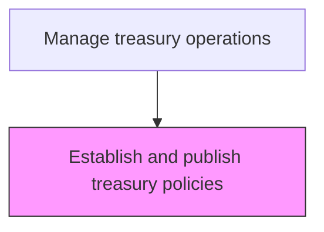
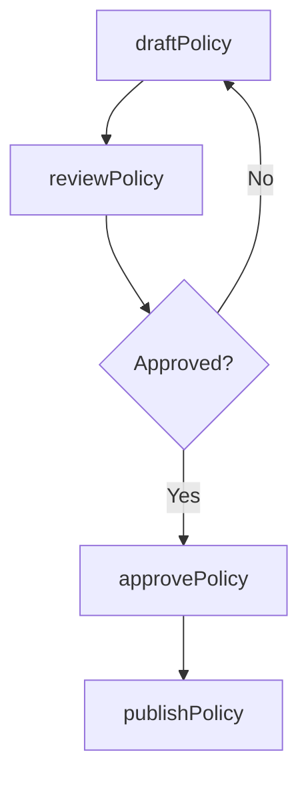

# Establish and publish treasury policies

> Business-as-Code definition for treasury policy publication. Models the drafting, review, approval, and distribution of treasury operating policies covering investment, borrowing, FX, and counterparty risk management.

## Overview

Drafting, reviewing, approving, and distributing treasury operating policies that govern investment guidelines, borrowing limits, foreign exchange management, and counterparty risk thresholds. These policies establish the boundaries and rules for treasury decision-making, ensuring that all activities comply with regulatory requirements and align with organizational risk appetite. The process includes periodic review cycles to keep policies current with market conditions and regulatory changes.

## Process Hierarchy



## GraphDL

```yaml
establish:
  object: And Publish Treasury Policies
  actor: TreasuryPolicyManager
  result: TreasuryPolicy
```

## Actions

| Action | Description |
|--------|-------------|
| draftPolicy | Create treasury policy covering specific operational area |
| reviewPolicy | Submit policy for stakeholder and legal review |
| approvePolicy | Obtain executive approval for the finalized policy |
| publishPolicy | Distribute approved policy to all relevant personnel |

## Events

| Event | Description |
|-------|-------------|
| policyDrafted | Treasury policy draft completed |
| policyReviewed | Policy review cycle completed |
| policyApproved | Treasury policy approved by executives |
| policyPublished | Policy distributed to treasury personnel |

## Searches

| Search | Description |
|--------|-------------|
| getActivePolicies | List all current treasury policies by category |
| getPolicyVersionHistory | Retrieve revision history for a specific policy |

## Process Flow



## RACI Matrix

| Activity | Responsible | Accountable | Consulted | Informed |
|----------|-------------|-------------|-----------|----------|
| draftPolicy | TreasuryPolicyManager | Treasurer | RiskManager | Controller |
| reviewPolicy | RiskManager | Treasurer | LegalCounsel | ComplianceOfficer |
| approvePolicy | Treasurer | CFO | LegalCounsel | Board |
| publishPolicy | TreasuryPolicyManager | Treasurer | CommunicationsTeam | TreasuryStaff |

## Related Processes

| Process | Relationship |
|---------|-------------|
| 9.7.1.1 Establish scope and governance | Upstream - governance scope defines policy areas |
| 9.7.1.3 Develop treasury procedures | Downstream - policies drive procedure development |
| 9.7.1.7 Develop and confirm internal controls for treasury | Downstream - policies define control requirements |
| 9.8.1 Establish internal controls, policies, and procedures | Parallel - treasury policies align with enterprise policy framework |

## Related Departments

| Department | Role |
|-----------|------|
| Treasury | Drafts and maintains treasury policies |
| Legal | Reviews policies for regulatory compliance |

## Related Occupations

| Occupation | Involvement |
|-----------|-------------|
| Treasury Policy Manager | Drafts and publishes treasury policies |

## KPIs

| KPI | Description | Unit |
|-----|-------------|------|
| Policy Currency | Percentage of policies reviewed within scheduled cycle | % |
| Publication Timeliness | Days from approval to publication | Days |
| Policy Acknowledgment Rate | Percentage of personnel who acknowledged receipt of published policies | % |
| Policy Exception Rate | Number of policy exceptions granted per quarter | Count |

## Usage

```typescript
import { establishAndPublishTreasuryPolicies } from '@headlessly/establish-and-publish-treasury-policies'

const policies = establishAndPublishTreasuryPolicies()

const policy = await policies.publishPolicy({
  category: 'investment-guidelines',
  version: '3.0',
  effectiveDate: '2025-04-01'
})

// Retrieve version history for a specific policy
const history = await policies.getPolicyVersionHistory({
  policyId: 'INV-GUIDELINES-001',
  includeApprovalDetails: true
})
```
