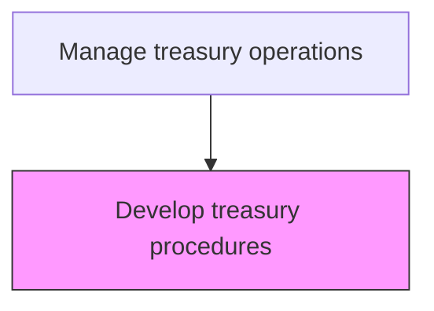
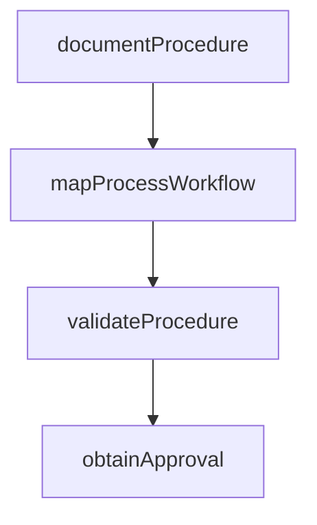

# Develop treasury procedures

> Business-as-Code definition for treasury procedure development. Models the creation of detailed operational procedures for executing treasury activities including cash management, investment placement, and bank account operations.

## Overview

Creating detailed operational procedures for executing treasury activities including cash management, investment placement, bank account operations, and payment processing. Each procedure translates high-level treasury policies into step-by-step workflows with defined roles, system interactions, and exception handling paths. The process includes validating procedures against real-world scenarios and obtaining management sign-off to ensure operational readiness.

## Process Hierarchy



## GraphDL

```yaml
develop:
  object: Treasury Procedures
  actor: TreasuryProcedureAnalyst
  result: TreasuryProcedure
```

## Actions

| Action | Description |
|--------|-------------|
| documentProcedure | Write detailed step-by-step operating procedures |
| mapProcessWorkflow | Create workflow diagrams for treasury procedures |
| validateProcedure | Test procedures against real-world scenarios |
| obtainApproval | Secure management sign-off on procedures |

## Events

| Event | Description |
|-------|-------------|
| procedureDocumented | Treasury procedure written and formatted |
| workflowMapped | Process flow diagram created |
| procedureValidated | Procedure tested and confirmed |
| approvalObtained | Management sign-off received |

## Searches

| Search | Description |
|--------|-------------|
| getProcedures | List treasury procedures by operational area |
| getProcedureStatus | Query procedure approval and review status |

## Process Flow



## RACI Matrix

| Activity | Responsible | Accountable | Consulted | Informed |
|----------|-------------|-------------|-----------|----------|
| documentProcedure | TreasuryProcedureAnalyst | TreasuryPolicyManager | TreasuryOperator | Treasurer |
| mapProcessWorkflow | TreasuryProcedureAnalyst | TreasuryPolicyManager | ITSystems | TreasuryOperator |
| validateProcedure | TreasuryOperator | TreasuryPolicyManager | RiskManager | Treasurer |
| obtainApproval | TreasuryPolicyManager | Treasurer | ComplianceOfficer | CFO |

## Related Processes

| Process | Relationship |
|---------|-------------|
| 9.7.1.2 Establish and publish treasury policies | Upstream - policies inform procedure content |
| 9.7.1.4 Monitor treasury procedures | Downstream - procedures are monitored for adherence |
| 9.7.1.7 Develop and confirm internal controls for treasury | Parallel - procedures embed control activities |
| 9.7.3 Manage cash | Consumer - cash management requires documented procedures |

## Related Departments

| Department | Role |
|-----------|------|
| Treasury | Develops and validates operating procedures |

## Related Occupations

| Occupation | Involvement |
|-----------|-------------|
| Treasury Procedure Analyst | Documents and tests treasury procedures |

## KPIs

| KPI | Description | Unit |
|-----|-------------|------|
| Procedure Coverage | Percentage of treasury activities with documented procedures | % |
| Procedure Approval Time | Average days from draft to approval | Days |
| Validation Pass Rate | Percentage of procedures passing scenario validation on first attempt | % |
| Procedure Freshness | Percentage of procedures reviewed within the last 12 months | % |

## Usage

```typescript
import { developTreasuryProcedures } from '@headlessly/develop-treasury-procedures'

const procedures = developTreasuryProcedures()

const proc = await procedures.documentProcedure({
  area: 'cash-concentration',
  steps: ['Review daily balances', 'Initiate sweep transfers', 'Confirm execution'],
  owner: 'CashManager'
})

// Query procedure approval and review status
const status = await procedures.getProcedureStatus({
  area: 'cash-concentration',
  includeExpiring: true,
  reviewWindow: '90-days'
})
```
