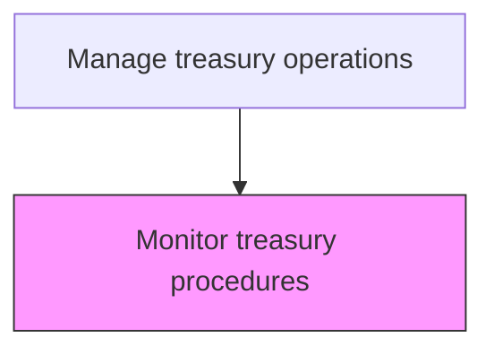
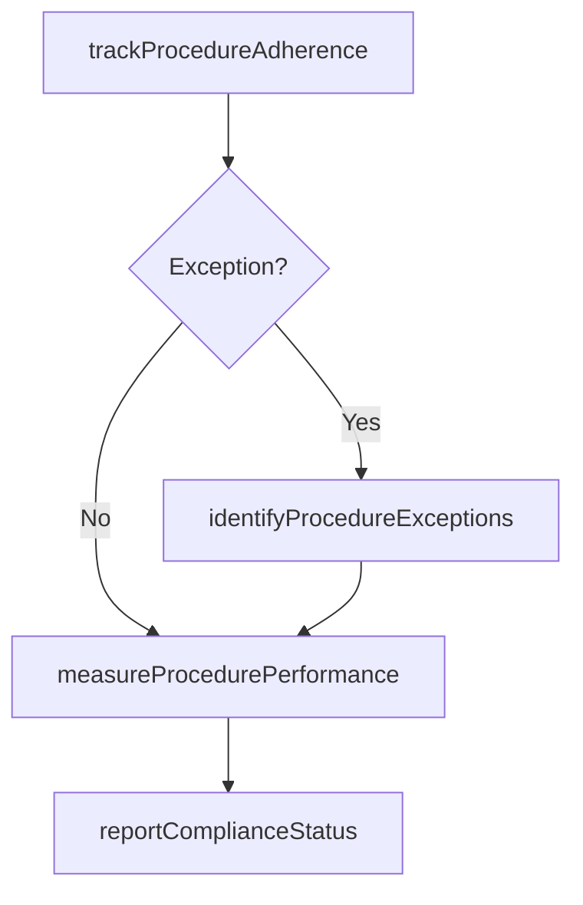

# Monitor treasury procedures

> Business-as-Code definition for treasury procedure monitoring. Models the ongoing surveillance of treasury procedure adherence, exception tracking, and performance measurement.

## Overview

Conducting ongoing surveillance of treasury procedure adherence by tracking daily compliance, flagging deviations, and measuring operational efficiency. This process ensures that established treasury procedures for cash management, investments, and payment processing are followed consistently across all entities. Exception tracking and performance measurement provide early warning of control breakdowns and identify opportunities for process improvement.

## Process Hierarchy



## GraphDL

```yaml
monitor:
  object: Treasury Procedures
  actor: TreasuryOperationsManager
  result: ProcedureComplianceReport
```

## Actions

| Action | Description |
|--------|-------------|
| trackProcedureAdherence | Monitor daily compliance with treasury operating procedures |
| identifyProcedureExceptions | Flag deviations from established treasury procedures |
| measureProcedurePerformance | Assess efficiency and effectiveness of treasury procedures |
| reportComplianceStatus | Produce periodic compliance status reports |

## Events

| Event | Description |
|-------|-------------|
| procedureAdherenceTracked | Daily compliance review completed |
| procedureExceptionIdentified | Deviation from procedure detected |
| procedurePerformanceMeasured | Efficiency assessment completed |
| complianceStatusReported | Compliance report produced |

## Searches

| Search | Description |
|--------|-------------|
| getExceptionLog | List procedure exceptions by type and severity |
| getComplianceDashboard | Retrieve real-time procedure compliance metrics |

## Process Flow



## RACI Matrix

| Activity | Responsible | Accountable | Consulted | Informed |
|----------|-------------|-------------|-----------|----------|
| trackProcedureAdherence | TreasuryOperationsAnalyst | TreasuryOperationsManager | TreasuryPolicyManager | Treasurer |
| identifyProcedureExceptions | TreasuryOperationsManager | Treasurer | ComplianceOfficer | CFO |
| measureProcedurePerformance | TreasuryOperationsAnalyst | TreasuryOperationsManager | Controller | Treasurer |
| reportComplianceStatus | TreasuryOperationsManager | Treasurer | InternalAudit | CFO |

## Related Processes

| Process | Relationship |
|---------|-------------|
| 9.7.1.3 Develop treasury procedures | Upstream - procedures being monitored |
| 9.7.1.5 Audit treasury procedures | Downstream - monitoring data informs audit scope |
| 9.7.1.6 Revise treasury procedures | Downstream - monitoring exceptions trigger procedure revisions |
| 9.8.1 Establish internal controls, policies, and procedures | Parallel - monitoring supports enterprise control assessment |

## Related Departments

| Department | Role |
|-----------|------|
| Treasury | Monitors adherence to operating procedures |
| Internal Audit | Reviews monitoring results for audit planning |

## Related Occupations

| Occupation | Involvement |
|-----------|-------------|
| Treasury Operations Manager | Oversees daily procedure compliance |

## KPIs

| KPI | Description | Unit |
|-----|-------------|------|
| Procedure Compliance Rate | Percentage of procedures followed without exception | % |
| Exception Resolution Time | Average days to resolve procedure exceptions | Days |
| Exception Frequency | Number of procedure exceptions identified per month | Count |
| Monitoring Coverage | Percentage of treasury procedures actively monitored | % |

## Usage

```typescript
import { monitorTreasuryProcedures } from '@headlessly/monitor-treasury-procedures'

const monitoring = monitorTreasuryProcedures()

// Track daily procedure adherence across treasury operations
const compliance = await monitoring.trackProcedureAdherence({
  date: '2025-03-15',
  procedures: ['cash-concentration', 'wire-authorization', 'investment-placement'],
  entities: ['US-Corp', 'EU-GmbH']
})

// Retrieve exception log filtered by severity
const exceptions = await monitoring.getExceptionLog({
  period: '2025-Q1',
  severity: 'high',
  status: 'open'
})
```
