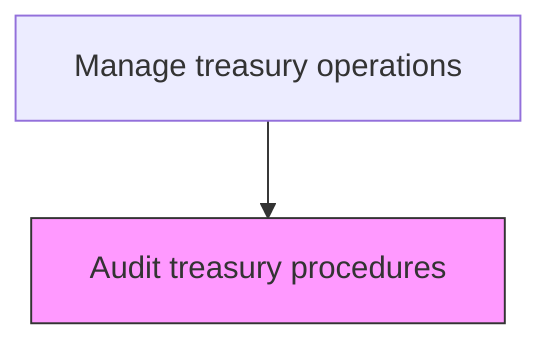
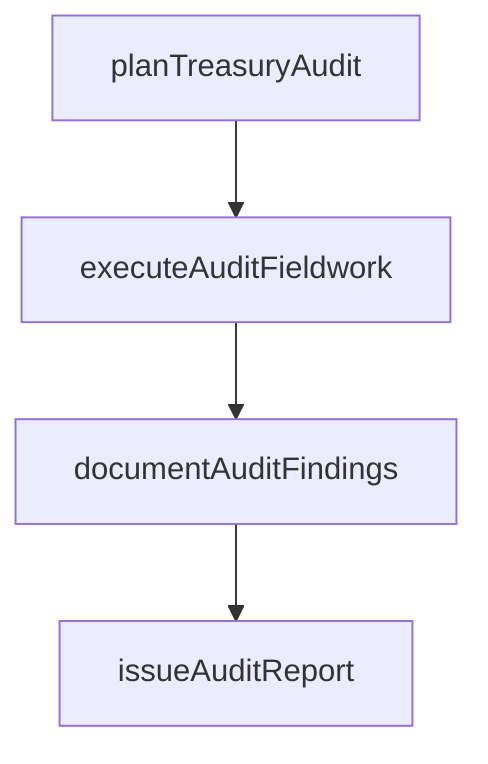

# Audit treasury procedures

> Business-as-Code definition for treasury procedure auditing. Models the planning, execution, and reporting of internal audits evaluating treasury procedure compliance and effectiveness.

## Overview

Planning, executing, and reporting on internal audits of treasury procedures to evaluate compliance, operational effectiveness, and control adequacy. Auditors define scope and methodology, perform testing and evidence collection, and document findings with risk-rated recommendations. Audit results provide independent assurance to the board and management that treasury operations are functioning within established policies and mitigating financial risks appropriately.

## Process Hierarchy



## GraphDL

```yaml
audit:
  object: Treasury Procedures
  actor: InternalAuditor
  result: AuditReport
```

## Actions

| Action | Description |
|--------|-------------|
| planTreasuryAudit | Define audit scope, objectives, and methodology |
| executeAuditFieldwork | Perform testing and evidence collection |
| documentAuditFindings | Record observations, exceptions, and recommendations |
| issueAuditReport | Publish final audit report with findings and ratings |

## Events

| Event | Description |
|-------|-------------|
| treasuryAuditPlanned | Audit scope and methodology defined |
| auditFieldworkExecuted | Testing and evidence collection completed |
| auditFindingsDocumented | Observations and recommendations recorded |
| auditReportIssued | Final audit report published |

## Searches

| Search | Description |
|--------|-------------|
| getAuditSchedule | Retrieve upcoming treasury audit schedule |
| getAuditFindings | List findings by severity and remediation status |

## Process Flow



## RACI Matrix

| Activity | Responsible | Accountable | Consulted | Informed |
|----------|-------------|-------------|-----------|----------|
| planTreasuryAudit | InternalAuditor | AuditDirector | Treasurer | CFO |
| executeAuditFieldwork | InternalAuditor | AuditDirector | TreasuryOperationsManager | Treasurer |
| documentAuditFindings | InternalAuditor | AuditDirector | TreasuryPolicyManager | Treasurer |
| issueAuditReport | AuditDirector | ChiefAuditExecutive | Treasurer | Board |

## Related Processes

| Process | Relationship |
|---------|-------------|
| 9.7.1.4 Monitor treasury procedures | Upstream - monitoring data informs audit focus |
| 9.7.1.6 Revise treasury procedures | Downstream - audit findings trigger procedure revisions |
| 9.7.1.7 Develop and confirm internal controls for treasury | Parallel - audits test effectiveness of treasury controls |
| 9.8.2 Manage internal audit | Governance - treasury audits follow enterprise audit methodology |

## Related Departments

| Department | Role |
|-----------|------|
| Internal Audit | Plans and executes treasury audits |
| Treasury | Provides access and documentation for audit |

## Related Occupations

| Occupation | Involvement |
|-----------|-------------|
| Internal Auditor | Conducts treasury procedure audits |

## KPIs

| KPI | Description | Unit |
|-----|-------------|------|
| Audit Coverage | Percentage of treasury procedures audited annually | % |
| Finding Severity Distribution | Ratio of high to low severity findings | Ratio |
| Finding Remediation Rate | Percentage of audit findings remediated by target date | % |
| Audit Cycle Time | Days from audit kickoff to final report issuance | Days |

## Usage

```typescript
import { auditTreasuryProcedures } from '@headlessly/audit-treasury-procedures'

const audit = auditTreasuryProcedures()

// Plan a treasury audit with defined scope and methodology
const plan = await audit.planTreasuryAudit({
  auditYear: 2025,
  scope: ['cash-management', 'investment-placement', 'wire-transfers'],
  methodology: 'risk-based',
  estimatedDuration: '4-weeks'
})

// Retrieve audit findings by severity and remediation status
const findings = await audit.getAuditFindings({
  auditId: plan.id,
  severity: 'high',
  remediationStatus: 'open'
})
```
