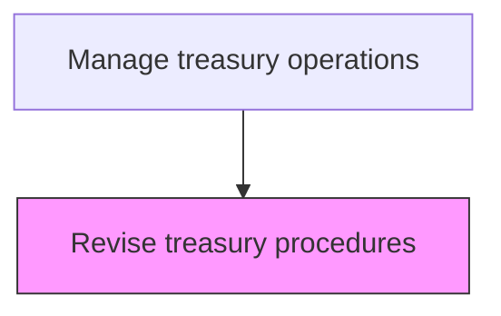
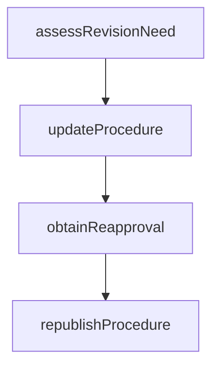

# Revise treasury procedures

> Business-as-Code definition for treasury procedure revision. Models the assessment, update, and re-publication of treasury procedures based on audit findings, regulatory changes, or operational improvements.

## Overview

Evaluating, updating, and re-publishing treasury procedures in response to audit findings, regulatory changes, operational incidents, or technology upgrades. The revision process ensures that documented procedures remain accurate, effective, and aligned with current policies and market practices. Each revision undergoes management re-approval before distribution, and personnel are notified of changes to maintain consistent operational execution.

## Process Hierarchy



## GraphDL

```yaml
revise:
  object: Treasury Procedures
  actor: TreasuryPolicyManager
  result: RevisedProcedure
```

## Actions

| Action | Description |
|--------|-------------|
| assessRevisionNeed | Evaluate audit findings and regulatory changes requiring updates |
| updateProcedure | Revise procedure documentation with corrections or enhancements |
| obtainReapproval | Secure management approval for revised procedures |
| republishProcedure | Distribute updated procedures to relevant personnel |

## Events

| Event | Description |
|-------|-------------|
| revisionNeedAssessed | Revision requirements evaluated |
| procedureUpdated | Procedure documentation revised |
| reapprovalObtained | Management approved revised procedure |
| procedureRepublished | Updated procedure distributed |

## Searches

| Search | Description |
|--------|-------------|
| getRevisionQueue | List procedures pending revision |
| getRevisionHistory | Retrieve revision log for a specific procedure |

## Process Flow



## RACI Matrix

| Activity | Responsible | Accountable | Consulted | Informed |
|----------|-------------|-------------|-----------|----------|
| assessRevisionNeed | TreasuryPolicyManager | Treasurer | InternalAuditor | CFO |
| updateProcedure | TreasuryProcedureAnalyst | TreasuryPolicyManager | TreasuryOperator | Treasurer |
| obtainReapproval | TreasuryPolicyManager | Treasurer | ComplianceOfficer | CFO |
| republishProcedure | TreasuryPolicyManager | Treasurer | CommunicationsTeam | TreasuryStaff |

## Related Processes

| Process | Relationship |
|---------|-------------|
| 9.7.1.5 Audit treasury procedures | Upstream - audit findings trigger revisions |
| 9.7.1.3 Develop treasury procedures | Parallel - revision follows same methodology as development |
| 9.7.1.4 Monitor treasury procedures | Upstream - monitoring exceptions identify revision needs |
| 9.7.1.2 Establish and publish treasury policies | Upstream - policy changes require procedure revisions |

## Related Departments

| Department | Role |
|-----------|------|
| Treasury | Revises and republishes operating procedures |
| Internal Audit | Validates that revisions address audit findings |

## Related Occupations

| Occupation | Involvement |
|-----------|-------------|
| Treasury Policy Manager | Updates and republishes revised procedures |

## KPIs

| KPI | Description | Unit |
|-----|-------------|------|
| Revision Timeliness | Average days from finding to procedure update | Days |
| Revision Effectiveness | Percentage of revisions that resolve underlying findings | % |
| Revision Backlog | Number of procedures pending revision at period end | Count |
| Reapproval Cycle Time | Average days from revision submission to management sign-off | Days |

## Usage

```typescript
import { reviseTreasuryProcedures } from '@headlessly/revise-treasury-procedures'

const revision = reviseTreasuryProcedures()

// Update a procedure based on audit finding
const updated = await revision.updateProcedure({
  procedureId: 'PROC-WIRE-AUTH-001',
  findingReference: 'AUDIT-2025-F003',
  changes: ['Add dual-approval for wires over $500K', 'Update beneficiary verification steps'],
  effectiveDate: '2025-04-01'
})

// Query procedures pending revision
const queue = await revision.getRevisionQueue({
  priority: 'high',
  source: 'audit-finding',
  includeOverdue: true
})
```
