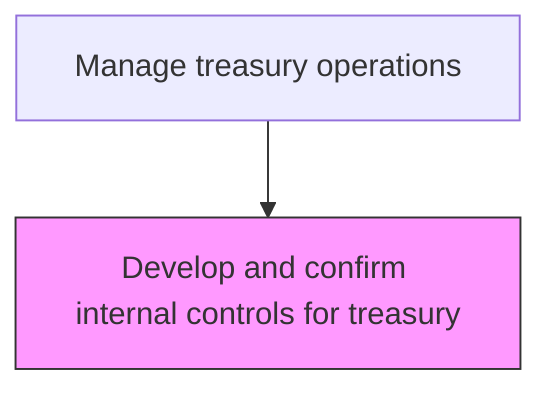
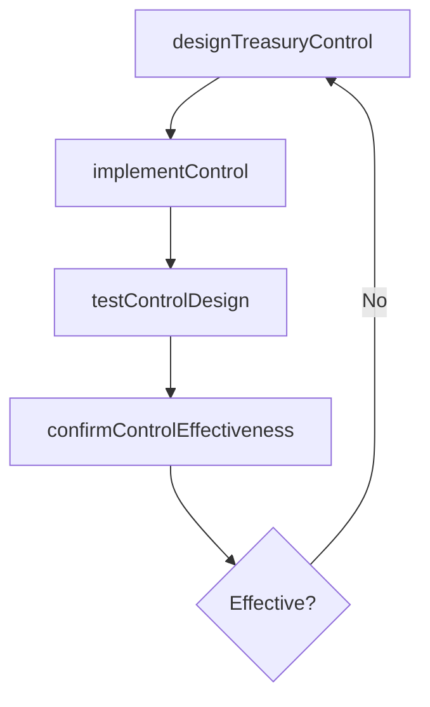

# Develop and confirm internal controls for treasury

> Business-as-Code definition for treasury internal controls development. Models the design, implementation, and validation of internal control mechanisms for treasury operations including segregation of duties and transaction authorization.

## Overview

Designing, implementing, and validating internal control mechanisms for treasury operations including segregation of duties, transaction authorization limits, and reconciliation checkpoints. Controls are tested for both design adequacy and operating effectiveness to ensure they mitigate key risks such as unauthorized transactions, data integrity failures, and fraud. The process supports SOX compliance and provides assurance to auditors and regulators that treasury activities are properly safeguarded.

## Process Hierarchy



## GraphDL

```yaml
develop:
  object: And Confirm Internal Controls For Treasury
  actor: TreasuryControlsManager
  result: TreasuryControlFramework
```

## Actions

| Action | Description |
|--------|-------------|
| designTreasuryControl | Define control activity, frequency, and evidence requirements |
| implementControl | Deploy the control in the treasury operating environment |
| testControlDesign | Verify the control is properly designed to mitigate risk |
| confirmControlEffectiveness | Validate that controls operate as intended |

## Events

| Event | Description |
|-------|-------------|
| treasuryControlDesigned | Treasury control activity defined |
| controlImplemented | Control deployed in operations |
| controlDesignTested | Control design validation completed |
| controlEffectivenessConfirmed | Control operating effectiveness validated |

## Searches

| Search | Description |
|--------|-------------|
| getTreasuryControls | List treasury controls by risk area and effectiveness |
| getControlTestResults | Retrieve control testing results for treasury |

## Process Flow



## RACI Matrix

| Activity | Responsible | Accountable | Consulted | Informed |
|----------|-------------|-------------|-----------|----------|
| designTreasuryControl | TreasuryControlsManager | Treasurer | RiskManager | CFO |
| implementControl | TreasuryOperationsManager | TreasuryControlsManager | ITSystems | Treasurer |
| testControlDesign | InternalAuditor | AuditDirector | TreasuryControlsManager | Treasurer |
| confirmControlEffectiveness | InternalAuditor | AuditDirector | TreasuryControlsManager | Board |

## Related Processes

| Process | Relationship |
|---------|-------------|
| 9.8.1 Establish internal controls, policies, and procedures | Upstream - enterprise framework guides treasury controls |
| 9.7.1.4 Monitor treasury procedures | Parallel - controls complement procedure monitoring |
| 9.7.1.5 Audit treasury procedures | Downstream - control effectiveness feeds audit scope |
| 9.7.1.8 Define system security requirements | Parallel - system controls complement operational controls |

## Related Departments

| Department | Role |
|-----------|------|
| Treasury | Designs and implements treasury-specific controls |
| Internal Audit | Tests and validates treasury controls |

## Related Occupations

| Occupation | Involvement |
|-----------|-------------|
| Treasury Controls Manager | Designs and maintains treasury control activities |

## KPIs

| KPI | Description | Unit |
|-----|-------------|------|
| Control Coverage Rate | Percentage of treasury risks with mitigating controls | % |
| Control Effectiveness Rate | Percentage of treasury controls operating effectively | % |
| Control Deficiency Count | Number of control deficiencies identified per testing cycle | Count |
| Segregation of Duties Compliance | Percentage of treasury roles with proper duty segregation | % |

## Usage

```typescript
import { developAndConfirmInternalControlsForTreasury } from '@headlessly/develop-and-confirm-internal-controls-for-treasury'

const controls = developAndConfirmInternalControlsForTreasury()

// Design a new treasury control for wire transfer authorization
const control = await controls.designTreasuryControl({
  riskArea: 'unauthorized-wire-transfers',
  controlType: 'preventive',
  frequency: 'per-transaction',
  evidence: 'dual-authorization-log',
  owner: 'EFTOperationsManager'
})

// Retrieve control test results for the treasury function
const testResults = await controls.getControlTestResults({
  testingPeriod: '2025-Q1',
  riskArea: 'all',
  includeDeficiencies: true
})
```
