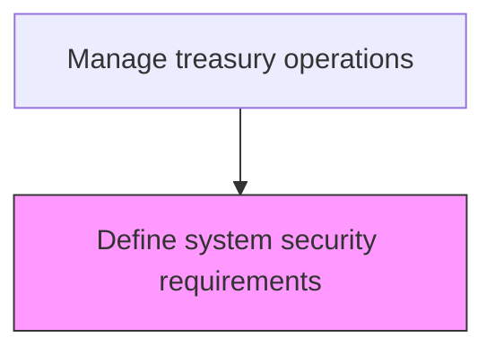
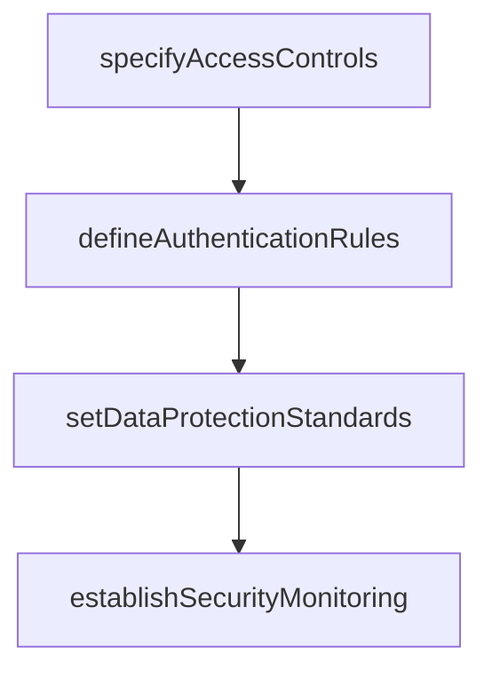

# Define system security requirements

> Business-as-Code definition for treasury system security requirements. Models the specification of access controls, data protection standards, system authentication, and security monitoring for treasury management systems.

## Overview

Specifying access controls, data protection standards, authentication mechanisms, and security monitoring requirements for treasury management systems. This includes defining role-based access permissions, multi-factor authentication rules, encryption standards for sensitive financial data, and incident response procedures. The process ensures that treasury systems protect against unauthorized access, data breaches, and cyber threats while maintaining the availability and integrity of financial transaction processing.

## Process Hierarchy



## GraphDL

```yaml
define:
  object: System Security Requirements
  actor: ITSecurityAnalyst
  result: SecurityRequirementsDocument
```

## Actions

| Action | Description |
|--------|-------------|
| specifyAccessControls | Define role-based access permissions for treasury systems |
| defineAuthenticationRules | Establish multi-factor authentication and session requirements |
| setDataProtectionStandards | Specify encryption, masking, and data handling requirements |
| establishSecurityMonitoring | Define logging, alerting, and incident response procedures |

## Events

| Event | Description |
|-------|-------------|
| accessControlsSpecified | Role-based access permissions documented |
| authenticationRulesDefined | Authentication requirements established |
| dataProtectionStandardsSet | Data protection requirements specified |
| securityMonitoringEstablished | Security monitoring procedures defined |

## Searches

| Search | Description |
|--------|-------------|
| getAccessPermissions | Query user access rights for treasury systems |
| getSecurityAuditLog | Retrieve system access and activity logs |

## Process Flow



## RACI Matrix

| Activity | Responsible | Accountable | Consulted | Informed |
|----------|-------------|-------------|-----------|----------|
| specifyAccessControls | ITSecurityAnalyst | CISO | Treasurer | TreasuryStaff |
| defineAuthenticationRules | ITSecurityAnalyst | CISO | TreasuryOperationsManager | ITOperations |
| setDataProtectionStandards | ITSecurityAnalyst | CISO | ComplianceOfficer | Treasurer |
| establishSecurityMonitoring | ITSecurityAnalyst | CISO | InternalAudit | CFO |

## Related Processes

| Process | Relationship |
|---------|-------------|
| 9.7.1.7 Develop and confirm internal controls for treasury | Parallel - security requirements complement operational controls |
| 9.8.2.6 Implement controls-related enabling technologies | Parallel - security tools are part of control technology |
| 9.7.7 Manage financial fraud/dispute cases | Downstream - security requirements support fraud prevention |
| 9.7.3.3 Process and oversee EFTs | Consumer - EFT systems require defined security parameters |

## Related Departments

| Department | Role |
|-----------|------|
| IT Security | Defines and enforces system security requirements |
| Treasury | Specifies operational security needs |

## Related Occupations

| Occupation | Involvement |
|-----------|-------------|
| IT Security Analyst | Designs treasury system security requirements |

## KPIs

| KPI | Description | Unit |
|-----|-------------|------|
| Unauthorized Access Incidents | Number of security breaches per period | Count |
| Access Review Compliance | Percentage of access reviews completed on time | % |
| MFA Adoption Rate | Percentage of treasury system users with multi-factor authentication enabled | % |
| Security Patch Currency | Percentage of treasury systems running current security patches | % |

## Usage

```typescript
import { defineSystemSecurityRequirements } from '@headlessly/define-system-security-requirements'

const security = defineSystemSecurityRequirements()

// Specify role-based access controls for the treasury management system
const accessControls = await security.specifyAccessControls({
  system: 'treasury-management-system',
  roles: ['Treasurer', 'CashManager', 'TreasuryAnalyst', 'ReadOnlyAuditor'],
  enforceSegregation: true,
  reviewCycle: 'quarterly'
})

// Query current user access rights for audit purposes
const permissions = await security.getAccessPermissions({
  system: 'treasury-management-system',
  userId: 'all',
  includeLastAccessDate: true
})
```
