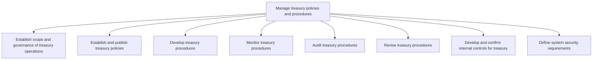
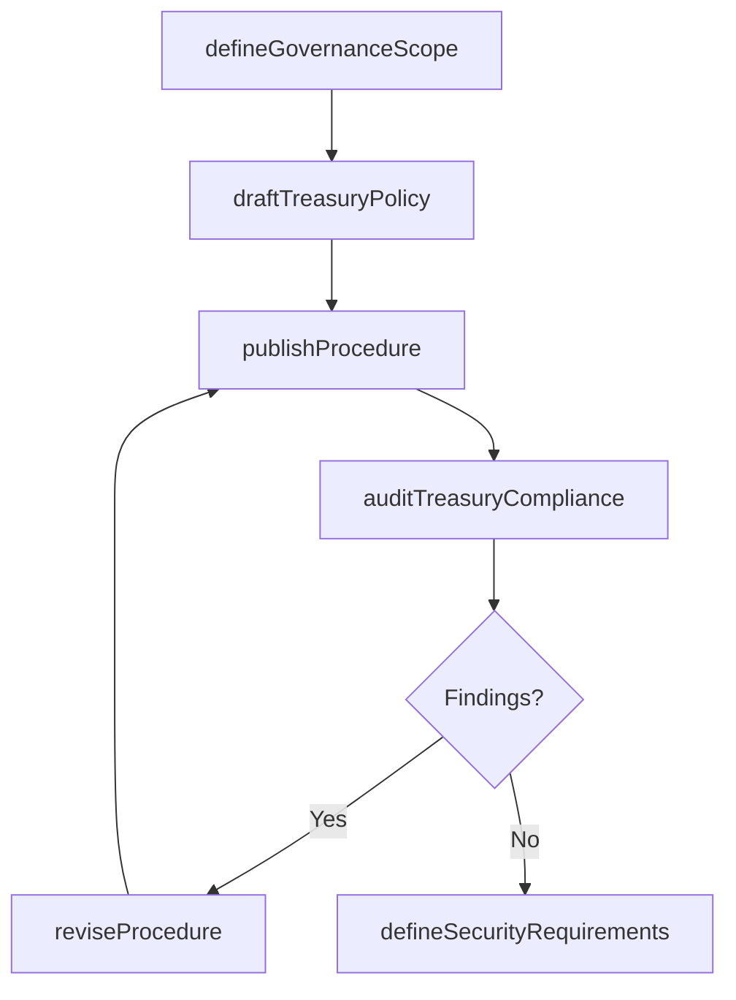

# Manage treasury policies and procedures

> Business-as-Code definition for treasury policy and procedure governance. Models the establishment, documentation, monitoring, auditing, and revision of treasury operating policies, internal controls, and system security requirements.

## Overview

Managing rules and regulations for investments in trading in bonds, currencies, financial derivatives, etc. Establish policies and procedures for investments made. Optimize liquidity in treasury operations.

## Process Hierarchy



## GraphDL

```yaml
manage:
  object: Treasury Policies And Procedures
  actor: TreasuryPolicyManager
  result: TreasuryPolicyDocument
```

## Actions

| Action | Description |
|--------|-------------|
| defineGovernanceScope | Establish the scope and authority structure for treasury operations |
| draftTreasuryPolicy | Create or update treasury operating policies and guidelines |
| publishProcedure | Distribute finalized treasury procedures to stakeholders |
| auditTreasuryCompliance | Conduct periodic audits of treasury procedure adherence |
| reviseProcedure | Update treasury procedures based on audit findings or regulatory changes |
| defineSecurityRequirements | Specify system access controls and data protection standards for treasury systems |

## Events

| Event | Description |
|-------|-------------|
| governanceScopeDefined | Treasury governance scope and authority documented |
| treasuryPolicyDrafted | Treasury policy created or revised |
| procedurePublished | Finalized treasury procedure distributed to stakeholders |
| treasuryComplianceAudited | Audit of treasury procedures completed |
| procedureRevised | Treasury procedure updated based on findings |
| securityRequirementsDefined | Treasury system security standards established |

## Searches

| Search | Description |
|--------|-------------|
| getTreasuryPolicies | Retrieve current treasury policies by category or effective date |
| getAuditFindings | List audit findings and remediation status for treasury procedures |
| getProcedureVersions | Query revision history for a specific treasury procedure |

## Process Flow



## RACI Matrix

| Activity | Responsible | Accountable | Consulted | Informed |
|----------|-------------|-------------|-----------|----------|
| defineGovernanceScope | Treasurer | CFO | LegalCounsel | Board |
| draftTreasuryPolicy | TreasuryPolicyManager | Treasurer | RiskManager | Controller |
| auditTreasuryCompliance | InternalAuditor | ChiefAuditExecutive | Treasurer | CFO |
| defineSecurityRequirements | ITSecurity | Treasurer | CIO | TreasuryStaff |

## Sub-Processes

| ID | Name | Description |
|----|------|-------------|
| 9.7.1.1 | Establish scope and governance of treasury operations | Selecting opportunities and the authoritative body for investments in trading in bonds, currencies,  |
| 9.7.1.2 | Establish and publish treasury policies | Creating and providing investment regulations for the organization. Establish policies and procedure |
| 9.7.1.3 | Develop treasury procedures | Making processes for investing. Create steps for investments in bonds, currencies, and financial der |
| 9.7.1.4 | Monitor treasury procedures | Checking treasury processes in order to optimize company's liquidity, invest excess cash, and reduce |
| 9.7.1.5 | Audit treasury procedures | Auditing the treasury function. |
| 9.7.1.6 | Revise treasury procedures | Reassessing all treasury procedures based on audit findings. |
| 9.7.1.7 | Develop and confirm internal controls for treasury | Creating and managing the internal control systems for investments in bonds, currencies, and financi |
| 9.7.1.8 | Define system security requirements | Describing the need of system security requirements for controlling access, reliability of informati |

## Related Processes

| Process | Relationship |
|---------|-------------|
| 9.7.3 Manage cash | Downstream - cash management follows treasury policies |
| 9.7.5 Manage debt and investment | Downstream - investment activities governed by treasury policies |
| 9.8.1 Establish internal controls, policies, and procedures | Parallel - treasury controls align with enterprise control framework |

## Related Departments

| Department | Role |
|-----------|------|
| Treasury | Primary owner of policy development and procedure governance |
| Internal Audit | Conducts periodic audits of treasury procedures |
| Legal | Reviews regulatory requirements affecting treasury policies |
| IT Security | Defines and enforces system access controls |

## Related Occupations

| Occupation | Involvement |
|-----------|-------------|
| Treasury Policy Manager | Drafts and maintains treasury operating procedures |
| Internal Auditor | Evaluates compliance with treasury policies |
| IT Security Analyst | Configures treasury system access controls |

## KPIs

| KPI | Description | Unit |
|-----|-------------|------|
| Policy Review Timeliness | Percentage of policies reviewed within scheduled cycle | % |
| Audit Finding Closure Rate | Percentage of audit findings remediated within target period | % |
| Procedure Currency | Average age of treasury procedures since last revision | Months |

## Usage

```typescript
import { manageTreasuryPoliciesAndProcedures } from '@headlessly/manage-treasury-policies-and-procedures'

const policies = manageTreasuryPoliciesAndProcedures()

// Draft a new investment policy
const policy = await policies.draftTreasuryPolicy({
  category: 'investment-guidelines',
  effectiveDate: '2025-04-01',
  approvers: ['Treasurer', 'CFO']
})

// Audit treasury procedure compliance
const audit = await policies.auditTreasuryCompliance({
  scope: 'cash-management',
  period: 'Q1-2025',
  framework: 'SOX-302'
})
```
