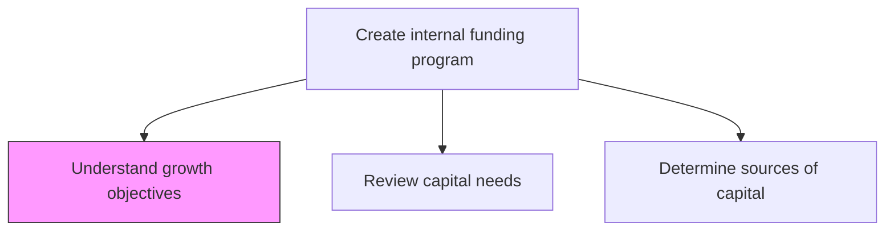
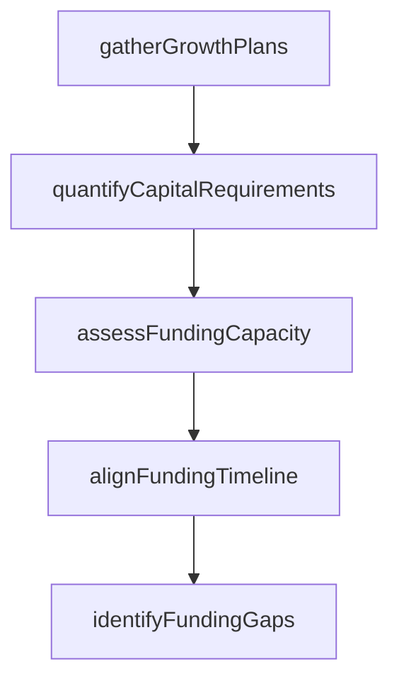

# Understand the organization's growth objectives

> Business-as-Code definition for growth objective analysis within treasury. Models the assessment and alignment of organizational growth targets with treasury funding capacity, capital structure, and liquidity requirements.

## Overview

Gathering and interpreting the organization's strategic growth plans, expansion targets, and market entry objectives. Translating business growth ambitions into quantifiable capital requirements that treasury can plan for and support through appropriate funding vehicles.

## Process Hierarchy



## GraphDL

```yaml
understand:
  object: Organization's Growth Objectives
  actor: TreasuryStrategist
  result: GrowthFundingAssessment
```

## Actions

| Action | Description |
|--------|-------------|
| gatherGrowthPlans | Collect strategic growth plans from business units and executive leadership |
| quantifyCapitalRequirements | Translate growth objectives into specific capital requirements |
| assessFundingCapacity | Evaluate current treasury capacity to support planned growth |
| alignFundingTimeline | Map capital needs against projected growth milestones |
| identifyFundingGaps | Highlight gaps between growth ambitions and available funding |

## Events

| Event | Description |
|-------|-------------|
| growthPlansGathered | Strategic growth plans collected from all business units |
| capitalRequirementsQuantified | Growth objectives translated into capital figures |
| fundingCapacityAssessed | Treasury capacity evaluation completed |
| fundingTimelineAligned | Capital needs mapped to growth milestones |
| fundingGapsIdentified | Gaps between growth plans and funding capacity documented |

## Searches

| Search | Description |
|--------|-------------|
| getGrowthObjectives | Retrieve current growth objectives by business unit or region |
| getCapitalRequirements | Query capital requirements by growth initiative |
| getFundingGapAnalysis | Retrieve gap analysis between growth needs and funding capacity |

## Process Flow



## RACI Matrix

| Activity | Responsible | Accountable | Consulted | Informed |
|----------|-------------|-------------|-----------|----------|
| gatherGrowthPlans | TreasuryStrategist | Treasurer | BusinessUnitLeads | CFO |
| quantifyCapitalRequirements | TreasuryAnalyst | TreasuryStrategist | FPATeam | Treasurer |
| assessFundingCapacity | TreasuryStrategist | Treasurer | CreditAnalyst | CFO |

## Related Processes

| Process | Relationship |
|---------|-------------|
| 9.7.2.2 Review organization's capital needs/budgets | Downstream - capital needs derived from growth objectives |
| 9.7.2.3 Determine sources and uses of capital | Downstream - funding sources mapped to growth requirements |
| 9.7.1 Manage treasury policies and procedures | Upstream - policies govern growth funding approach |

## Related Departments

| Department | Role |
|-----------|------|
| Treasury | Leads assessment of funding capacity for growth |
| Corporate Strategy | Provides growth objectives and expansion plans |
| Finance | Contributes budget and forecast data |

## Related Occupations

| Occupation | Involvement |
|-----------|-------------|
| Treasury Strategist | Aligns funding strategy with growth objectives |
| Financial Analyst | Quantifies capital requirements for growth initiatives |

## KPIs

| KPI | Description | Unit |
|-----|-------------|------|
| Growth Funding Coverage | Percentage of growth initiatives with confirmed funding paths | % |
| Capital Gap Ratio | Unfunded capital needs as a percentage of total growth requirements | % |
| Assessment Cycle Time | Days to complete growth-to-funding alignment analysis | Days |

## Usage

```typescript
import { understandOrganizationsGrowthObjectives } from '@headlessly/understand-organizations-growth-objectives'

const growth = understandOrganizationsGrowthObjectives()

const assessment = await growth.gatherGrowthPlans({
  fiscalYear: 2025,
  businessUnits: ['retail', 'wholesale', 'digital'],
  includeMATargets: true
})

// Identify gaps between growth plans and available funding
const gaps = await growth.identifyFundingGaps({
  fiscalYear: 2025,
  includeContingencyBuffer: true,
  minimumCoverageRatio: 1.2
})
```
