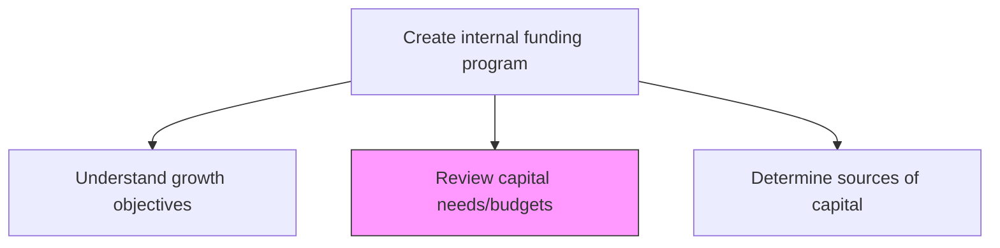
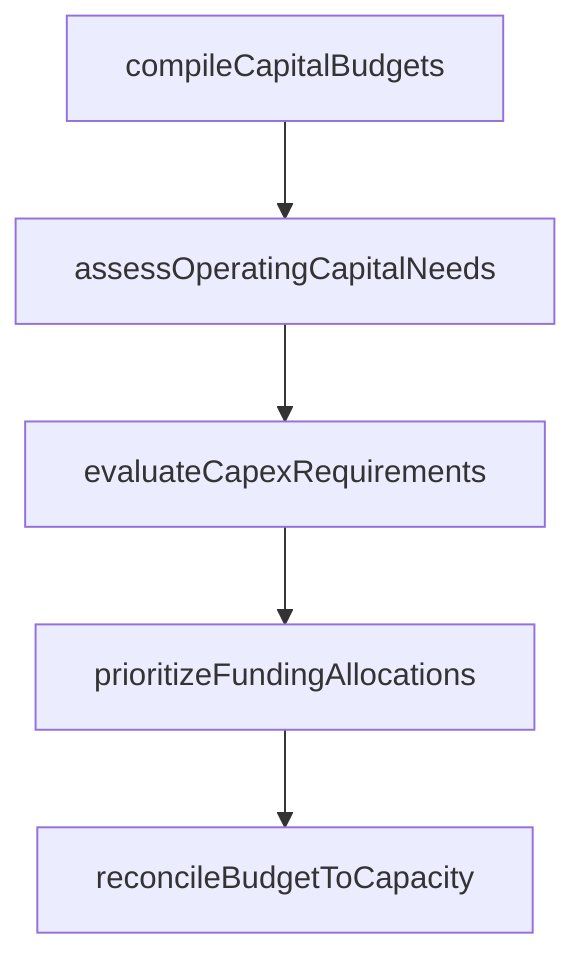

# Review organization's capital needs/budgets

> Business-as-Code definition for capital needs and budget review. Models the systematic evaluation of organizational capital requirements, budget allocations, and funding priorities across business units and strategic initiatives.

## Overview

Reviewing an organization's capital needs and budgets. Assessing cash requirements to fund operating activities, capital investments, and strategic initiatives. Comparing capital budgets against available resources to prioritize funding decisions.

## Process Hierarchy



## GraphDL

```yaml
review:
  object: Organization's Capital Needs/budgets
  actor: CapitalPlanningAnalyst
  result: CapitalNeedsAssessment
```

## Actions

| Action | Description |
|--------|-------------|
| compileCapitalBudgets | Aggregate capital budgets from all business units and subsidiaries |
| assessOperatingCapitalNeeds | Evaluate working capital requirements for ongoing operations |
| evaluateCapexRequirements | Review capital expenditure requests and investment proposals |
| prioritizeFundingAllocations | Rank capital needs by strategic priority and return potential |
| reconcileBudgetToCapacity | Compare total capital needs against available funding sources |

## Events

| Event | Description |
|-------|-------------|
| capitalBudgetsCompiled | Business unit capital budgets aggregated |
| operatingCapitalAssessed | Working capital requirements evaluated |
| capexRequirementsEvaluated | Capital expenditure proposals reviewed |
| fundingAllocationsPrioritized | Capital needs ranked by priority |
| budgetReconciledToCapacity | Total needs compared against available funding |

## Searches

| Search | Description |
|--------|-------------|
| getCapitalBudgets | Retrieve capital budgets by business unit, period, or category |
| getCapexPipeline | Query pending capital expenditure requests |
| getFundingPriorities | List capital needs ranked by strategic priority |

## Process Flow



## RACI Matrix

| Activity | Responsible | Accountable | Consulted | Informed |
|----------|-------------|-------------|-----------|----------|
| compileCapitalBudgets | CapitalPlanningAnalyst | Treasurer | BusinessUnitControllers | CFO |
| evaluateCapexRequirements | CapitalPlanningAnalyst | Treasurer | ProjectManagers | CFO |
| prioritizeFundingAllocations | Treasurer | CFO | StrategyTeam | Board |

## Related Processes

| Process | Relationship |
|---------|-------------|
| 9.7.2.1 Understand growth objectives | Upstream - growth objectives drive capital needs |
| 9.7.2.3 Determine sources and uses of capital | Downstream - needs assessment informs capital sourcing |
| 9.7.3 Manage cash | Parallel - cash management supports capital deployment |

## Related Departments

| Department | Role |
|-----------|------|
| Treasury | Reviews and consolidates capital requirements |
| Finance | Provides budget data and financial projections |
| Corporate Development | Submits M&A and strategic investment capital requests |

## Related Occupations

| Occupation | Involvement |
|-----------|-------------|
| Capital Planning Analyst | Compiles and analyzes capital budget submissions |
| Treasurer | Approves capital allocation priorities |

## KPIs

| KPI | Description | Unit |
|-----|-------------|------|
| Budget Submission Completeness | Percentage of business units with submitted capital budgets | % |
| Capital Utilization Rate | Actual capital deployment versus approved budget | % |
| Review Cycle Time | Days to complete capital needs review process | Days |

## Usage

```typescript
import { reviewOrganizationsCapitalNeedsBudgets } from '@headlessly/review-organizations-capital-needs-budgets'

const review = reviewOrganizationsCapitalNeedsBudgets()

const needs = await review.compileCapitalBudgets({
  fiscalYear: 2025,
  includeContingencies: true,
  categories: ['operating', 'capex', 'strategic']
})

// Prioritize funding allocations based on strategic value and ROI
const priorities = await review.prioritizeFundingAllocations({
  fiscalYear: 2025,
  scoringCriteria: ['strategic-alignment', 'roi', 'risk-adjusted-return'],
  availableCapital: 500000000
})
```
