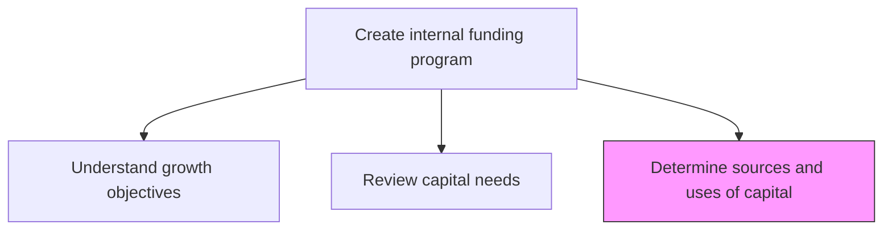
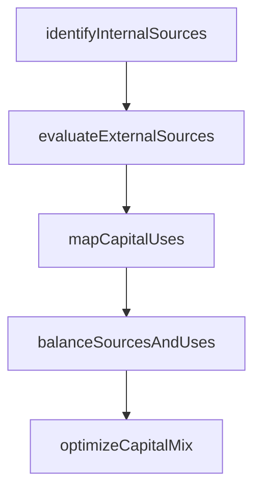

# Determine sources and uses of capital

> Business-as-Code definition for capital source and use determination. Models the identification, evaluation, and allocation of internal and external funding sources against planned capital expenditures, operating needs, and strategic investments.

## Overview

Identifying and evaluating available sources of capital including retained earnings, debt instruments, equity issuance, and asset monetization. Mapping these sources against planned uses such as capital expenditures, acquisitions, working capital, and debt repayment to create a balanced funding plan.

## Process Hierarchy



## GraphDL

```yaml
determine:
  object: Sources And Uses Of Capital
  actor: CapitalStructureAnalyst
  result: SourcesAndUsesStatement
```

## Actions

| Action | Description |
|--------|-------------|
| identifyInternalSources | Catalog internal capital sources including retained earnings and cash reserves |
| evaluateExternalSources | Assess external funding options such as debt, equity, and hybrid instruments |
| mapCapitalUses | Document all planned capital deployments by category and timeline |
| balanceSourcesAndUses | Align funding sources with capital uses to ensure coverage |
| optimizeCapitalMix | Determine optimal blend of internal and external capital |

## Events

| Event | Description |
|-------|-------------|
| internalSourcesIdentified | Internal capital sources cataloged and quantified |
| externalSourcesEvaluated | External funding options assessed and ranked |
| capitalUsesMapped | Planned capital deployments documented |
| sourcesAndUsesBalanced | Funding sources aligned with capital needs |
| capitalMixOptimized | Optimal capital structure determined |

## Searches

| Search | Description |
|--------|-------------|
| getCapitalSources | List available funding sources by type, cost, and capacity |
| getCapitalUses | Query planned capital deployments by category |
| getSourcesAndUsesStatement | Retrieve balanced sources and uses analysis |

## Process Flow



## RACI Matrix

| Activity | Responsible | Accountable | Consulted | Informed |
|----------|-------------|-------------|-----------|----------|
| identifyInternalSources | CapitalStructureAnalyst | Treasurer | Controller | CFO |
| evaluateExternalSources | CapitalStructureAnalyst | Treasurer | InvestmentBanker | CFO |
| optimizeCapitalMix | Treasurer | CFO | BoardFinanceCommittee | Board |

## Related Processes

| Process | Relationship |
|---------|-------------|
| 9.7.2.2 Review capital needs/budgets | Upstream - capital needs drive source identification |
| 9.7.2.4 Create alternative financing programs | Downstream - sources inform financing program design |
| 9.7.5 Manage debt and investment | Parallel - debt/investment execution of sourcing decisions |

## Related Departments

| Department | Role |
|-----------|------|
| Treasury | Leads capital sourcing strategy |
| Finance | Provides financial projections for capital planning |
| Legal | Reviews terms of external capital arrangements |

## Related Occupations

| Occupation | Involvement |
|-----------|-------------|
| Capital Structure Analyst | Evaluates and optimizes capital mix |
| Treasurer | Approves capital sourcing decisions |

## KPIs

| KPI | Description | Unit |
|-----|-------------|------|
| Weighted Average Cost of Capital | Blended cost of all capital sources | % |
| Funding Coverage Ratio | Total available sources divided by total planned uses | Ratio |
| Internal Funding Ratio | Percentage of capital needs met through internal sources | % |

## Usage

```typescript
import { determineSourcesAndUsesOfCapital } from '@headlessly/determine-sources-and-uses-of-capital'

const capital = determineSourcesAndUsesOfCapital()

const analysis = await capital.balanceSourcesAndUses({
  planningHorizon: '3-year',
  includeContingency: true,
  targetDebtToEquity: 0.45
})

// Optimize the mix of internal and external capital sources
const optimized = await capital.optimizeCapitalMix({
  constraints: { maxDebtRatio: 0.50, minLiquidity: 100000000 },
  objectives: ['minimize-wacc', 'maintain-credit-rating'],
  ratingTarget: 'BBB+'
})
```
