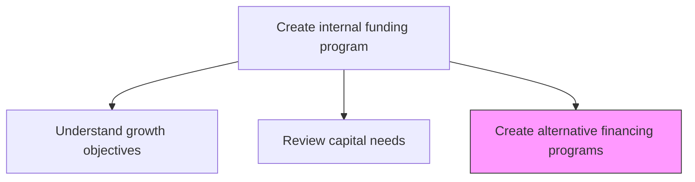
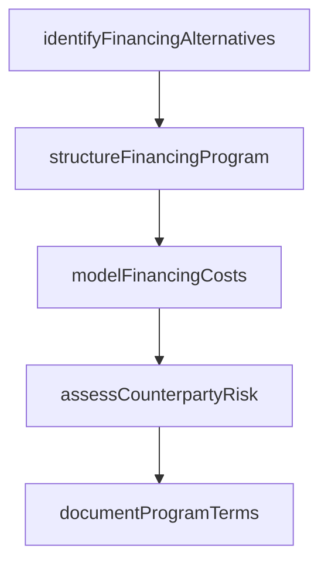

# Create alternative financing programs

> Business-as-Code definition for alternative financing program creation. Models the design and structuring of non-traditional funding vehicles such as revolving credit facilities, asset-backed securities, supply chain finance, and intercompany lending programs.

## Overview

Designing and structuring alternative financing programs beyond traditional bank debt and equity issuance. Developing creative funding solutions such as revolving credit facilities, commercial paper programs, asset securitization, supply chain financing, and internal capital markets to diversify funding sources and reduce cost of capital.

## Process Hierarchy



## GraphDL

```yaml
create:
  object: Alternative Financing Programs
  actor: TreasuryFinancingManager
  result: FinancingProgram
```

## Actions

| Action | Description |
|--------|-------------|
| identifyFinancingAlternatives | Research and catalog non-traditional financing structures |
| structureFinancingProgram | Design the terms, covenants, and mechanics of the financing vehicle |
| modelFinancingCosts | Calculate all-in costs including fees, interest, and operational expenses |
| assessCounterpartyRisk | Evaluate creditworthiness and reliability of financing counterparties |
| documentProgramTerms | Prepare term sheets, agreements, and program documentation |

## Events

| Event | Description |
|-------|-------------|
| financingAlternativesIdentified | Non-traditional financing options cataloged |
| financingProgramStructured | Program terms and mechanics designed |
| financingCostsModeled | All-in program costs calculated |
| counterpartyRiskAssessed | Financing counterparty evaluations completed |
| programTermsDocumented | Program documentation prepared |

## Searches

| Search | Description |
|--------|-------------|
| getFinancingAlternatives | List available financing structures by type and cost |
| getProgramStructure | Retrieve program terms and mechanics for a specific vehicle |
| getCounterpartyProfiles | Query counterparty credit and risk profiles |

## Process Flow



## RACI Matrix

| Activity | Responsible | Accountable | Consulted | Informed |
|----------|-------------|-------------|-----------|----------|
| identifyFinancingAlternatives | TreasuryFinancingManager | Treasurer | InvestmentBanker | CFO |
| structureFinancingProgram | TreasuryFinancingManager | Treasurer | LegalCounsel | CFO |
| modelFinancingCosts | TreasuryAnalyst | TreasuryFinancingManager | Controller | Treasurer |

## Related Processes

| Process | Relationship |
|---------|-------------|
| 9.7.2.3 Determine sources and uses of capital | Upstream - capital sourcing decisions drive program design |
| 9.7.2.5 Evaluate alternative financing programs | Downstream - created programs are evaluated for selection |
| 9.7.5 Manage debt and investment | Parallel - programs feed into debt management |

## Related Departments

| Department | Role |
|-----------|------|
| Treasury | Designs and manages financing programs |
| Legal | Reviews and approves program documentation |
| Finance | Validates cost models and accounting treatment |

## Related Occupations

| Occupation | Involvement |
|-----------|-------------|
| Treasury Financing Manager | Leads program design and structuring |
| Treasury Analyst | Models costs and analyzes alternatives |

## KPIs

| KPI | Description | Unit |
|-----|-------------|------|
| Program Design Cycle Time | Days from initiation to completed program documentation | Days |
| Cost of Financing | All-in cost of the financing program versus benchmark | bps |
| Alternative Funding Ratio | Percentage of total funding from alternative programs | % |

## Usage

```typescript
import { createAlternativeFinancingPrograms } from '@headlessly/create-alternative-financing-programs'

const financing = createAlternativeFinancingPrograms()

const program = await financing.structureFinancingProgram({
  type: 'revolving-credit',
  facilitySize: 250000000,
  tenor: '5-year',
  currency: 'USD'
})

// Model all-in financing costs for comparison
const costs = await financing.modelFinancingCosts({
  programId: program.id,
  includeCommitmentFees: true,
  scenarios: ['base-rate', 'rate-increase-100bps', 'full-utilization']
})
```
