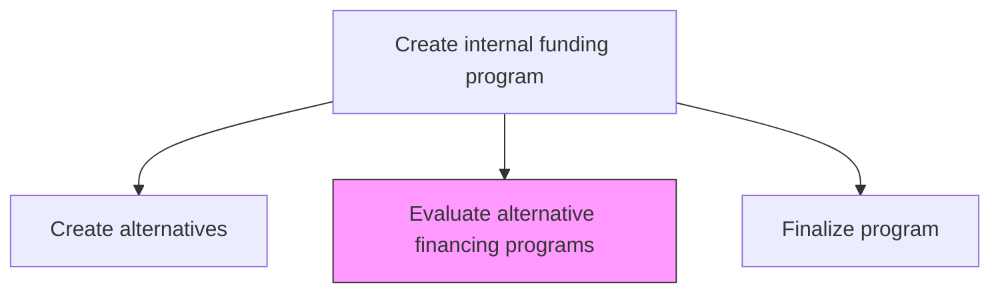
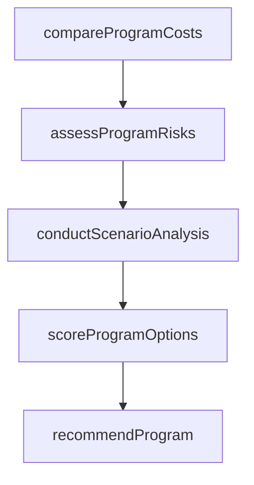

# Evaluate alternative financing programs

> Business-as-Code definition for alternative financing program evaluation. Models the comparative analysis, risk assessment, and scoring of proposed financing programs to select the optimal funding structure for organizational needs.

## Overview

Performing rigorous evaluation of alternative financing programs by comparing costs, terms, risk profiles, and strategic fit. Conducting scenario analysis, stress testing, and stakeholder review to rank and recommend optimal financing structures for executive approval.

## Process Hierarchy



## GraphDL

```yaml
evaluate:
  object: Alternative Financing Programs
  actor: TreasuryEvaluationAnalyst
  result: ProgramEvaluation
```

## Actions

| Action | Description |
|--------|-------------|
| compareProgramCosts | Perform side-by-side cost comparison of alternative financing programs |
| assessProgramRisks | Evaluate risk profiles including credit, market, and operational risks |
| conductScenarioAnalysis | Model program performance under various economic scenarios |
| scoreProgramOptions | Apply weighted scoring criteria to rank financing alternatives |
| recommendProgram | Prepare recommendation with supporting analysis for approval |

## Events

| Event | Description |
|-------|-------------|
| programCostsCompared | Side-by-side cost comparison completed |
| programRisksAssessed | Risk profiles evaluated for all alternatives |
| scenarioAnalysisConducted | Economic scenario modeling completed |
| programOptionsScored | Financing alternatives ranked by weighted criteria |
| programRecommended | Recommendation prepared for executive review |

## Searches

| Search | Description |
|--------|-------------|
| getProgramComparison | Retrieve side-by-side comparison of financing programs |
| getScenarioResults | Query scenario analysis results by program and assumption |
| getProgramScorecard | Retrieve weighted scoring results for all alternatives |

## Process Flow



## RACI Matrix

| Activity | Responsible | Accountable | Consulted | Informed |
|----------|-------------|-------------|-----------|----------|
| compareProgramCosts | TreasuryEvaluationAnalyst | TreasuryFinancingManager | Controller | CFO |
| conductScenarioAnalysis | TreasuryEvaluationAnalyst | Treasurer | RiskManager | CFO |
| recommendProgram | TreasuryFinancingManager | Treasurer | CFO | Board |

## Related Processes

| Process | Relationship |
|---------|-------------|
| 9.7.2.4 Create alternative financing programs | Upstream - created programs are evaluated |
| 9.7.2.6 Finalize financing program | Downstream - selected program moves to finalization |
| 9.7.6 Monitor and execute risk and hedging transactions | Parallel - risk assessment informs hedging needs |

## Related Departments

| Department | Role |
|-----------|------|
| Treasury | Leads program evaluation and recommendation |
| Risk Management | Provides risk assessment frameworks and analysis |
| Finance | Validates financial models and cost assumptions |

## Related Occupations

| Occupation | Involvement |
|-----------|-------------|
| Treasury Evaluation Analyst | Conducts comparative analysis of financing programs |
| Risk Manager | Assesses risk profiles of financing alternatives |

## KPIs

| KPI | Description | Unit |
|-----|-------------|------|
| Evaluation Thoroughness | Number of criteria assessed per financing alternative | Count |
| Scenario Coverage | Number of economic scenarios modeled per program | Count |
| Decision Turnaround | Days from evaluation start to executive recommendation | Days |

## Usage

```typescript
import { evaluateAlternativeFinancingPrograms } from '@headlessly/evaluate-alternative-financing-programs'

const evaluation = evaluateAlternativeFinancingPrograms()

const scorecard = await evaluation.scoreProgramOptions({
  programs: ['revolving-credit', 'commercial-paper', 'securitization'],
  criteria: ['cost', 'flexibility', 'risk', 'speed'],
  weights: { cost: 0.35, flexibility: 0.25, risk: 0.25, speed: 0.15 }
})

// Conduct scenario analysis under different economic conditions
const scenarios = await evaluation.conductScenarioAnalysis({
  programId: 'revolving-credit',
  assumptions: [
    { name: 'base', rateEnvironment: 'stable', utilizationRate: 0.50 },
    { name: 'stress', rateEnvironment: 'rising-200bps', utilizationRate: 0.90 }
  ]
})
```
