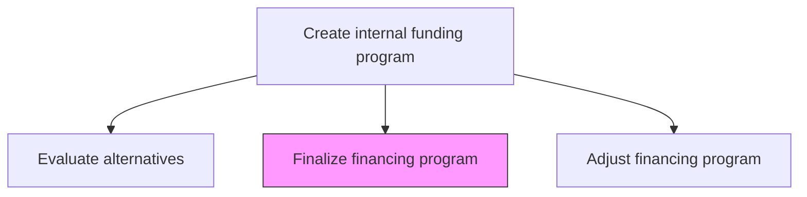
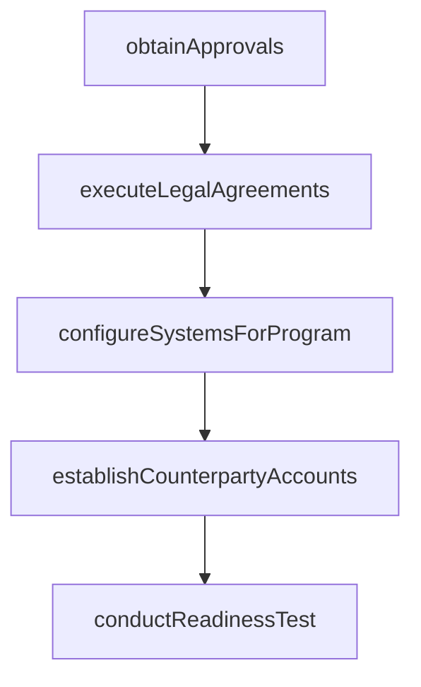

# Finalize financing program

> Business-as-Code definition for financing program finalization. Models the closing process for selected financing programs including legal documentation, counterparty execution, regulatory filings, and system configuration for operational readiness.

## Overview

Completing all steps required to make a selected financing program operational. Executing legal agreements, obtaining board and regulatory approvals, configuring treasury management systems, establishing counterparty accounts, and conducting operational readiness testing prior to program launch.

## Process Hierarchy



## GraphDL

```yaml
finalize:
  object: Financing Program
  actor: TreasuryFinancingManager
  result: FinalizedProgram
```

## Actions

| Action | Description |
|--------|-------------|
| obtainApprovals | Secure board, committee, and regulatory approvals for the program |
| executeLegalAgreements | Finalize and execute all program legal documentation |
| configureSystemsForProgram | Set up treasury management system parameters for the new program |
| establishCounterpartyAccounts | Open and configure accounts with financing counterparties |
| conductReadinessTest | Perform end-to-end operational test before program launch |

## Events

| Event | Description |
|-------|-------------|
| approvalsObtained | All required approvals received |
| legalAgreementsExecuted | Program legal documentation signed and filed |
| systemsConfigured | Treasury systems configured for the new program |
| counterpartyAccountsEstablished | Counterparty accounts opened and active |
| readinessTestCompleted | Operational readiness test passed |

## Searches

| Search | Description |
|--------|-------------|
| getApprovalStatus | Track approval status across required signatories |
| getLegalDocumentStatus | Query status of program legal documentation |
| getReadinessChecklist | Retrieve operational readiness checklist and completion status |

## Process Flow



## RACI Matrix

| Activity | Responsible | Accountable | Consulted | Informed |
|----------|-------------|-------------|-----------|----------|
| obtainApprovals | TreasuryFinancingManager | CFO | BoardSecretary | Board |
| executeLegalAgreements | TreasuryFinancingManager | Treasurer | LegalCounsel | CFO |
| conductReadinessTest | TreasuryOperationsManager | TreasuryFinancingManager | ITSystems | Treasurer |

## Related Processes

| Process | Relationship |
|---------|-------------|
| 9.7.2.5 Evaluate alternative financing programs | Upstream - selected program moves to finalization |
| 9.7.2.7 Adjust financing program | Downstream - finalized program may require adjustments |
| 9.7.1 Manage treasury policies and procedures | Parallel - policies govern program setup requirements |

## Related Departments

| Department | Role |
|-----------|------|
| Treasury | Leads program finalization and launch |
| Legal | Executes and files program documentation |
| IT | Configures treasury management systems |

## Related Occupations

| Occupation | Involvement |
|-----------|-------------|
| Treasury Financing Manager | Manages program closing process |
| Legal Counsel | Reviews and executes legal agreements |

## KPIs

| KPI | Description | Unit |
|-----|-------------|------|
| Closing Cycle Time | Days from program selection to operational readiness | Days |
| Approval Completion Rate | Percentage of required approvals obtained on schedule | % |
| System Configuration Accuracy | Percentage of system parameters correctly configured at first setup | % |

## Usage

```typescript
import { finalizeFinancingProgram } from '@headlessly/finalize-financing-program'

const finalization = finalizeFinancingProgram()

const readiness = await finalization.conductReadinessTest({
  programId: 'RCF-2025-001',
  testScenarios: ['drawdown', 'repayment', 'rollover'],
  validateAccounting: true
})

// Track approval status across all required signatories
const approvalStatus = await finalization.getApprovalStatus({
  programId: 'RCF-2025-001',
  includeTimeline: true
})
```
