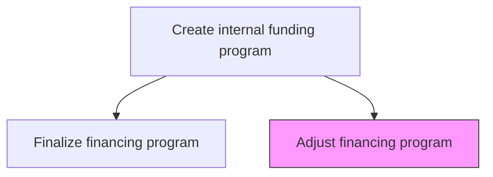
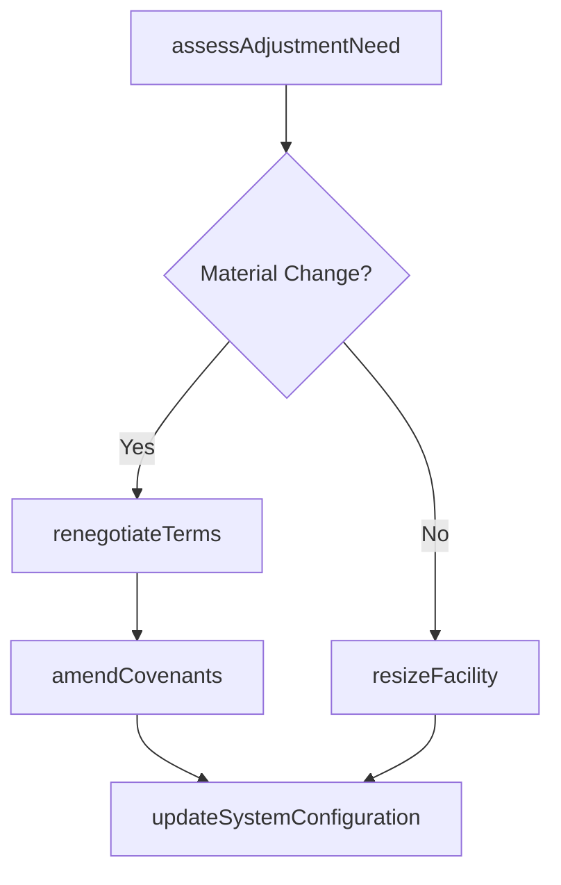

# Adjust financing program

> Business-as-Code definition for financing program adjustment. Models the ongoing modification of existing financing programs in response to changing business conditions, market movements, covenant compliance needs, and organizational restructuring.

## Overview

Modifying existing financing programs to reflect changes in business conditions, market interest rates, organizational structure, or regulatory requirements. Includes renegotiating terms, amending covenants, adjusting facility sizes, extending maturities, and reconfiguring treasury systems to accommodate program changes.

## Process Hierarchy



## GraphDL

```yaml
adjust:
  object: Financing Program
  actor: TreasuryFinancingManager
  result: ProgramAmendment
```

## Actions

| Action | Description |
|--------|-------------|
| assessAdjustmentNeed | Identify triggers and rationale for financing program modification |
| renegotiateTerms | Engage counterparties to modify program terms and conditions |
| amendCovenants | Update financial covenants to reflect changed circumstances |
| resizeFacility | Increase or decrease facility size to match current needs |
| updateSystemConfiguration | Reconfigure treasury systems to reflect program amendments |

## Events

| Event | Description |
|-------|-------------|
| adjustmentNeedAssessed | Program modification triggers documented and approved |
| termsRenegotiated | Counterparty negotiations concluded with amended terms |
| covenantsAmended | Financial covenants updated in program documentation |
| facilityResized | Program facility size adjusted to current requirements |
| systemConfigurationUpdated | Treasury systems reconfigured for amended program |

## Searches

| Search | Description |
|--------|-------------|
| getAdjustmentHistory | Retrieve history of amendments for a financing program |
| getCovenantStatus | Query current covenant compliance status |
| getFacilityUtilization | Track facility usage relative to committed size |

## Process Flow



## RACI Matrix

| Activity | Responsible | Accountable | Consulted | Informed |
|----------|-------------|-------------|-----------|----------|
| assessAdjustmentNeed | TreasuryFinancingManager | Treasurer | RiskManager | CFO |
| renegotiateTerms | TreasuryFinancingManager | Treasurer | LegalCounsel | CFO |
| updateSystemConfiguration | TreasuryOperationsManager | TreasuryFinancingManager | ITSystems | Treasurer |

## Related Processes

| Process | Relationship |
|---------|-------------|
| 9.7.2.6 Finalize financing program | Upstream - finalized programs may require subsequent adjustments |
| 9.7.6 Monitor and execute risk and hedging transactions | Parallel - program changes may affect hedging strategy |
| 9.7.1 Manage treasury policies and procedures | Governance - policies dictate amendment authority |

## Related Departments

| Department | Role |
|-----------|------|
| Treasury | Leads program amendment process |
| Legal | Reviews and executes amendment documentation |
| Risk Management | Assesses impact of program changes on risk profile |

## Related Occupations

| Occupation | Involvement |
|-----------|-------------|
| Treasury Financing Manager | Manages program modification process |
| Legal Counsel | Drafts and reviews amendment agreements |

## KPIs

| KPI | Description | Unit |
|-----|-------------|------|
| Amendment Frequency | Number of program modifications per year | Count |
| Covenant Compliance Rate | Percentage of periods with full covenant compliance | % |
| Facility Utilization Rate | Average drawn amount as percentage of committed facility | % |

## Usage

```typescript
import { adjustFinancingProgram } from '@headlessly/adjust-financing-program'

const adjustment = adjustFinancingProgram()

const amendment = await adjustment.renegotiateTerms({
  programId: 'RCF-2025-001',
  requestedChanges: { facilitySize: 300000000, maturityExtension: '2-year' },
  rationale: 'Increased capital needs from acquisition'
})

// Check current covenant compliance status
const covenants = await adjustment.getCovenantStatus({
  programId: 'RCF-2025-001',
  asOfDate: '2025-03-31',
  includeProjections: true
})
```
