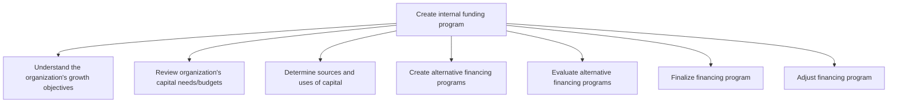
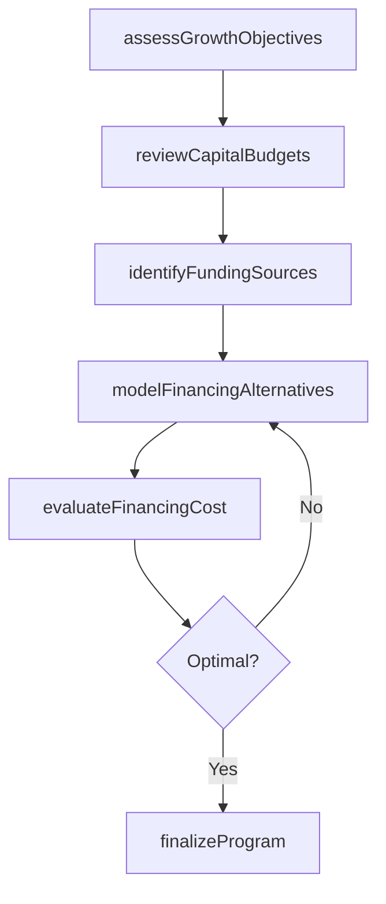

# Create internal funding program

> Business-as-Code definition for internal funding program creation. Models the process of aligning capital needs with growth objectives, evaluating financing alternatives, and establishing internal funding mechanisms to support business unit capital requirements.

## Overview

Designing and implementing internal funding programs that align the organization's capital allocation with its strategic growth objectives. Reviewing capital budgets, determining sources and uses of funds, creating and evaluating alternative financing structures, and finalizing funding programs that optimize the organization's cost of capital.

## Process Hierarchy



## GraphDL

```yaml
create:
  object: Internal Funding Program
  actor: TreasuryAnalyst
  result: FundingProgram
```

## Actions

| Action | Description |
|--------|-------------|
| assessGrowthObjectives | Analyze organizational growth targets and capital implications |
| reviewCapitalBudgets | Evaluate business unit capital needs and budget requests |
| identifyFundingSources | Determine internal and external sources of capital |
| modelFinancingAlternatives | Create financial models comparing funding options |
| evaluateFinancingCost | Assess cost of capital and risk profile for each alternative |
| finalizeProgram | Select and formalize the internal funding structure |

## Events

| Event | Description |
|-------|-------------|
| growthObjectivesAssessed | Growth targets reviewed and capital needs quantified |
| capitalBudgetsReviewed | Business unit capital requirements evaluated |
| fundingSourcesIdentified | Available capital sources cataloged and assessed |
| financingAlternativesModeled | Financial models completed for funding options |
| financingCostEvaluated | Cost-benefit analysis finalized for each alternative |
| programFinalized | Internal funding program structure approved |

## Searches

| Search | Description |
|--------|-------------|
| getCapitalRequests | Retrieve business unit capital funding requests by period |
| getFundingPrograms | List active and proposed internal funding programs |
| getFinancingModels | Query financial models and scenario analyses for funding options |

## Process Flow



## RACI Matrix

| Activity | Responsible | Accountable | Consulted | Informed |
|----------|-------------|-------------|-----------|----------|
| assessGrowthObjectives | TreasuryAnalyst | Treasurer | StrategyTeam | CFO |
| reviewCapitalBudgets | FPAAnalyst | Treasurer | BusinessUnitLeads | Controller |
| modelFinancingAlternatives | TreasuryAnalyst | Treasurer | InvestmentBanker | Board |
| finalizeProgram | Treasurer | CFO | LegalCounsel | BusinessUnitLeads |

## Sub-Processes

| ID | Name | Description |
|----|------|-------------|
| 9.7.2.1 | Understand the organization's growth objectives | Analyzing strategic plans and expansion targets to determine long-term funding requirements. |
| 9.7.2.2 | Review organization's capital needs/budgets | Evaluating capital expenditure plans and working capital requirements across business units. |
| 9.7.2.3 | Determine sources and uses of capital | Identifying available funding sources including debt, equity, and internal cash generation. |
| 9.7.2.4 | Create alternative financing programs | Designing multiple financing structures to meet identified capital needs. |
| 9.7.2.5 | Evaluate alternative financing programs | Assessing cost, risk, and flexibility of each financing alternative. |
| 9.7.2.6 | Finalize financing program | Selecting and formalizing the optimal financing structure and terms. |
| 9.7.2.7 | Adjust financing program | Modifying the funding program in response to changing business conditions or market rates. |

## Related Processes

| Process | Relationship |
|---------|-------------|
| 9.7.1 Manage treasury policies and procedures | Upstream - funding programs must align with treasury policies |
| 9.7.5 Manage debt and investment | Downstream - funding program determines debt and investment activities |
| 9.1 Perform planning and management accounting | Upstream - budget and planning data informs capital needs |

## Related Departments

| Department | Role |
|-----------|------|
| Treasury | Designs and manages internal funding structures |
| Finance | Provides budget data and capital requirements |
| Strategy | Supplies growth objectives and investment priorities |
| Legal | Reviews financing agreements and structures |

## Related Occupations

| Occupation | Involvement |
|-----------|-------------|
| Treasury Analyst | Models funding alternatives and evaluates costs |
| Treasurer | Approves and manages the internal funding program |
| FP&A Analyst | Provides capital budget data and growth projections |

## KPIs

| KPI | Description | Unit |
|-----|-------------|------|
| Weighted Average Cost of Capital | Blended cost of internal and external funding | % |
| Capital Allocation Efficiency | Percentage of allocated capital deployed within plan | % |
| Funding Program Utilization | Percentage of approved funding capacity drawn | % |

## Usage

```typescript
import { createInternalFundingProgram } from '@headlessly/create-internal-funding-program'

const funding = createInternalFundingProgram()

// Review capital budgets across business units
const needs = await funding.reviewCapitalBudgets({
  fiscalYear: 2025,
  businessUnits: ['Manufacturing', 'R&D', 'Sales'],
  includePlannedCapex: true
})

// Model financing alternatives
const models = await funding.modelFinancingAlternatives({
  totalCapitalNeed: 50000000,
  options: ['internal-cash', 'revolving-credit', 'intercompany-loan'],
  targetWACC: 0.08
})
```
