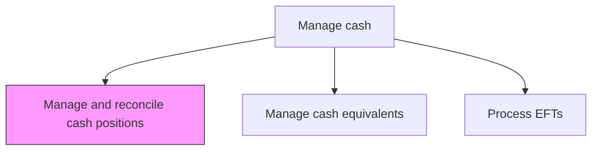
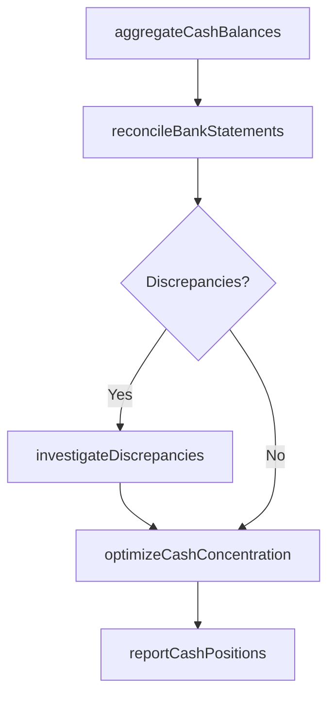

# Manage and reconcile cash positions

> Business-as-Code definition for cash position management and reconciliation. Models the daily monitoring, reconciliation, and optimization of cash balances across all bank accounts, currencies, and legal entities.

## Overview

Monitoring, reconciling, and optimizing cash balances across all bank accounts, currencies, and legal entities on a daily basis. The process involves aggregating cash positions from multiple banking partners, matching internal records against bank statements to identify and resolve discrepancies, and concentrating idle funds into yield-bearing accounts. Accurate cash position management ensures the organization maintains sufficient liquidity while minimizing unproductive balances.

## Process Hierarchy



## GraphDL

```yaml
manage:
  object: And Reconcile Cash Positions
  actor: CashManager
  result: ReconciledCashPosition
```

## Actions

| Action | Description |
|--------|-------------|
| aggregateCashBalances | Collect opening and closing cash balances from all bank accounts |
| reconcileBankStatements | Match internal records against bank statement transactions |
| investigateDiscrepancies | Research and resolve differences between book and bank balances |
| optimizeCashConcentration | Move idle balances to concentration accounts for optimal yield |
| reportCashPositions | Generate daily cash position reports for treasury management |

## Events

| Event | Description |
|-------|-------------|
| cashBalancesAggregated | Cash balances collected from all accounts |
| bankStatementsReconciled | Internal records matched against bank statements |
| discrepanciesInvestigated | Balance differences researched and resolved |
| cashConcentrationOptimized | Idle funds moved to concentration accounts |
| cashPositionsReported | Daily cash position reports generated |

## Searches

| Search | Description |
|--------|-------------|
| getCashPositions | Retrieve current cash positions by account, entity, or currency |
| getReconciliationStatus | Query reconciliation status for bank accounts |
| getUnreconciledItems | List outstanding unreconciled transactions |

## Process Flow



## RACI Matrix

| Activity | Responsible | Accountable | Consulted | Informed |
|----------|-------------|-------------|-----------|----------|
| aggregateCashBalances | CashManager | Treasurer | BankingOperations | CFO |
| reconcileBankStatements | CashReconciliationAnalyst | CashManager | Accounting | Treasurer |
| reportCashPositions | CashManager | Treasurer | Controller | CFO |

## Related Processes

| Process | Relationship |
|---------|-------------|
| 9.7.3.2 Manage cash equivalents | Parallel - cash equivalents affect total cash positions |
| 9.7.3.4 Develop cash flow forecasts | Downstream - actual positions feed forecast accuracy |
| 9.7.3.7 Manage banking relationships | Supporting - bank account structure impacts reconciliation |

## Related Departments

| Department | Role |
|-----------|------|
| Treasury | Manages daily cash positions and reconciliation |
| Accounting | Provides general ledger entries for reconciliation |
| Banking Operations | Supplies bank statement data and transaction details |

## Related Occupations

| Occupation | Involvement |
|-----------|-------------|
| Cash Manager | Oversees daily cash position management |
| Cash Reconciliation Analyst | Performs bank statement reconciliation |

## KPIs

| KPI | Description | Unit |
|-----|-------------|------|
| Reconciliation Accuracy | Percentage of transactions reconciled without discrepancies | % |
| Days to Reconcile | Average business days to complete monthly reconciliation | Days |
| Idle Cash Ratio | Percentage of total cash sitting unproductively in accounts | % |

## Usage

```typescript
import { manageAndReconcileCashPositions } from '@headlessly/manage-and-reconcile-cash-positions'

const cash = manageAndReconcileCashPositions()

const positions = await cash.aggregateCashBalances({
  date: '2025-03-15',
  entities: ['US-Corp', 'EU-GmbH', 'APAC-Ltd'],
  currencies: ['USD', 'EUR', 'JPY']
})

// List outstanding unreconciled items for investigation
const unreconciled = await cash.getUnreconciledItems({
  agingThreshold: '3-days',
  minimumAmount: 10000,
  sortBy: 'amount-descending'
})
```
