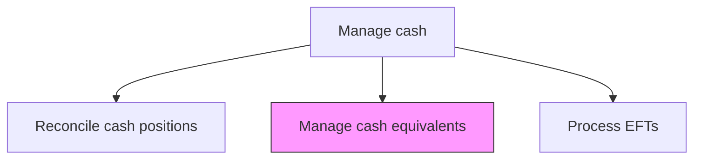
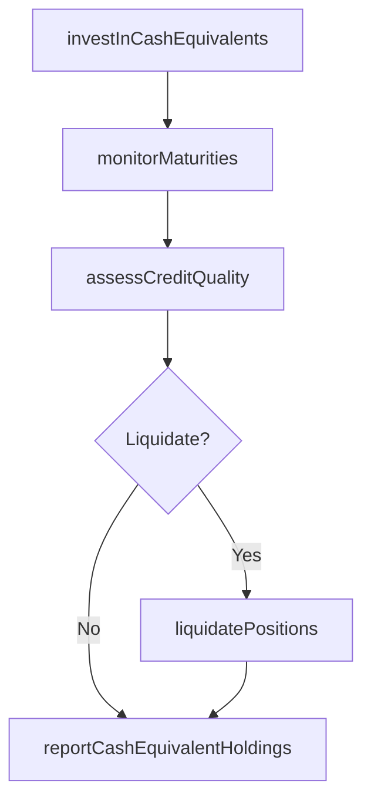

# Manage cash equivalents

> Business-as-Code definition for cash equivalent management. Models the investment, monitoring, and liquidation of short-term highly liquid instruments including money market funds, treasury bills, and commercial paper.

## Overview

Managing the investment, monitoring, and liquidation of short-term highly liquid instruments such as money market funds, treasury bills, commercial paper, and certificates of deposit. The process balances yield optimization with liquidity preservation and credit quality requirements, ensuring that excess cash earns a competitive return while remaining readily available for operational needs. Regular maturity tracking and issuer credit assessment protect the organization from concentration risk and credit deterioration.

## Process Hierarchy



## GraphDL

```yaml
manage:
  object: Cash Equivalents
  actor: ShortTermInvestmentManager
  result: CashEquivalentPortfolio
```

## Actions

| Action | Description |
|--------|-------------|
| investInCashEquivalents | Place funds into short-term liquid instruments |
| monitorMaturities | Track maturity dates and rollover requirements for holdings |
| assessCreditQuality | Evaluate creditworthiness of cash equivalent issuers |
| liquidatePositions | Convert cash equivalents back to cash when needed |
| reportCashEquivalentHoldings | Generate portfolio reports on cash equivalent positions |

## Events

| Event | Description |
|-------|-------------|
| cashEquivalentsInvested | Funds placed into short-term instruments |
| maturitiesMonitored | Maturity tracking updated for all holdings |
| creditQualityAssessed | Issuer creditworthiness evaluations completed |
| positionsLiquidated | Cash equivalents converted to cash |
| cashEquivalentHoldingsReported | Portfolio reports generated |

## Searches

| Search | Description |
|--------|-------------|
| getCashEquivalentHoldings | Retrieve current cash equivalent portfolio by instrument type |
| getUpcomingMaturities | List holdings approaching maturity within a given window |
| getYieldAnalysis | Query yield performance of cash equivalent holdings |

## Process Flow



## RACI Matrix

| Activity | Responsible | Accountable | Consulted | Informed |
|----------|-------------|-------------|-----------|----------|
| investInCashEquivalents | ShortTermInvestmentManager | Treasurer | CreditAnalyst | CFO |
| monitorMaturities | TreasuryAnalyst | ShortTermInvestmentManager | Controller | Treasurer |
| assessCreditQuality | CreditAnalyst | ShortTermInvestmentManager | RiskManager | Treasurer |

## Related Processes

| Process | Relationship |
|---------|-------------|
| 9.7.3.1 Manage and reconcile cash positions | Upstream - excess cash directed to equivalents |
| 9.7.5 Manage debt and investment | Parallel - cash equivalents are part of overall investment strategy |
| 9.7.3.5 Manage cash flows | Supporting - cash equivalent maturities affect cash flow timing |

## Related Departments

| Department | Role |
|-----------|------|
| Treasury | Manages short-term investment portfolio |
| Risk Management | Monitors credit quality of cash equivalent issuers |
| Accounting | Records fair value changes and maturity transactions |

## Related Occupations

| Occupation | Involvement |
|-----------|-------------|
| Short-Term Investment Manager | Directs cash equivalent portfolio decisions |
| Treasury Analyst | Tracks maturities and performs yield analysis |

## KPIs

| KPI | Description | Unit |
|-----|-------------|------|
| Portfolio Yield | Annualized return on cash equivalent holdings | % |
| Average Maturity | Weighted average days to maturity of portfolio | Days |
| Credit Quality Score | Weighted average credit rating of holdings | Rating |

## Usage

```typescript
import { manageCashEquivalents } from '@headlessly/manage-cash-equivalents'

const equiv = manageCashEquivalents()

const portfolio = await equiv.investInCashEquivalents({
  amount: 5000000,
  instrumentType: 'treasury-bill',
  maturity: '90-day',
  minimumCreditRating: 'AA'
})

// Check upcoming maturities to plan reinvestment or liquidation
const maturities = await equiv.getUpcomingMaturities({
  window: '30-days',
  minimumAmount: 1000000,
  includeReinvestmentOptions: true
})
```
