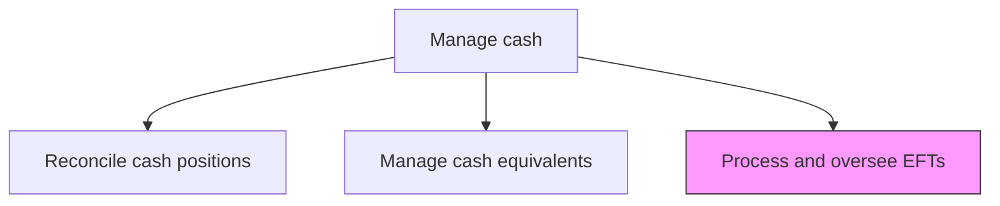
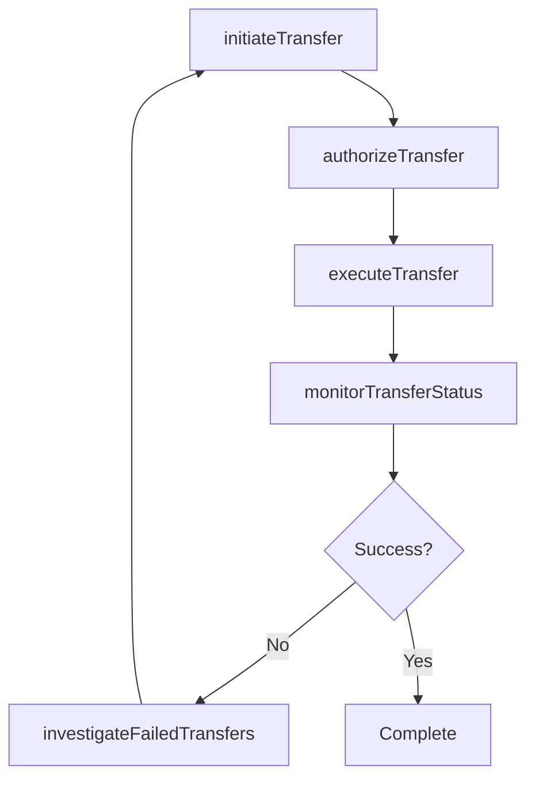

# Process and oversee electronic fund transfers (EFTs)

> Business-as-Code definition for electronic fund transfer processing and oversight. Models the initiation, authorization, execution, and monitoring of wire transfers, ACH payments, SWIFT messages, and other electronic payment methods.

## Overview

Initiating, authorizing, executing, and monitoring electronic fund transfers including wire transfers, ACH payments, SWIFT messages, and real-time payment networks. The process enforces dual-control authorization to prevent unauthorized disbursements, tracks transfer status through to beneficiary confirmation, and investigates failed or rejected transactions. Effective EFT oversight is critical for maintaining payment security, regulatory compliance, and timely settlement of financial obligations.

## Process Hierarchy



## GraphDL

```yaml
process:
  object: And Oversee Electronic Fund Transfers (EFTs)
  actor: EFTOperationsManager
  result: EFTTransaction
```

## Actions

| Action | Description |
|--------|-------------|
| initiateTransfer | Create and submit electronic fund transfer requests |
| authorizeTransfer | Apply dual-control authorization for outbound transfers |
| executeTransfer | Process the electronic fund transfer through banking channels |
| monitorTransferStatus | Track transfer execution status and confirmation |
| investigateFailedTransfers | Research and resolve rejected or failed transfer attempts |

## Events

| Event | Description |
|-------|-------------|
| transferInitiated | Electronic fund transfer request created |
| transferAuthorized | Dual-control authorization approved |
| transferExecuted | Fund transfer processed through banking channel |
| transferStatusMonitored | Transfer execution status confirmed |
| failedTransferInvestigated | Failed transfer researched and resolved |

## Searches

| Search | Description |
|--------|-------------|
| getTransferHistory | Retrieve electronic fund transfer history by date, amount, or recipient |
| getPendingTransfers | List transfers awaiting authorization or execution |
| getFailedTransfers | Query rejected or failed transfer attempts |

## Process Flow



## RACI Matrix

| Activity | Responsible | Accountable | Consulted | Informed |
|----------|-------------|-------------|-----------|----------|
| initiateTransfer | TreasuryOperationsAnalyst | EFTOperationsManager | APTeam | Treasurer |
| authorizeTransfer | EFTOperationsManager | Treasurer | ComplianceOfficer | CFO |
| monitorTransferStatus | TreasuryOperationsAnalyst | EFTOperationsManager | BankingPartner | Treasurer |

## Related Processes

| Process | Relationship |
|---------|-------------|
| 9.7.3.1 Manage and reconcile cash positions | Downstream - transfers affect cash positions |
| 9.7.3.5 Manage cash flows | Parallel - EFTs are primary cash flow execution mechanism |
| 9.7.7 Manage financial fraud/dispute cases | Supporting - EFT monitoring detects suspicious activity |

## Related Departments

| Department | Role |
|-----------|------|
| Treasury | Initiates and authorizes electronic transfers |
| Accounts Payable | Requests outbound vendor payment transfers |
| IT Security | Monitors EFT systems for unauthorized access |

## Related Occupations

| Occupation | Involvement |
|-----------|-------------|
| EFT Operations Manager | Oversees electronic transfer processing |
| Treasury Operations Analyst | Initiates and monitors fund transfers |

## KPIs

| KPI | Description | Unit |
|-----|-------------|------|
| Transfer Success Rate | Percentage of EFTs completed without failure | % |
| Same-Day Processing Rate | Percentage of transfers executed on request date | % |
| Authorization Turnaround | Average time from initiation to authorization | Hours |

## Usage

```typescript
import { processAndOverseeElectronicFundTransfers } from '@headlessly/process-and-oversee-electronic-fund-transfers'

const eft = processAndOverseeElectronicFundTransfers()

const transfer = await eft.initiateTransfer({
  amount: 250000,
  currency: 'USD',
  method: 'wire',
  beneficiary: 'ACME-Corp',
  priority: 'same-day'
})

// Retrieve pending transfers awaiting authorization
const pending = await eft.getPendingTransfers({
  method: 'wire',
  minimumAmount: 100000,
  sortBy: 'priority'
})
```
