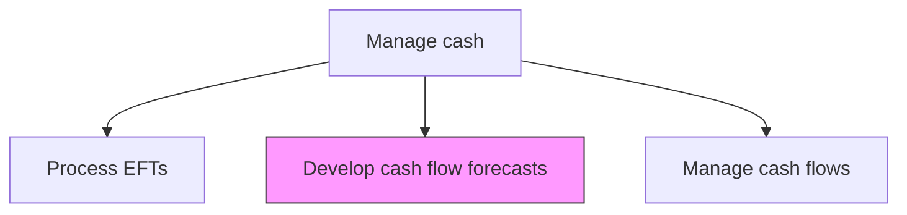
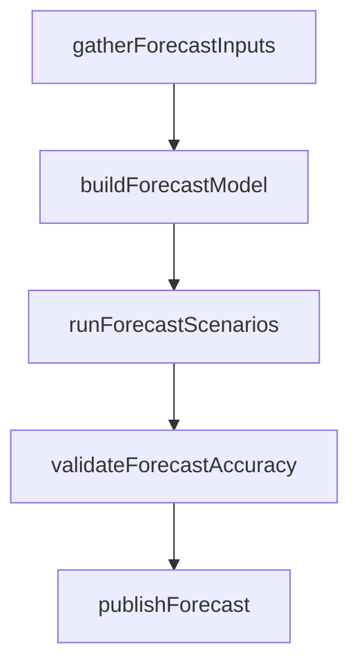

# Develop cash flow forecasts

> Business-as-Code definition for cash flow forecast development. Models the construction of short-term and long-term cash flow projections using historical patterns, scheduled transactions, and business unit inputs to optimize liquidity planning.

## Overview

Constructing short-term and long-term cash flow projections by gathering inputs from accounts receivable, accounts payable, payroll, and business units. Forecast models combine historical patterns with scheduled transactions and macroeconomic assumptions to project daily, weekly, and monthly cash positions. Scenario analysis and regular forecast-to-actual variance reviews improve model accuracy over time, enabling treasury to make informed decisions about borrowing, investing, and liquidity reserves.

## Process Hierarchy



## GraphDL

```yaml
develop:
  object: Cash Flow Forecasts
  actor: CashForecastAnalyst
  result: CashFlowForecast
```

## Actions

| Action | Description |
|--------|-------------|
| gatherForecastInputs | Collect cash flow data from AR, AP, payroll, and business units |
| buildForecastModel | Construct cash flow projection model using historical data and assumptions |
| runForecastScenarios | Model multiple cash flow scenarios under varying business conditions |
| validateForecastAccuracy | Compare previous forecasts against actual results to calibrate models |
| publishForecast | Distribute approved cash flow forecasts to treasury and finance stakeholders |

## Events

| Event | Description |
|-------|-------------|
| forecastInputsGathered | Cash flow data collected from all contributing functions |
| forecastModelBuilt | Cash flow projection model constructed |
| forecastScenariosRun | Multiple scenario projections completed |
| forecastAccuracyValidated | Forecast-to-actual variance analysis completed |
| forecastPublished | Cash flow forecast distributed to stakeholders |

## Searches

| Search | Description |
|--------|-------------|
| getCurrentForecast | Retrieve active cash flow forecast by period and entity |
| getForecastVariance | Query forecast-to-actual variance by period |
| getScenarioResults | Retrieve scenario analysis results for a forecast period |

## Process Flow



## RACI Matrix

| Activity | Responsible | Accountable | Consulted | Informed |
|----------|-------------|-------------|-----------|----------|
| gatherForecastInputs | CashForecastAnalyst | CashManager | ARManager | Treasurer |
| buildForecastModel | CashForecastAnalyst | CashManager | FPAAnalyst | Treasurer |
| publishForecast | CashManager | Treasurer | Controller | CFO |

## Related Processes

| Process | Relationship |
|---------|-------------|
| 9.7.3.1 Manage and reconcile cash positions | Upstream - actual positions validate forecasts |
| 9.7.3.5 Manage cash flows | Downstream - forecasts guide cash flow management decisions |
| 9.7.5 Manage debt and investment | Consumer - forecasts inform borrowing and investment timing |

## Related Departments

| Department | Role |
|-----------|------|
| Treasury | Builds and publishes cash flow forecasts |
| Finance | Provides budget and financial plan inputs |
| Accounts Receivable | Supplies collection and receivables timing data |

## Related Occupations

| Occupation | Involvement |
|-----------|-------------|
| Cash Forecast Analyst | Constructs and maintains forecast models |
| Cash Manager | Approves and distributes forecasts |

## KPIs

| KPI | Description | Unit |
|-----|-------------|------|
| Forecast Accuracy | Percentage variance between forecast and actual cash flows | % |
| Forecast Horizon | Number of weeks covered by rolling cash flow forecast | Weeks |
| Input Completeness | Percentage of business units providing timely forecast inputs | % |

## Usage

```typescript
import { developCashFlowForecasts } from '@headlessly/develop-cash-flow-forecasts'

const forecasting = developCashFlowForecasts()

// Build a rolling 13-week cash flow forecast
const forecast = await forecasting.buildForecastModel({
  horizon: '13-week',
  entities: ['US-Corp', 'EU-GmbH'],
  granularity: 'weekly',
  includeScenarios: true
})

// Run scenario analysis under different business conditions
const scenarios = await forecasting.runForecastScenarios({
  forecastId: forecast.id,
  scenarios: [
    { name: 'base', revenueGrowth: 0.05, collectionDays: 45 },
    { name: 'downturn', revenueGrowth: -0.10, collectionDays: 60 },
    { name: 'expansion', revenueGrowth: 0.15, collectionDays: 38 }
  ]
})

// Validate accuracy against prior period actuals
const accuracy = await forecasting.validateForecastAccuracy({
  forecastId: forecast.id,
  comparisonPeriod: 'last-quarter',
  tolerancePercent: 5
})
```
