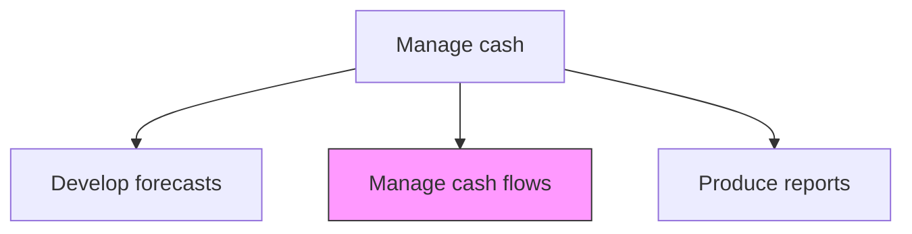
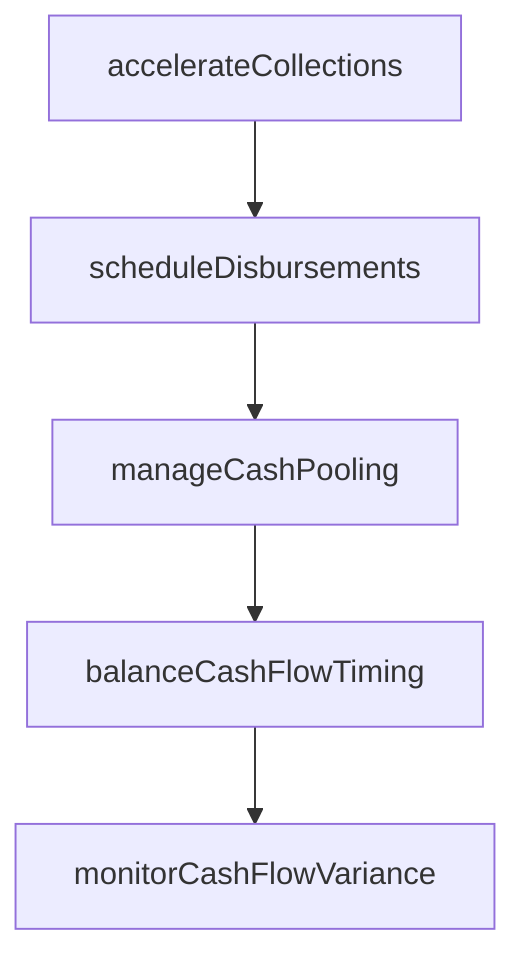

# Manage cash flows

> Business-as-Code definition for cash flow management. Models the active optimization of cash inflows and outflows through payment timing, collection acceleration, disbursement scheduling, and intercompany cash pooling.

## Overview

Actively optimizing the timing and volume of cash inflows and outflows through collection acceleration, disbursement scheduling, and intercompany cash pooling. The process strategically delays outbound payments to maximize float while accelerating customer receipts through early-payment incentives, automated reminders, and dunning escalation. Cash pooling arrangements across subsidiaries concentrate idle balances for investment or debt reduction, minimizing the organization's overall borrowing costs and improving working capital efficiency.

## Process Hierarchy



## GraphDL

```yaml
manage:
  object: Cash Flows
  actor: CashFlowManager
  result: CashFlowSchedule
```

## Actions

| Action | Description |
|--------|-------------|
| accelerateCollections | Implement strategies to speed up customer payment receipts |
| scheduleDisbursements | Optimize payment timing to maximize float and cash availability |
| manageCashPooling | Coordinate intercompany cash concentration and pooling arrangements |
| balanceCashFlowTiming | Align inflow and outflow schedules to minimize borrowing needs |
| monitorCashFlowVariance | Track actual cash flows against planned schedules |

## Events

| Event | Description |
|-------|-------------|
| collectionsAccelerated | Collection improvement strategies implemented |
| disbursementsScheduled | Payment timing optimized for the period |
| cashPoolingManaged | Intercompany cash pooling transactions executed |
| cashFlowTimingBalanced | Inflow and outflow schedules aligned |
| cashFlowVarianceMonitored | Actual-to-plan cash flow variance tracked |

## Searches

| Search | Description |
|--------|-------------|
| getCashFlowSchedule | Retrieve planned cash inflows and outflows by period |
| getCashFlowVariance | Query actual versus planned cash flow variance |
| getPoolingTransactions | List intercompany cash pooling transactions |

## Process Flow



## RACI Matrix

| Activity | Responsible | Accountable | Consulted | Informed |
|----------|-------------|-------------|-----------|----------|
| accelerateCollections | CashFlowManager | Treasurer | ARManager | CFO |
| scheduleDisbursements | CashFlowManager | Treasurer | APManager | CFO |
| manageCashPooling | CashFlowManager | Treasurer | SubsidiaryControllers | CFO |

## Related Processes

| Process | Relationship |
|---------|-------------|
| 9.7.3.4 Develop cash flow forecasts | Upstream - forecasts guide flow management decisions |
| 9.7.3.1 Manage and reconcile cash positions | Parallel - positions reflect flow execution results |
| 9.7.4 Manage in-house bank accounts | Supporting - in-house banking facilitates cash pooling |

## Related Departments

| Department | Role |
|-----------|------|
| Treasury | Manages cash flow optimization |
| Accounts Receivable | Executes collection acceleration strategies |
| Accounts Payable | Implements optimized disbursement schedules |

## Related Occupations

| Occupation | Involvement |
|-----------|-------------|
| Cash Flow Manager | Optimizes timing of cash inflows and outflows |
| Treasury Analyst | Monitors cash flow variance and pooling transactions |

## KPIs

| KPI | Description | Unit |
|-----|-------------|------|
| Days Sales Outstanding | Average days to collect receivables | Days |
| Days Payable Outstanding | Average days to pay suppliers | Days |
| Cash Conversion Cycle | Days from cash outflow for inputs to cash inflow from sales | Days |

## Usage

```typescript
import { manageCashFlows } from '@headlessly/manage-cash-flows'

const cashFlow = manageCashFlows()

// Optimize disbursement timing for float maximization
const schedule = await cashFlow.scheduleDisbursements({
  period: '2026-Q1',
  optimizeFor: 'float-maximization',
  respectDiscountTerms: true,
  paymentMethods: ['ACH', 'wire', 'virtual-card']
})

// Accelerate collections for overdue receivables
const collections = await cashFlow.accelerateCollections({
  agingBucket: '30-60-days',
  strategies: ['early-payment-discount', 'auto-reminder', 'dunning-escalation'],
  targetReduction: 5
})

// Monitor variance between planned and actual cash flows
const variance = await cashFlow.monitorCashFlowVariance({
  period: '2026-Q1',
  entities: ['US-Corp', 'EU-GmbH'],
  alertThresholdPercent: 10
})
```
