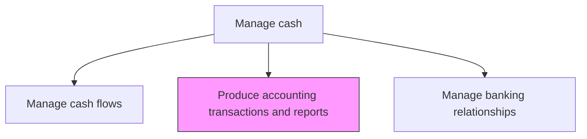
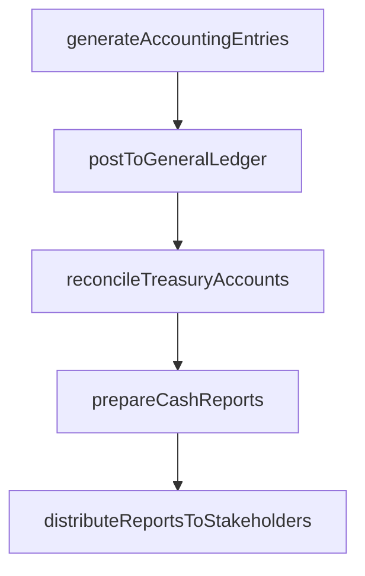

# Produce cash management accounting transactions and reports

> Business-as-Code definition for cash management accounting and reporting. Models the generation of accounting entries, journal postings, and management reports for all treasury cash transactions including investments, transfers, and pooling activities.

## Overview

Generating accounting entries, journal postings, and management reports for all treasury cash transactions including investments, transfers, pooling activities, and bank fee charges. The process ensures that every cash movement is accurately recorded in the general ledger with proper account coding and period allocation. Periodic reconciliation between treasury sub-ledgers and GL accounts validates data integrity, while standardized reports provide finance leadership with visibility into cash positions, transaction volumes, and treasury performance.

## Process Hierarchy



## GraphDL

```yaml
produce:
  object: Cash Management Accounting Transactions And Reports
  actor: TreasuryAccountant
  result: CashManagementReport
```

## Actions

| Action | Description |
|--------|-------------|
| generateAccountingEntries | Create journal entries for cash management transactions |
| postToGeneralLedger | Record cash transactions in the general ledger system |
| reconcileTreasuryAccounts | Verify treasury sub-ledger balances against GL accounts |
| prepareCashReports | Compile daily, weekly, and monthly cash management reports |
| distributeReportsToStakeholders | Deliver cash management reports to finance leadership |

## Events

| Event | Description |
|-------|-------------|
| accountingEntriesGenerated | Journal entries created for cash transactions |
| postedToGeneralLedger | Cash transactions recorded in general ledger |
| treasuryAccountsReconciled | Treasury sub-ledger verified against GL |
| cashReportsPrepared | Cash management reports compiled |
| reportsDistributed | Reports delivered to stakeholders |

## Searches

| Search | Description |
|--------|-------------|
| getCashTransactionJournals | Retrieve journal entries for cash management transactions |
| getCashManagementReports | Query available cash management reports by type and period |
| getReconciliationStatus | Check reconciliation status of treasury accounts |

## Process Flow



## RACI Matrix

| Activity | Responsible | Accountable | Consulted | Informed |
|----------|-------------|-------------|-----------|----------|
| generateAccountingEntries | TreasuryAccountant | Controller | CashManager | Treasurer |
| prepareCashReports | TreasuryAccountant | CashManager | Controller | CFO |
| distributeReportsToStakeholders | CashManager | Treasurer | Controller | CFO |

## Related Processes

| Process | Relationship |
|---------|-------------|
| 9.7.3.1 Manage and reconcile cash positions | Upstream - positions generate accounting transactions |
| 9.7.3.5 Manage cash flows | Upstream - flow activities create reportable transactions |
| 9.5 Process accounts receivable | Parallel - AR transactions feed cash reporting |

## Related Departments

| Department | Role |
|-----------|------|
| Treasury | Produces cash management reports |
| Accounting | Reviews and posts journal entries |
| Finance | Consumes cash management reports for decision-making |

## Related Occupations

| Occupation | Involvement |
|-----------|-------------|
| Treasury Accountant | Creates accounting entries and reports for cash activities |
| Cash Manager | Reviews and approves cash management reports |

## KPIs

| KPI | Description | Unit |
|-----|-------------|------|
| Reporting Timeliness | Percentage of reports delivered by scheduled deadline | % |
| Journal Entry Accuracy | Percentage of entries posted without correction | % |
| Reconciliation Completion Rate | Percentage of treasury accounts reconciled on time | % |

## Usage

```typescript
import { produceCashManagementAccountingTransactionsAndReports } from '@headlessly/produce-cash-management-accounting-transactions-and-reports'

const reporting = produceCashManagementAccountingTransactionsAndReports()

const report = await reporting.prepareCashReports({
  reportType: 'daily-cash-position',
  date: '2025-03-15',
  entities: ['US-Corp', 'EU-GmbH'],
  format: 'pdf'
})

// Retrieve journal entries for cash management transactions
const journals = await reporting.getCashTransactionJournals({
  period: '2025-03',
  transactionType: 'investment-placement',
  includeReversals: true
})
```
