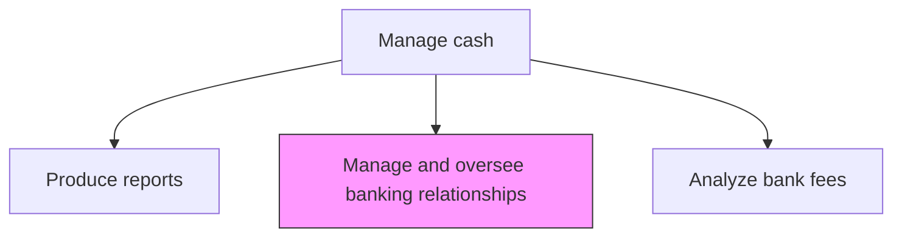
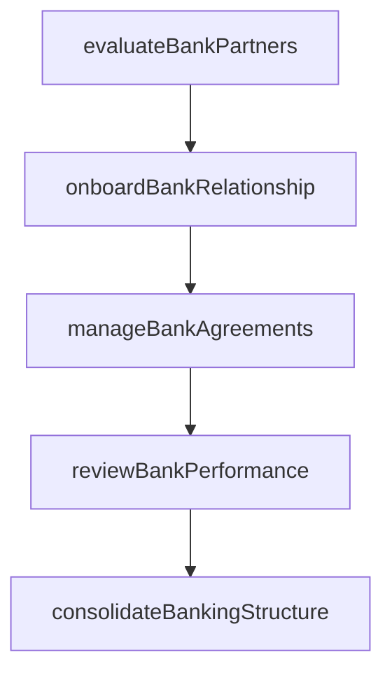

# Manage and oversee banking relationships

> Business-as-Code definition for banking relationship management. Models the selection, onboarding, performance evaluation, and governance of commercial banking partners including account structures, service agreements, and relationship reviews.

## Overview

Selecting, onboarding, evaluating, and governing commercial banking partners to ensure the organization receives competitive services, pricing, and support. The process includes conducting RFP processes for new banking mandates, establishing account structures and connectivity, and performing periodic service quality reviews. Banking relationship rationalization reduces complexity and costs while ensuring adequate geographic coverage and credit diversification across the bank partner portfolio.

## Process Hierarchy



## GraphDL

```yaml
manage:
  object: And Oversee Banking Relationships
  actor: BankRelationshipManager
  result: BankRelationshipProfile
```

## Actions

| Action | Description |
|--------|-------------|
| evaluateBankPartners | Assess prospective banking partners based on capabilities and pricing |
| onboardBankRelationship | Establish accounts, services, and connectivity with new bank partners |
| reviewBankPerformance | Conduct periodic service quality and performance reviews |
| manageBankAgreements | Maintain and renew banking service agreements and mandates |
| consolidateBankingStructure | Rationalize bank account and relationship structure across entities |

## Events

| Event | Description |
|-------|-------------|
| bankPartnersEvaluated | Prospective bank assessment completed |
| bankRelationshipOnboarded | New banking relationship established |
| bankPerformanceReviewed | Bank service performance review completed |
| bankAgreementsManaged | Banking service agreements updated or renewed |
| bankingStructureConsolidated | Bank account structure rationalized |

## Searches

| Search | Description |
|--------|-------------|
| getBankRelationships | Retrieve active banking relationships by entity or region |
| getBankPerformanceMetrics | Query bank service performance metrics |
| getBankAccountStructure | List all bank accounts organized by entity and purpose |

## Process Flow



## RACI Matrix

| Activity | Responsible | Accountable | Consulted | Informed |
|----------|-------------|-------------|-----------|----------|
| evaluateBankPartners | BankRelationshipManager | Treasurer | Procurement | CFO |
| reviewBankPerformance | BankRelationshipManager | Treasurer | TreasuryOperations | CFO |
| consolidateBankingStructure | BankRelationshipManager | Treasurer | SubsidiaryControllers | CFO |

## Related Processes

| Process | Relationship |
|---------|-------------|
| 9.7.3.8 Analyze, negotiate, resolve, and confirm bank fees | Downstream - relationships frame fee negotiations |
| 9.7.3.1 Manage and reconcile cash positions | Supporting - bank structures affect reconciliation |
| 9.7.4 Manage in-house bank accounts | Parallel - in-house banking complements external relationships |

## Related Departments

| Department | Role |
|-----------|------|
| Treasury | Manages all banking relationships |
| Procurement | Supports bank selection and RFP processes |
| Legal | Reviews banking agreements and mandates |

## Related Occupations

| Occupation | Involvement |
|-----------|-------------|
| Bank Relationship Manager | Primary liaison with banking partners |
| Treasurer | Approves banking relationship decisions |

## KPIs

| KPI | Description | Unit |
|-----|-------------|------|
| Bank Rationalization Progress | Reduction in total number of banking relationships | % |
| Service Level Achievement | Percentage of bank SLAs met or exceeded | % |
| Wallet Share Optimization | Revenue allocated to top-tier banking partners | % |

## Usage

```typescript
import { manageAndOverseeBankingRelationships } from '@headlessly/manage-and-oversee-banking-relationships'

const banking = manageAndOverseeBankingRelationships()

const review = await banking.reviewBankPerformance({
  bankId: 'CITI-001',
  reviewPeriod: '2025-Q1',
  metrics: ['transaction-accuracy', 'response-time', 'fee-competitiveness']
})

// List all bank accounts organized by entity and purpose
const structure = await banking.getBankAccountStructure({
  region: 'EMEA',
  includeInactive: false,
  groupBy: 'entity'
})
```
