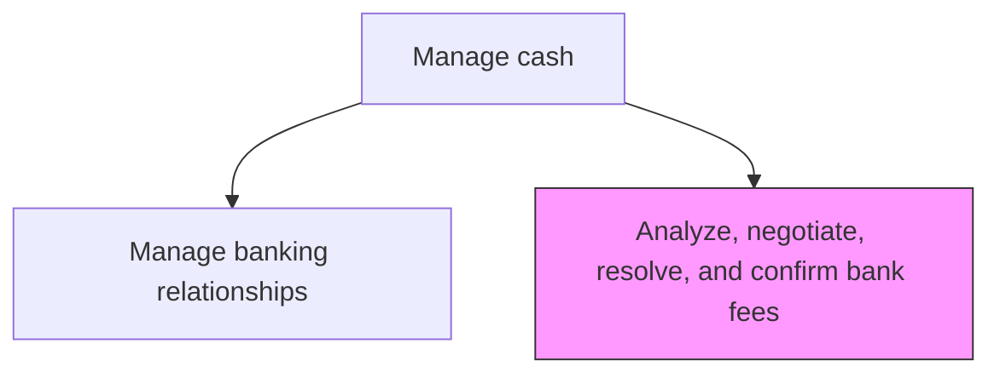
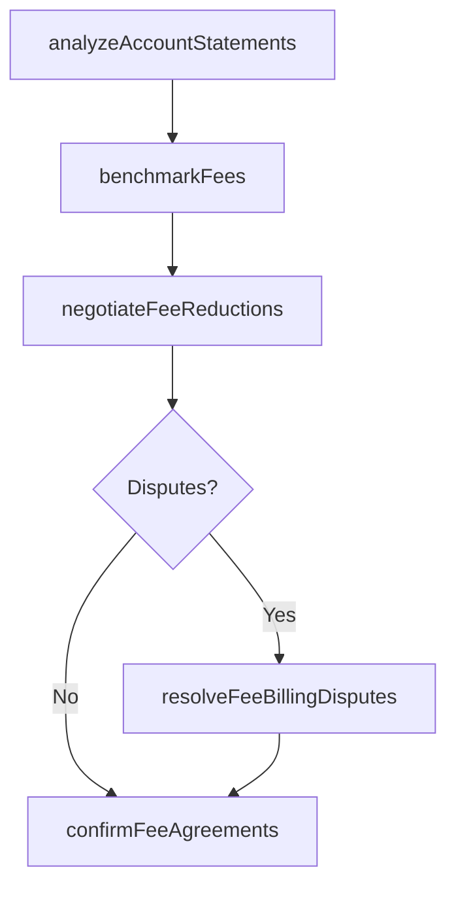

# Analyze, negotiate, resolve, and confirm bank fees

> Business-as-Code definition for bank fee analysis and negotiation. Models the benchmarking, negotiation, dispute resolution, and confirmation of banking service charges, account analysis statements, and fee schedules.

## Overview

Reviewing bank account analysis statements for accuracy, benchmarking service charges against industry data, and negotiating fee reductions with banking partners. The process includes resolving billing disputes for incorrect or unexpected charges and confirming agreed-upon fee schedules in formal documentation. Systematic fee management ensures the organization pays competitive rates for banking services including wire transfers, ACH origination, account maintenance, and lockbox processing.

## Process Hierarchy



## GraphDL

```yaml
analyze,:
  object: Negotiate, Resolve, And Confirm Bank Fees
  actor: BankFeeAnalyst
  result: BankFeeAgreement
```

## Actions

| Action | Description |
|--------|-------------|
| analyzeAccountStatements | Review bank account analysis statements for accuracy and completeness |
| benchmarkFees | Compare bank fees against industry benchmarks and peer institutions |
| negotiateFeeReductions | Engage banks to renegotiate service charges and fee schedules |
| resolveFeeBillingDisputes | Investigate and resolve incorrect or unexpected fee charges |
| confirmFeeAgreements | Validate and document agreed-upon fee schedules with banking partners |

## Events

| Event | Description |
|-------|-------------|
| accountStatementsAnalyzed | Bank account analysis statements reviewed |
| feesBenchmarked | Bank fees compared against industry benchmarks |
| feeReductionsNegotiated | Fee renegotiation completed with banking partners |
| feeBillingDisputesResolved | Incorrect fee charges investigated and resolved |
| feeAgreementsConfirmed | Agreed fee schedules validated and documented |

## Searches

| Search | Description |
|--------|-------------|
| getBankFeeHistory | Retrieve bank fee history by account, service, or period |
| getFeeBenchmarks | Query industry benchmark data for banking services |
| getOpenFeeDisputes | List unresolved bank fee billing disputes |

## Process Flow



## RACI Matrix

| Activity | Responsible | Accountable | Consulted | Informed |
|----------|-------------|-------------|-----------|----------|
| analyzeAccountStatements | BankFeeAnalyst | BankRelationshipManager | TreasuryAccountant | Treasurer |
| negotiateFeeReductions | BankRelationshipManager | Treasurer | Procurement | CFO |
| resolveFeeBillingDisputes | BankFeeAnalyst | BankRelationshipManager | BankingPartner | Treasurer |

## Related Processes

| Process | Relationship |
|---------|-------------|
| 9.7.3.7 Manage and oversee banking relationships | Upstream - relationship context guides fee negotiations |
| 9.7.3.6 Produce cash management accounting transactions and reports | Downstream - confirmed fees feed reporting |
| 9.7.1 Manage treasury policies and procedures | Governance - policies define fee management authority |

## Related Departments

| Department | Role |
|-----------|------|
| Treasury | Analyzes and negotiates bank fees |
| Procurement | Supports competitive bidding for banking services |
| Accounting | Records bank fee expenses |

## Related Occupations

| Occupation | Involvement |
|-----------|-------------|
| Bank Fee Analyst | Reviews account analysis statements and benchmarks fees |
| Bank Relationship Manager | Leads fee negotiations with banking partners |

## KPIs

| KPI | Description | Unit |
|-----|-------------|------|
| Fee Savings Achieved | Annual reduction in bank fees through negotiation | USD |
| Fee Accuracy Rate | Percentage of bank fee charges matching agreed schedules | % |
| Dispute Resolution Time | Average days to resolve bank fee disputes | Days |

## Usage

```typescript
import { analyzeNegotiateResolveAndConfirmBankFees } from '@headlessly/analyze-negotiate-resolve-and-confirm-bank-fees'

const fees = analyzeNegotiateResolveAndConfirmBankFees()

const analysis = await fees.benchmarkFees({
  bankId: 'CITI-001',
  services: ['wire-transfer', 'ach-origination', 'account-maintenance'],
  benchmarkSource: 'AFP-survey'
})

// List unresolved bank fee billing disputes
const disputes = await fees.getOpenFeeDisputes({
  bankId: 'CITI-001',
  minimumAmount: 500,
  agingDays: 30
})
```
