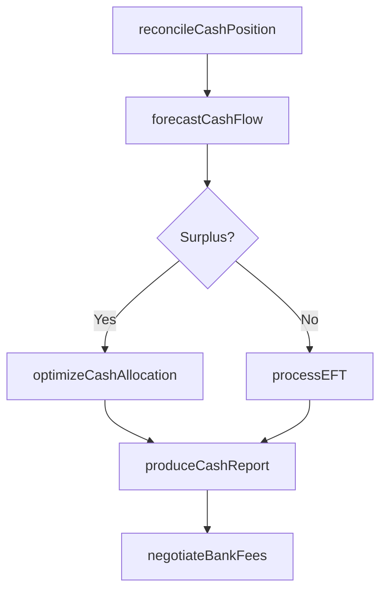

# Manage cash

> Business-as-Code definition for corporate cash management. Models the reconciliation, forecasting, and optimization of cash positions, electronic fund transfers, banking relationships, and cash accounting across the enterprise.

## Overview

Taking care of all cash-related activities in the business. Manage and reconcile cash positions. Manage cash equivalents. Process and oversee electronic fund transfers. Develop cash flow forecasts. Manage cash flows. Produce cash management accounting transactions and reports. Manage and oversee banking relationships. Analyze, negotiate, resolve, and confirm bank fees.

## Process Hierarchy

```mermaid
graph TD
    A[Manage cash]
    A --> B[Manage and reconcile cash positions]
    A --> C[Manage cash equivalents]
    A --> D[Process and oversee electronic fund transfers (EFTs)]
    A --> E[Develop cash flow forecasts]
    A --> F[Manage cash flows]
    A --> G[Produce cash management accounting transactions and reports]
    A --> H[Manage and oversee banking relationships]
    A --> I[Analyze, negotiate, resolve, and confirm bank fees]
```

## GraphDL

```yaml
manage:
  object: Cash
  actor: CashManager
  result: CashPosition
```

## Actions

| Action | Description |
|--------|-------------|
| reconcileCashPosition | Match internal cash records against bank balances |
| forecastCashFlow | Project future cash inflows and outflows by period |
| processEFT | Initiate and monitor electronic fund transfers |
| optimizeCashAllocation | Move excess cash to higher-yield instruments or accounts |
| negotiateBankFees | Analyze and renegotiate banking service fees |
| produceCashReport | Generate cash management accounting transactions and reports |

## Events

| Event | Description |
|-------|-------------|
| cashPositionReconciled | Cash balances matched between internal records and bank |
| cashFlowForecasted | Cash flow projection completed for the period |
| eftProcessed | Electronic fund transfer initiated and confirmed |
| cashAllocationOptimized | Excess cash reallocated to optimal accounts |
| bankFeesNegotiated | Banking fee structure reviewed and renegotiated |
| cashReportProduced | Cash management report generated and distributed |

## Searches

| Search | Description |
|--------|-------------|
| getDailyCashPosition | Retrieve consolidated cash balance across all bank accounts |
| getCashForecast | Query projected cash flows by period, entity, or currency |
| getEFTStatus | Track electronic fund transfer status by reference number |
| getBankFeeAnalysis | Retrieve banking fee breakdown by service type and institution |

## Process Flow



## RACI Matrix

| Activity | Responsible | Accountable | Consulted | Informed |
|----------|-------------|-------------|-----------|----------|
| reconcileCashPosition | CashManager | Treasurer | BankRelationshipManager | Controller |
| forecastCashFlow | TreasuryAnalyst | CashManager | FPAAnalyst | CFO |
| processEFT | TreasuryOperator | CashManager | BankRelationshipManager | APManager |
| negotiateBankFees | BankRelationshipManager | Treasurer | LegalCounsel | CFO |

## Sub-Processes

| ID | Name | Description |
|----|------|-------------|
| 9.7.3.1 | Manage and reconcile cash positions | Correcting cash differences in the books of accounts. Make optimum utilization of funds available in |
| 9.7.3.2 | Manage cash equivalents | Taking care of all cash-related activities in the business. Utilize short-term assets that can be ea |
| 9.7.3.3 | Process and oversee electronic fund transfers (EFTs) | Supervising all online transactions. |
| 9.7.3.4 | Develop cash flow forecasts | Preparing forecasts for the cash generated or used by the organization. |
| 9.7.3.5 | Manage cash flows | Delaying the outflow of funds as long as possible, but encourage the inflow of as fast as possible. |
| 9.7.3.6 | Produce cash management accounting transactions and reports | Presenting reports on all cash-related activities. Collect and manage short-term investing activitie |
| 9.7.3.7 | Manage and oversee banking relationships | Maintaining and directing the course of relationships with banking partners. |
| 9.7.3.8 | Analyze, negotiate, resolve, and confirm bank fees | Studying and finalizing bank fees for services provided by banks. Negotiate and finalize nominal fee |

## Related Processes

| Process | Relationship |
|---------|-------------|
| 9.7.4 Manage in-house bank accounts | Parallel - in-house banking feeds cash position |
| 9.7.5 Manage debt and investment | Downstream - surplus cash deployed into investments |
| 9.5 Process accounts receivable | Upstream - collections feed cash inflows |
| 9.6 Process accounts payable | Upstream - disbursements drive cash outflows |

## Related Departments

| Department | Role |
|-----------|------|
| Treasury | Manages daily cash positions and bank relationships |
| Finance | Provides budget data for cash forecasting |
| Accounting | Records cash management transactions |
| IT | Supports treasury management system operations |

## Related Occupations

| Occupation | Involvement |
|-----------|-------------|
| Cash Manager | Daily cash position management and fund allocation |
| Treasury Analyst | Cash flow forecasting and analysis |
| Bank Relationship Manager | Banking partner negotiations and fee optimization |

## KPIs

| KPI | Description | Unit |
|-----|-------------|------|
| Cash Forecast Accuracy | Variance between forecasted and actual cash balances | % |
| Idle Cash Ratio | Percentage of total cash not earning return | % |
| Reconciliation Timeliness | Percentage of accounts reconciled within one business day | % |
| Total Banking Cost | Annual cost of banking services per dollar managed | Basis Points |

## Usage

```typescript
import { manageCash } from '@headlessly/manage-cash'

const cash = manageCash()

// Get daily consolidated cash position
const position = await cash.reconcileCashPosition({
  date: '2025-03-15',
  entities: ['US-HQ', 'EU-Sub'],
  includePending: true
})

// Forecast cash flows for the next 13 weeks
const forecast = await cash.forecastCashFlow({
  horizon: '13-week',
  granularity: 'weekly',
  includeCommitted: true
})
```
