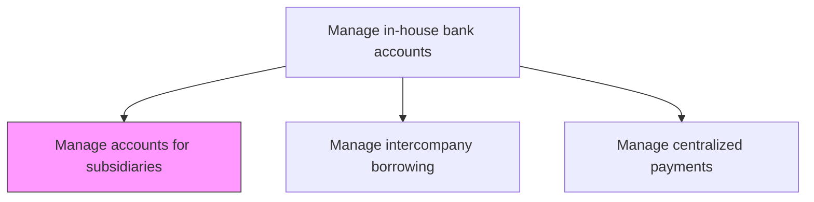
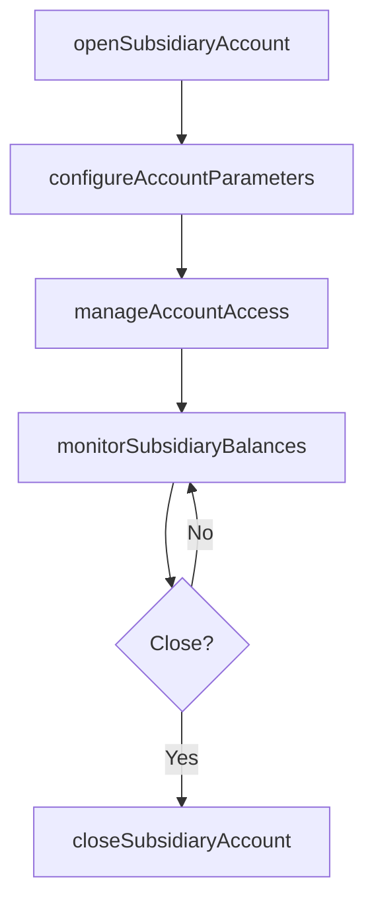

# Manage in-house bank accounts for subsidiaries

> Business-as-Code definition for subsidiary in-house bank account management. Models the setup, maintenance, and administration of internal bank accounts that centralize treasury services for subsidiary entities within a corporate group.

## Overview

Setting up, configuring, and administering internal bank accounts that centralize treasury services for subsidiary entities within a corporate group. The in-house bank structure replaces or supplements external banking relationships by providing subsidiaries with accounts for payments, collections, and intercompany settlements. Account parameters such as currency, credit limits, and interest rate terms are configured to reflect transfer pricing policies and local regulatory requirements. Daily balance monitoring ensures subsidiaries maintain appropriate liquidity levels.

## Process Hierarchy



## GraphDL

```yaml
manage:
  object: In-house Bank Accounts For Subsidiaries
  actor: InHouseBankManager
  result: SubsidiaryAccountStructure
```

## Actions

| Action | Description |
|--------|-------------|
| openSubsidiaryAccount | Create new in-house bank account for a subsidiary entity |
| configureAccountParameters | Set currency, credit limits, and interest rate terms for subsidiary accounts |
| monitorSubsidiaryBalances | Track daily balances and transaction volumes across subsidiary accounts |
| manageAccountAccess | Assign authorized signatories and access permissions for subsidiary accounts |
| closeSubsidiaryAccount | Deactivate and close in-house bank account for a subsidiary |

## Events

| Event | Description |
|-------|-------------|
| subsidiaryAccountOpened | New in-house bank account created for subsidiary |
| accountParametersConfigured | Account terms and limits set for subsidiary |
| subsidiaryBalancesMonitored | Daily balance review completed for subsidiary accounts |
| accountAccessManaged | Signatory and access permissions updated |
| subsidiaryAccountClosed | In-house bank account deactivated for subsidiary |

## Searches

| Search | Description |
|--------|-------------|
| getSubsidiaryAccounts | Retrieve in-house bank accounts by subsidiary entity |
| getAccountBalances | Query current balances across all subsidiary accounts |
| getAccountActivity | List recent transactions for a specific subsidiary account |

## Process Flow



## RACI Matrix

| Activity | Responsible | Accountable | Consulted | Informed |
|----------|-------------|-------------|-----------|----------|
| openSubsidiaryAccount | InHouseBankManager | Treasurer | SubsidiaryController | CFO |
| configureAccountParameters | InHouseBankManager | Treasurer | TaxAdvisor | SubsidiaryController |
| monitorSubsidiaryBalances | TreasuryOperationsAnalyst | InHouseBankManager | CashManager | Treasurer |

## Related Processes

| Process | Relationship |
|---------|-------------|
| 9.7.4.2 Manage inter-company borrowing transactions | Downstream - accounts enable intercompany lending |
| 9.7.4.6 Calculate interest and fees | Downstream - account parameters drive interest calculations |
| 9.7.3 Manage cash | Parallel - in-house accounts are part of cash management |

## Related Departments

| Department | Role |
|-----------|------|
| Treasury | Administers in-house bank accounts |
| Subsidiary Finance | Uses in-house bank accounts for daily operations |
| Tax | Advises on transfer pricing for intercompany transactions |

## Related Occupations

| Occupation | Involvement |
|-----------|-------------|
| In-House Bank Manager | Administers subsidiary account structures |
| Treasury Operations Analyst | Monitors daily account balances and activity |

## KPIs

| KPI | Description | Unit |
|-----|-------------|------|
| Account Utilization Rate | Percentage of subsidiaries using in-house bank accounts | % |
| External Bank Account Reduction | Decrease in number of external bank accounts | % |
| Account Setup Time | Days to open and configure a new subsidiary account | Days |

## Usage

```typescript
import { manageInHouseBankAccountsForSubsidiaries } from '@headlessly/manage-in-house-bank-accounts-for-subsidiaries'

const ihb = manageInHouseBankAccountsForSubsidiaries()

const account = await ihb.openSubsidiaryAccount({
  subsidiaryId: 'EU-GmbH',
  currency: 'EUR',
  creditLimit: 5000000,
  interestRate: 'EURIBOR+50bps'
})

// Monitor daily balances across all subsidiary in-house bank accounts
const balances = await ihb.getAccountBalances({
  date: '2025-03-15',
  currency: 'all',
  includeOverdrawn: true
})
```
