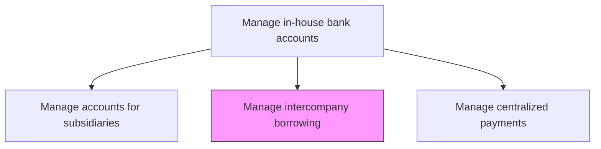
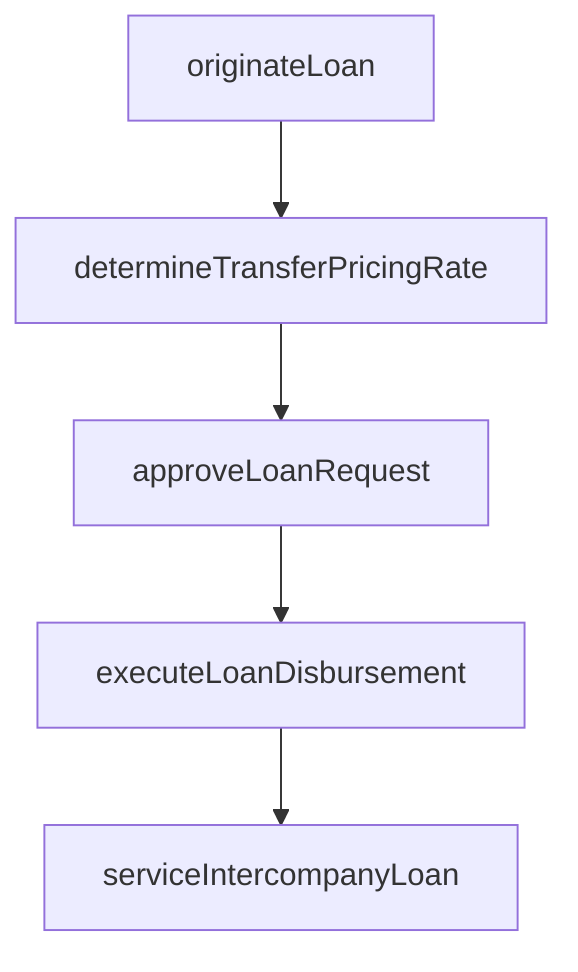

# Manage and facilitate inter-company borrowing transactions

> Business-as-Code definition for intercompany borrowing transaction management. Models the origination, execution, and servicing of internal loans between corporate entities through the in-house bank, including arm's-length rate determination and transfer pricing compliance.

## Overview

Originating, executing, and servicing internal loans between corporate entities through the in-house bank, replacing or supplementing external borrowing with lower-cost intercompany financing. The process includes determining arm's-length interest rates to satisfy transfer pricing regulations, obtaining appropriate approvals, and processing loan drawdowns and repayments through subsidiary in-house bank accounts. Proper documentation and rate-setting ensure compliance with tax authorities across multiple jurisdictions.

## Process Hierarchy



## GraphDL

```yaml
manage:
  object: And Facilitate Inter-company Borrowing Transactions
  actor: IntercompanyLendingManager
  result: IntercompanyLoan
```

## Actions

| Action | Description |
|--------|-------------|
| originateLoan | Create intercompany loan request with terms and repayment schedule |
| determineTransferPricingRate | Calculate arm's-length interest rate for intercompany lending |
| approveLoanRequest | Review and authorize intercompany borrowing request |
| executeLoanDisbursement | Process the intercompany loan drawdown through in-house bank |
| serviceIntercompanyLoan | Process interest accruals and scheduled repayments |

## Events

| Event | Description |
|-------|-------------|
| loanOriginated | Intercompany loan request created with proposed terms |
| transferPricingRateDetermined | Arm's-length interest rate calculated |
| loanRequestApproved | Intercompany borrowing authorized |
| loanDisbursed | Loan drawdown processed through in-house bank |
| intercompanyLoanServiced | Interest and principal payments processed |

## Searches

| Search | Description |
|--------|-------------|
| getIntercompanyLoans | Retrieve active intercompany loans by entity or currency |
| getLoanRepaymentSchedule | Query repayment schedule for a specific loan |
| getTransferPricingRates | List current arm's-length rates by currency and tenor |

## Process Flow



## RACI Matrix

| Activity | Responsible | Accountable | Consulted | Informed |
|----------|-------------|-------------|-----------|----------|
| originateLoan | SubsidiaryTreasurer | IntercompanyLendingManager | SubsidiaryController | Treasurer |
| determineTransferPricingRate | IntercompanyLendingManager | TaxAdvisor | Treasurer | CFO |
| approveLoanRequest | Treasurer | CFO | LegalCounsel | SubsidiaryController |

## Related Processes

| Process | Relationship |
|---------|-------------|
| 9.7.4.1 Manage in-house bank accounts for subsidiaries | Upstream - accounts required for loan execution |
| 9.7.4.6 Calculate interest and fees | Downstream - loan terms drive interest calculations |
| 9.9 Manage taxes | Parallel - transfer pricing compliance required |

## Related Departments

| Department | Role |
|-----------|------|
| Treasury | Manages intercompany lending operations |
| Tax | Ensures transfer pricing compliance for intercompany rates |
| Legal | Reviews loan documentation and regulatory requirements |

## Related Occupations

| Occupation | Involvement |
|-----------|-------------|
| Intercompany Lending Manager | Administers intercompany loan portfolio |
| Transfer Pricing Specialist | Determines compliant intercompany rates |

## KPIs

| KPI | Description | Unit |
|-----|-------------|------|
| Intercompany Loan Volume | Total outstanding intercompany loan balance | USD |
| Transfer Pricing Compliance Rate | Percentage of loans with documented arm's-length rates | % |
| Interest Savings vs External | Cost reduction from internal vs external borrowing | bps |

## Usage

```typescript
import { manageAndFacilitateInterCompanyBorrowingTransactions } from '@headlessly/manage-and-facilitate-inter-company-borrowing-transactions'

const lending = manageAndFacilitateInterCompanyBorrowingTransactions()

const loan = await lending.originateLoan({
  borrower: 'APAC-Ltd',
  lender: 'US-Corp',
  amount: 10000000,
  currency: 'USD',
  tenor: '12-month'
})

// Retrieve current arm's-length rates for intercompany pricing
const rates = await lending.getTransferPricingRates({
  currency: 'USD',
  tenors: ['3-month', '6-month', '12-month'],
  rateDate: '2025-03-15'
})
```
