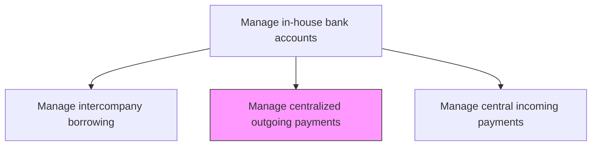
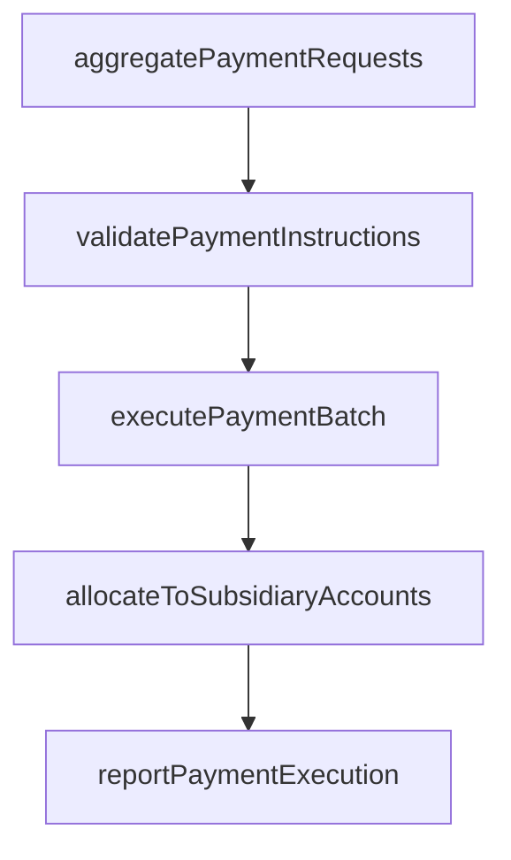

# Manage centralized outgoing payments on behalf of subsidiaries

> Business-as-Code definition for centralized outgoing payment management. Models the execution of vendor and supplier payments through a central payment factory on behalf of subsidiary entities, including payment aggregation, currency conversion, and intercompany settlement.

## Overview

Executing vendor and supplier payments through a central payment factory on behalf of subsidiary entities to achieve economies of scale, standardized controls, and reduced banking costs. The process aggregates payment requests from subsidiaries, validates instructions against approved beneficiary lists, processes consolidated payment batches through banking channels, and allocates costs to subsidiary in-house bank accounts. Centralization improves straight-through processing rates and enables better negotiation leverage with banking partners.

## Process Hierarchy



## GraphDL

```yaml
manage:
  object: Centralized Outgoing Payments On Behalf Of Subsidiaries
  actor: PaymentFactoryManager
  result: CentralizedPaymentBatch
```

## Actions

| Action | Description |
|--------|-------------|
| aggregatePaymentRequests | Collect outgoing payment requests from subsidiary entities |
| validatePaymentInstructions | Verify payment details, beneficiary information, and authorization |
| executePaymentBatch | Process consolidated payment batch through banking channels |
| allocateToSubsidiaryAccounts | Debit subsidiary in-house bank accounts for payments made |
| reportPaymentExecution | Generate payment execution reports for subsidiary entities |

## Events

| Event | Description |
|-------|-------------|
| paymentRequestsAggregated | Subsidiary payment requests collected and consolidated |
| paymentInstructionsValidated | Payment details and authorizations verified |
| paymentBatchExecuted | Consolidated payment batch processed |
| subsidiaryAccountsAllocated | In-house bank accounts debited for subsidiary payments |
| paymentExecutionReported | Payment completion reports distributed to subsidiaries |

## Searches

| Search | Description |
|--------|-------------|
| getPendingPaymentRequests | List incoming payment requests from subsidiaries |
| getPaymentBatchStatus | Query execution status of payment batches |
| getSubsidiaryPaymentHistory | Retrieve payment history for a specific subsidiary |

## Process Flow



## RACI Matrix

| Activity | Responsible | Accountable | Consulted | Informed |
|----------|-------------|-------------|-----------|----------|
| aggregatePaymentRequests | PaymentFactoryManager | Treasurer | SubsidiaryAPTeams | CFO |
| executePaymentBatch | PaymentFactoryManager | Treasurer | BankingOperations | SubsidiaryControllers |
| allocateToSubsidiaryAccounts | TreasuryOperationsAnalyst | PaymentFactoryManager | InHouseBankManager | Treasurer |

## Related Processes

| Process | Relationship |
|---------|-------------|
| 9.7.4.1 Manage in-house bank accounts for subsidiaries | Upstream - subsidiary accounts debited for payments |
| 9.7.4.5 Manage internal payments and netting | Parallel - netting reduces gross payment volumes |
| 9.6.1 Process accounts payable | Upstream - AP generates payment instructions |

## Related Departments

| Department | Role |
|-----------|------|
| Treasury | Operates central payment factory |
| Subsidiary AP Teams | Submit payment requests to central payment factory |
| Banking Operations | Provides payment processing channels |

## Related Occupations

| Occupation | Involvement |
|-----------|-------------|
| Payment Factory Manager | Oversees centralized payment processing |
| Treasury Operations Analyst | Processes payment batches and allocations |

## KPIs

| KPI | Description | Unit |
|-----|-------------|------|
| Payment Centralization Rate | Percentage of subsidiary payments processed centrally | % |
| Straight-Through Processing Rate | Percentage of payments processed without manual intervention | % |
| Payment Error Rate | Percentage of payments requiring correction or reprocessing | % |

## Usage

```typescript
import { manageCentralizedOutgoingPaymentsOnBehalfOfSubsidiaries } from '@headlessly/manage-centralized-outgoing-payments-on-behalf-of-subsidiaries'

const payments = manageCentralizedOutgoingPaymentsOnBehalfOfSubsidiaries()

const batch = await payments.executePaymentBatch({
  date: '2025-03-15',
  subsidiaries: ['EU-GmbH', 'UK-Ltd'],
  paymentMethod: 'SEPA',
  currency: 'EUR'
})

// Retrieve payment history for a specific subsidiary
const history = await payments.getSubsidiaryPaymentHistory({
  subsidiaryId: 'EU-GmbH',
  period: '2025-Q1',
  includeAllocationDetails: true
})
```
