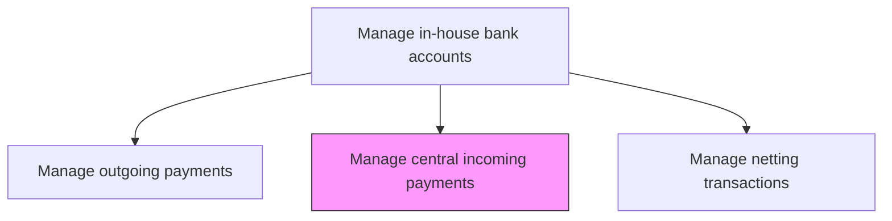
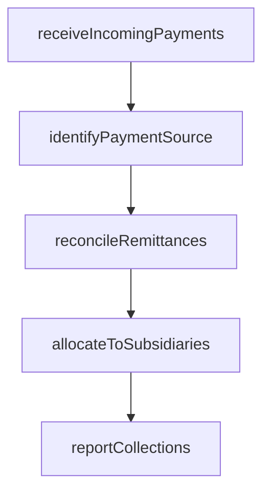

# Manage central incoming payments on behalf of subsidiaries

> Business-as-Code definition for centralized incoming payment management. Models the receipt, identification, and allocation of customer payments collected centrally on behalf of subsidiary entities, including remittance matching and intercompany settlement.

## Overview

Receiving, identifying, and allocating customer payments collected centrally on behalf of subsidiary entities through shared bank accounts. The process matches incoming remittances to subsidiary customers and outstanding invoices, credits the appropriate in-house bank accounts, and generates collection reports for subsidiary finance teams. Centralized collection reduces the number of external bank accounts, simplifies bank reconciliation, and provides consolidated visibility into group-wide receivables performance.

## Process Hierarchy



## GraphDL

```yaml
manage:
  object: Central Incoming Payments On Behalf Of Subsidiaries
  actor: CentralCollectionsManager
  result: AllocatedReceipt
```

## Actions

| Action | Description |
|--------|-------------|
| receiveIncomingPayments | Collect customer payments through centralized bank accounts |
| identifyPaymentSource | Match incoming payments to subsidiary customers and invoices |
| allocateToSubsidiaries | Credit subsidiary in-house bank accounts for received payments |
| reconcileRemittances | Match payment amounts against outstanding invoices and remittance advice |
| reportCollections | Generate collection reports for subsidiary entities |

## Events

| Event | Description |
|-------|-------------|
| incomingPaymentsReceived | Customer payments collected through central accounts |
| paymentSourceIdentified | Incoming payments matched to subsidiaries and customers |
| paymentsAllocatedToSubsidiaries | Subsidiary in-house bank accounts credited |
| remittancesReconciled | Payment amounts matched against outstanding invoices |
| collectionsReported | Collection reports delivered to subsidiary entities |

## Searches

| Search | Description |
|--------|-------------|
| getUnallocatedPayments | List incoming payments pending subsidiary allocation |
| getCollectionsBySubsidiary | Retrieve collections received for a specific subsidiary |
| getRemittanceMatchStatus | Query remittance matching status for incoming payments |

## Process Flow



## RACI Matrix

| Activity | Responsible | Accountable | Consulted | Informed |
|----------|-------------|-------------|-----------|----------|
| receiveIncomingPayments | CentralCollectionsManager | Treasurer | BankingOperations | SubsidiaryControllers |
| identifyPaymentSource | TreasuryOperationsAnalyst | CentralCollectionsManager | SubsidiaryARTeams | Treasurer |
| allocateToSubsidiaries | CentralCollectionsManager | Treasurer | InHouseBankManager | SubsidiaryControllers |

## Related Processes

| Process | Relationship |
|---------|-------------|
| 9.7.4.1 Manage in-house bank accounts for subsidiaries | Upstream - subsidiary accounts credited for receipts |
| 9.7.4.3 Manage centralized outgoing payments | Parallel - complements outgoing payment centralization |
| 9.5 Process accounts receivable | Upstream - AR generates expected collection data |

## Related Departments

| Department | Role |
|-----------|------|
| Treasury | Operates centralized collections function |
| Subsidiary AR Teams | Provide invoice and customer data for matching |
| Banking Operations | Provides receipt notification and bank statement data |

## Related Occupations

| Occupation | Involvement |
|-----------|-------------|
| Central Collections Manager | Manages centralized receipt and allocation process |
| Treasury Operations Analyst | Identifies payment sources and processes allocations |

## KPIs

| KPI | Description | Unit |
|-----|-------------|------|
| Payment Allocation Timeliness | Percentage of payments allocated to subsidiaries within SLA | % |
| Remittance Match Rate | Percentage of payments auto-matched to invoices | % |
| Unallocated Payment Aging | Average days for unallocated payments to be resolved | Days |

## Usage

```typescript
import { manageCentralIncomingPaymentsOnBehalfOfSubsidiaries } from '@headlessly/manage-central-incoming-payments-on-behalf-of-subsidiaries'

const collections = manageCentralIncomingPaymentsOnBehalfOfSubsidiaries()

const allocated = await collections.allocateToSubsidiaries({
  date: '2025-03-15',
  bankAccount: 'CENTRAL-EUR-001',
  autoMatchThreshold: 0.95
})

// List unallocated payments requiring manual investigation
const unallocated = await collections.getUnallocatedPayments({
  bankAccount: 'CENTRAL-EUR-001',
  agingDays: 5,
  minimumAmount: 1000
})
```
