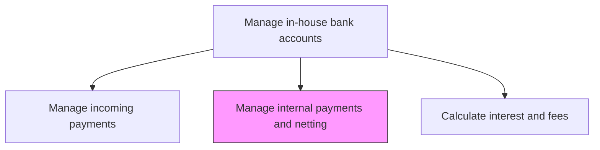
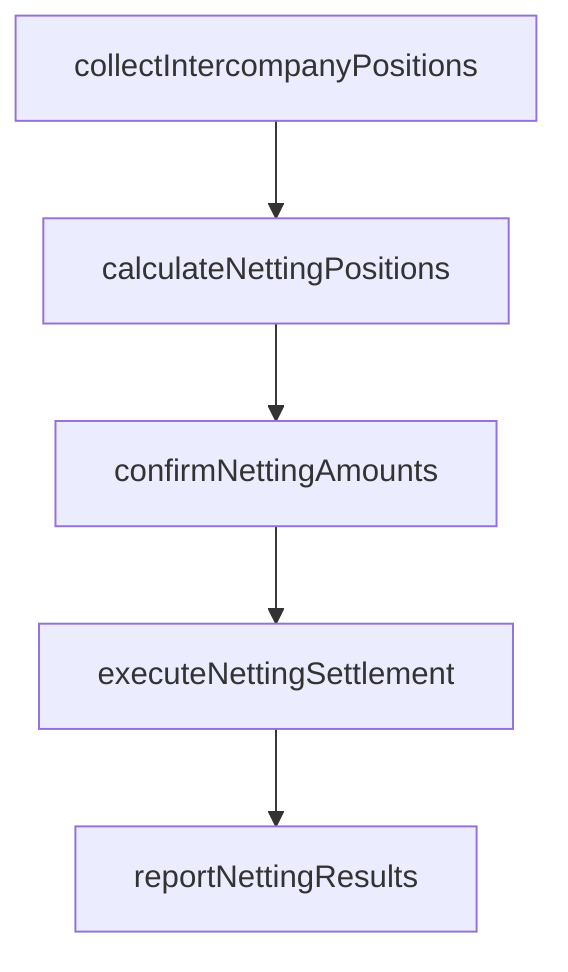

# Manage internal payments and netting transactions

> Business-as-Code definition for internal payment and netting transaction management. Models the multilateral netting of intercompany receivables and payables to minimize gross payment flows, reduce foreign exchange exposure, and lower transaction costs across a corporate group.

## Overview

Performing multilateral netting of intercompany receivables and payables to minimize gross payment flows, reduce foreign exchange exposure, and lower transaction costs across a corporate group. Each netting cycle collects intercompany positions from all entities, computes net settlement amounts, obtains entity confirmations, and executes settlements through in-house bank accounts. Effective netting significantly reduces the number and value of cross-border payments, yielding substantial savings in banking fees and currency conversion costs.

## Process Hierarchy



## GraphDL

```yaml
manage:
  object: Internal Payments And Netting Transactions
  actor: NettingManager
  result: NettingSettlement
```

## Actions

| Action | Description |
|--------|-------------|
| collectIntercompanyPositions | Gather intercompany receivables and payables from all entities |
| calculateNettingPositions | Compute multilateral net positions for each entity |
| confirmNettingAmounts | Obtain entity confirmation of net settlement amounts |
| executeNettingSettlement | Process net payments through in-house bank accounts |
| reportNettingResults | Generate netting cycle results and savings reports |

## Events

| Event | Description |
|-------|-------------|
| intercompanyPositionsCollected | Receivables and payables gathered from all entities |
| nettingPositionsCalculated | Multilateral net positions computed |
| nettingAmountsConfirmed | Entity confirmations received for net settlements |
| nettingSettlementExecuted | Net payments processed through in-house bank |
| nettingResultsReported | Netting cycle results and savings documented |

## Searches

| Search | Description |
|--------|-------------|
| getIntercompanyPositions | Retrieve intercompany balances by entity pair |
| getNettingCycleHistory | Query results of previous netting cycles |
| getNetSettlementAmounts | List net amounts due from each entity for current cycle |

## Process Flow



## RACI Matrix

| Activity | Responsible | Accountable | Consulted | Informed |
|----------|-------------|-------------|-----------|----------|
| collectIntercompanyPositions | NettingManager | Treasurer | SubsidiaryControllers | CFO |
| calculateNettingPositions | TreasuryAnalyst | NettingManager | InHouseBankManager | Treasurer |
| executeNettingSettlement | NettingManager | Treasurer | BankingOperations | SubsidiaryControllers |

## Related Processes

| Process | Relationship |
|---------|-------------|
| 9.7.4.3 Manage centralized outgoing payments | Downstream - netting reduces outgoing payment volumes |
| 9.7.4.4 Manage central incoming payments | Downstream - netting reduces incoming receipt volumes |
| 9.10 Manage international funds/consolidation | Parallel - netting reduces cross-border FX exposure |

## Related Departments

| Department | Role |
|-----------|------|
| Treasury | Manages netting process and settlements |
| Subsidiary Finance | Confirms intercompany positions and net amounts |
| Accounting | Records netting settlements and intercompany eliminations |

## Related Occupations

| Occupation | Involvement |
|-----------|-------------|
| Netting Manager | Administers multilateral netting cycles |
| Treasury Analyst | Calculates netting positions and savings |

## KPIs

| KPI | Description | Unit |
|-----|-------------|------|
| Netting Efficiency Ratio | Percentage of gross intercompany flows eliminated through netting | % |
| FX Savings from Netting | Currency conversion costs avoided through netting | USD |
| Entity Participation Rate | Percentage of entities participating in netting cycles | % |

## Usage

```typescript
import { manageInternalPaymentsAndNettingTransactions } from '@headlessly/manage-internal-payments-and-netting-transactions'

const netting = manageInternalPaymentsAndNettingTransactions()

const cycle = await netting.calculateNettingPositions({
  cycleDate: '2025-03-31',
  entities: ['US-Corp', 'EU-GmbH', 'UK-Ltd', 'APAC-Ltd'],
  baseCurrency: 'USD'
})

// Review historical netting cycle results and savings
const history = await netting.getNettingCycleHistory({
  year: 2025,
  includeSavingsBreakdown: true,
  groupBy: 'currency-pair'
})
```
