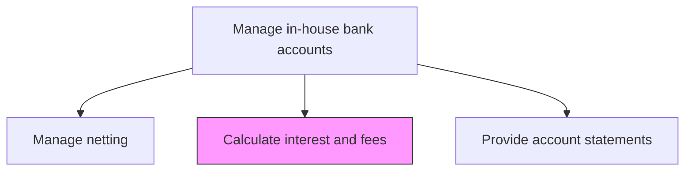
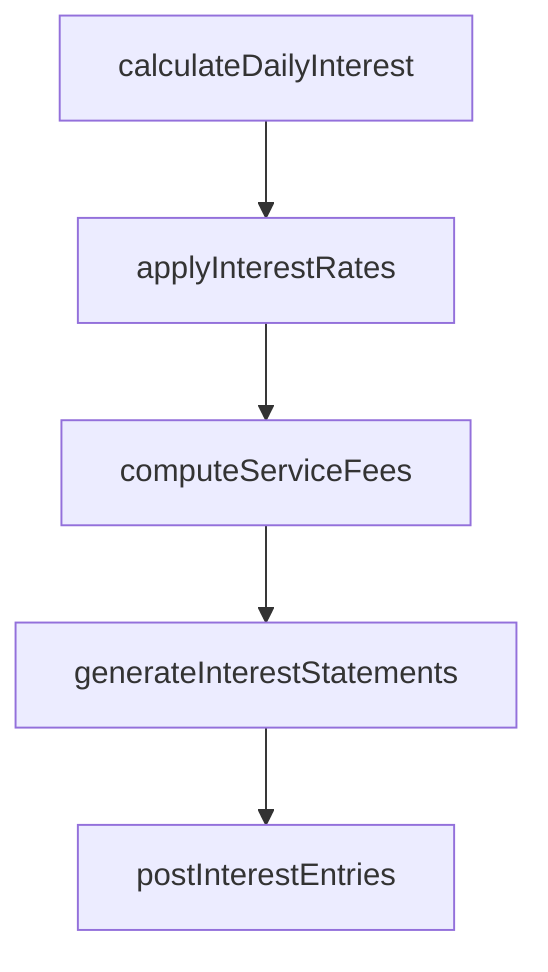

# Calculate interest and fees for in-house bank accounts

> Business-as-Code definition for in-house bank interest and fee calculation. Models the computation of internal interest charges, credits, and service fees applied to subsidiary in-house bank accounts based on agreed transfer pricing rates and service level agreements.

## Overview

Computing daily interest accruals, applying transfer pricing rates, and calculating service fees for subsidiary in-house bank accounts based on agreed terms and actual account activity. Interest calculations follow arm's-length pricing principles to satisfy tax and regulatory requirements across multiple jurisdictions. Monthly interest and fee statements are generated for each subsidiary and corresponding journal entries are posted to the general ledger, ensuring accurate intercompany accounting and transfer pricing compliance.

## Process Hierarchy



## GraphDL

```yaml
calculate:
  object: Interest And Fees For In-house Bank Accounts
  actor: InHouseBankAccountant
  result: InterestFeeStatement
```

## Actions

| Action | Description |
|--------|-------------|
| calculateDailyInterest | Compute daily interest accruals on subsidiary account balances |
| applyInterestRates | Apply agreed transfer pricing rates to debit and credit balances |
| computeServiceFees | Calculate transaction and service fees based on account activity |
| generateInterestStatements | Produce monthly interest and fee statements for subsidiaries |
| postInterestEntries | Record interest income and expense entries in the general ledger |

## Events

| Event | Description |
|-------|-------------|
| dailyInterestCalculated | Daily interest accruals computed for all accounts |
| interestRatesApplied | Transfer pricing rates applied to account balances |
| serviceFeesComputed | Transaction and service fees calculated |
| interestStatementsGenerated | Monthly interest statements produced for subsidiaries |
| interestEntriesPosted | Interest journal entries recorded in general ledger |

## Searches

| Search | Description |
|--------|-------------|
| getInterestAccruals | Retrieve interest accruals by subsidiary account and period |
| getServiceFeeSchedule | Query service fee schedule and rates for in-house bank |
| getInterestStatements | Retrieve monthly interest statements by subsidiary |

## Process Flow



## RACI Matrix

| Activity | Responsible | Accountable | Consulted | Informed |
|----------|-------------|-------------|-----------|----------|
| calculateDailyInterest | InHouseBankAccountant | InHouseBankManager | TaxAdvisor | Treasurer |
| applyInterestRates | InHouseBankAccountant | InHouseBankManager | TransferPricingSpecialist | CFO |
| postInterestEntries | InHouseBankAccountant | Controller | TreasuryAccountant | Treasurer |

## Related Processes

| Process | Relationship |
|---------|-------------|
| 9.7.4.1 Manage in-house bank accounts for subsidiaries | Upstream - account parameters define rate terms |
| 9.7.4.7 Provide account statements | Downstream - interest data included in account statements |
| 9.9 Manage taxes | Parallel - transfer pricing rates must be tax-compliant |

## Related Departments

| Department | Role |
|-----------|------|
| Treasury | Calculates and records in-house bank interest |
| Tax | Reviews transfer pricing compliance for intercompany rates |
| Accounting | Posts interest entries and validates GL accuracy |

## Related Occupations

| Occupation | Involvement |
|-----------|-------------|
| In-House Bank Accountant | Computes interest and fee calculations |
| Transfer Pricing Specialist | Validates arm's-length rate compliance |

## KPIs

| KPI | Description | Unit |
|-----|-------------|------|
| Interest Calculation Accuracy | Percentage of interest calculations without error | % |
| Transfer Pricing Compliance | Percentage of rates within documented arm's-length range | % |
| Statement Delivery Timeliness | Percentage of monthly statements delivered on schedule | % |

## Usage

```typescript
import { calculateInterestAndFeesForInHouseBankAccounts } from '@headlessly/calculate-interest-and-fees-for-in-house-bank-accounts'

const interest = calculateInterestAndFeesForInHouseBankAccounts()

const statement = await interest.generateInterestStatements({
  period: '2025-03',
  subsidiary: 'EU-GmbH',
  includeServiceFees: true
})

// Retrieve interest accruals across all subsidiary accounts
const accruals = await interest.getInterestAccruals({
  period: '2025-03',
  subsidiary: 'all',
  separateDebitCredit: true
})
```
