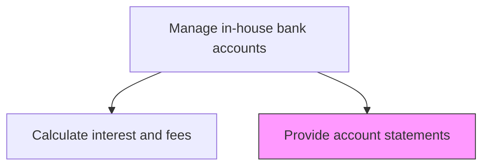
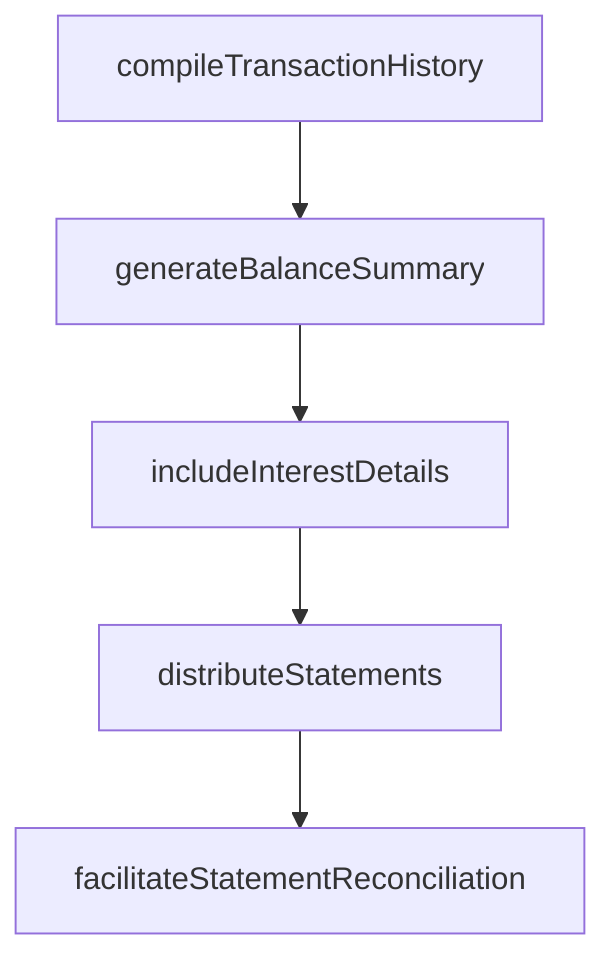

# Provide account statements for in-house bank accounts

> Business-as-Code definition for in-house bank account statement provision. Models the generation, distribution, and reconciliation of periodic account statements for subsidiary in-house bank accounts, including transaction details, balance summaries, and interest calculations.

## Overview

Generating, distributing, and supporting reconciliation of periodic account statements for subsidiary in-house bank accounts. Each statement includes detailed transaction history, opening and closing balances, average balance calculations, and interest and fee accruals for the period. Timely statement delivery enables subsidiary finance teams to reconcile their local records against centralized in-house bank data, maintaining accuracy across the corporate group's intercompany accounting.

## Process Hierarchy



## GraphDL

```yaml
provide:
  object: Account Statements For In-house Bank Accounts
  actor: InHouseBankReportingAnalyst
  result: InHouseBankStatement
```

## Actions

| Action | Description |
|--------|-------------|
| compileTransactionHistory | Aggregate all transactions for the statement period by subsidiary |
| generateBalanceSummary | Calculate opening, closing, and average balances for the period |
| includeInterestDetails | Append interest accruals and fee charges to the statement |
| distributeStatements | Deliver account statements to subsidiary finance teams |
| facilitateStatementReconciliation | Support subsidiary reconciliation of in-house bank statements |

## Events

| Event | Description |
|-------|-------------|
| transactionHistoryCompiled | All period transactions aggregated by subsidiary |
| balanceSummaryGenerated | Period balance calculations completed |
| interestDetailsIncluded | Interest and fee details appended to statements |
| statementsDistributed | Account statements delivered to subsidiaries |
| statementReconciliationFacilitated | Reconciliation support provided to subsidiary teams |

## Searches

| Search | Description |
|--------|-------------|
| getAccountStatements | Retrieve account statements by subsidiary and period |
| getStatementTransactions | Query individual transactions included in a statement |
| getReconciliationStatus | Check reconciliation status for distributed statements |

## Process Flow



## RACI Matrix

| Activity | Responsible | Accountable | Consulted | Informed |
|----------|-------------|-------------|-----------|----------|
| compileTransactionHistory | InHouseBankReportingAnalyst | InHouseBankManager | TreasuryOperations | Treasurer |
| distributeStatements | InHouseBankReportingAnalyst | InHouseBankManager | SubsidiaryControllers | CFO |
| facilitateStatementReconciliation | InHouseBankReportingAnalyst | InHouseBankManager | SubsidiaryAccountants | Treasurer |

## Related Processes

| Process | Relationship |
|---------|-------------|
| 9.7.4.6 Calculate interest and fees | Upstream - interest data feeds into statements |
| 9.7.4.1 Manage in-house bank accounts for subsidiaries | Upstream - account structure defines statement scope |
| 9.7.3.6 Produce cash management accounting transactions and reports | Parallel - in-house bank statements complement cash reporting |

## Related Departments

| Department | Role |
|-----------|------|
| Treasury | Generates and distributes in-house bank statements |
| Subsidiary Finance | Receives and reconciles account statements |
| Internal Audit | Reviews statement accuracy and completeness |

## Related Occupations

| Occupation | Involvement |
|-----------|-------------|
| In-House Bank Reporting Analyst | Prepares and distributes account statements |
| Subsidiary Accountant | Reconciles in-house bank statements against local records |

## KPIs

| KPI | Description | Unit |
|-----|-------------|------|
| Statement Delivery Timeliness | Percentage of statements delivered by agreed deadline | % |
| Reconciliation Completion Rate | Percentage of subsidiaries completing statement reconciliation on time | % |
| Statement Accuracy | Percentage of statements issued without corrections | % |

## Usage

```typescript
import { provideAccountStatementsForInHouseBankAccounts } from '@headlessly/provide-account-statements-for-in-house-bank-accounts'

const statements = provideAccountStatementsForInHouseBankAccounts()

const statement = await statements.distributeStatements({
  period: '2025-03',
  subsidiaries: ['EU-GmbH', 'UK-Ltd', 'APAC-Ltd'],
  format: 'pdf',
  includeInterest: true
})

// Check reconciliation status of distributed statements
const reconcStatus = await statements.getReconciliationStatus({
  period: '2025-03',
  subsidiaries: ['EU-GmbH', 'UK-Ltd', 'APAC-Ltd'],
  includeOverdue: true
})
```
