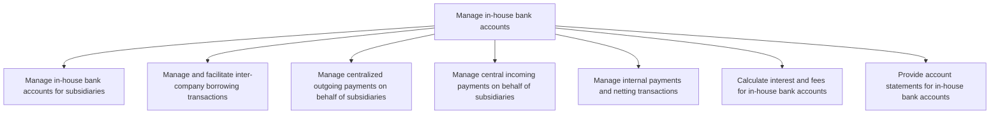
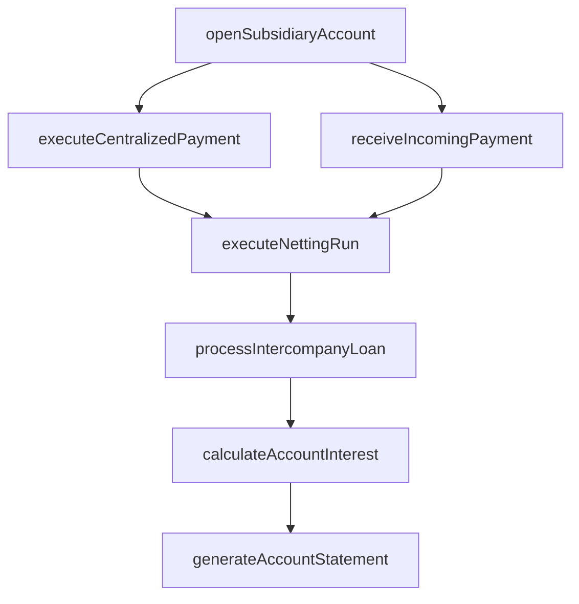

# Manage in-house bank accounts

> Business-as-Code definition for in-house banking operations. Models the centralized management of subsidiary bank accounts, intercompany borrowing, payment-on-behalf-of services, netting transactions, and internal account statement generation.

## Overview

Managing financial services provided by an in-house bank structure in the corporation that is operating like a commercial bank.

## Process Hierarchy



## GraphDL

```yaml
manage:
  object: In-house Bank Accounts
  actor: InHouseBankManager
  result: InHouseBankStatement
```

## Actions

| Action | Description |
|--------|-------------|
| openSubsidiaryAccount | Create an in-house bank account for a subsidiary entity |
| processIntercompanyLoan | Facilitate borrowing transactions between group entities |
| executeCentralizedPayment | Process outgoing payments centrally on behalf of subsidiaries |
| receiveIncomingPayment | Handle incoming payments received centrally for subsidiaries |
| executeNettingRun | Offset intercompany receivables and payables to minimize transfers |
| calculateAccountInterest | Compute interest charges and credits on in-house bank balances |
| generateAccountStatement | Produce periodic account statements for subsidiary accounts |

## Events

| Event | Description |
|-------|-------------|
| subsidiaryAccountOpened | In-house bank account created for subsidiary |
| intercompanyLoanProcessed | Intercompany borrowing transaction completed |
| centralizedPaymentExecuted | Payment made on behalf of subsidiary |
| incomingPaymentReceived | Payment received centrally and allocated to subsidiary |
| nettingRunExecuted | Intercompany netting cycle completed |
| accountInterestCalculated | Interest computed on in-house bank balances |
| accountStatementGenerated | Periodic statement produced for subsidiary account |

## Searches

| Search | Description |
|--------|-------------|
| getSubsidiaryBalances | Retrieve current in-house bank balances by subsidiary |
| getIntercompanyLoans | List active intercompany loans by borrower and lender |
| getNettingSchedule | Query upcoming netting cycle dates and positions |
| getAccountStatements | Retrieve historical account statements by entity and period |

## Process Flow



## RACI Matrix

| Activity | Responsible | Accountable | Consulted | Informed |
|----------|-------------|-------------|-----------|----------|
| openSubsidiaryAccount | InHouseBankManager | Treasurer | SubsidiaryController | CFO |
| processIntercompanyLoan | TreasuryAnalyst | InHouseBankManager | LegalCounsel | SubsidiaryFinance |
| executeNettingRun | TreasuryOperator | InHouseBankManager | SubsidiaryAP | Controller |
| generateAccountStatement | TreasuryAccountant | InHouseBankManager | ExternalAuditor | SubsidiaryController |

## Sub-Processes

| ID | Name | Description |
|----|------|-------------|
| 9.7.4.1 | Manage in-house bank accounts for subsidiaries | Maintaining subsidiaries' company accounts opened with bank inside the corporation. Manage different |
| 9.7.4.2 | Manage and facilitate inter-company borrowing transactions | Arranging loans for subsidiaries from in-house banks. |
| 9.7.4.3 | Manage centralized outgoing payments on behalf of subsidiaries | Handling payments made for subsidiaries by parent company. |
| 9.7.4.4 | Manage central incoming payments on behalf of subsidiaries | Handling payments received by parent company for subsidiaries. |
| 9.7.4.5 | Manage internal payments and netting transactions | Taking care of all business outflows and recording as whole. Manage making all payments for the orga |
| 9.7.4.6 | Calculate interest and fees for in-house bank accounts | Computing all expenses paid to and receivables collected over the organization's banking activity. C |
| 9.7.4.7 | Provide account statements for in-house bank accounts | Facilitating account statements for all in-house banking activity. |

## Related Processes

| Process | Relationship |
|---------|-------------|
| 9.7.3 Manage cash | Parallel - in-house banking supplements external cash management |
| 9.10 Manage international funds/consolidation | Downstream - in-house bank supports cross-border consolidation |
| 9.7.1 Manage treasury policies and procedures | Upstream - policies govern in-house banking operations |

## Related Departments

| Department | Role |
|-----------|------|
| Treasury | Operates in-house banking function centrally |
| Subsidiary Finance | Manages local account activity and reconciliation |
| Accounting | Records intercompany transactions and eliminations |
| Tax | Advises on transfer pricing implications of intercompany lending |

## Related Occupations

| Occupation | Involvement |
|-----------|-------------|
| In-House Bank Manager | Oversees centralized banking services for the group |
| Treasury Accountant | Processes intercompany transactions and calculates interest |
| Treasury Operator | Executes centralized payment and collection operations |

## KPIs

| KPI | Description | Unit |
|-----|-------------|------|
| Netting Efficiency | Percentage of intercompany balances eliminated through netting | % |
| External Bank Fee Savings | Reduction in external bank fees from centralized operations | Currency |
| Intercompany Settlement Time | Average days to settle intercompany transactions | Days |
| Account Statement Timeliness | Percentage of statements delivered within SLA | % |

## Usage

```typescript
import { manageInHouseBankAccounts } from '@headlessly/manage-in-house-bank-accounts'

const ihb = manageInHouseBankAccounts()

// Execute monthly netting run
const netting = await ihb.executeNettingRun({
  cycle: 'monthly',
  cutoffDate: '2025-03-31',
  currencies: ['USD', 'EUR', 'GBP']
})

// Generate quarterly account statement for a subsidiary
const statement = await ihb.generateAccountStatement({
  subsidiaryId: 'EU-Manufacturing',
  period: 'Q1-2025',
  includeInterestDetail: true
})
```
