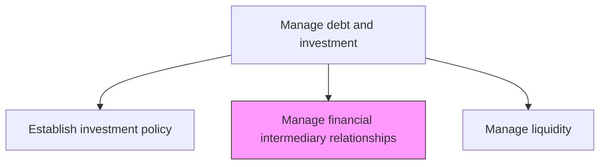
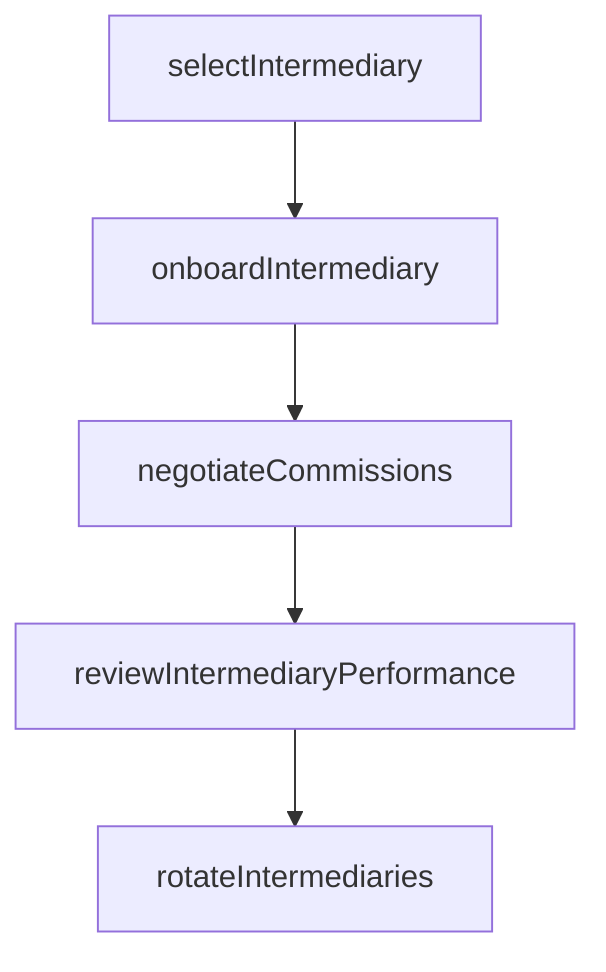

# Manage financial intermediary relationships

> Business-as-Code definition for financial intermediary relationship management. Models the selection, onboarding, performance monitoring, and governance of investment banks, broker-dealers, custodians, and other financial service providers.

## Overview

Managing financial intermediary relationships encompasses the selection, onboarding, performance monitoring, and governance of investment banks, broker-dealers, custodians, and other financial service providers. Treasury teams evaluate intermediaries based on execution quality, research capabilities, pricing competitiveness, and operational reliability. Regular performance reviews and panel rotation ensure the organization maintains access to best-in-class financial services while managing counterparty concentration risk.

## Process Hierarchy



## GraphDL

```yaml
manage:
  object: Financial Intermediary Relationships
  actor: IntermediaryRelationshipManager
  result: IntermediaryProfile
```

## Actions

| Action | Description |
|--------|-------------|
| selectIntermediary | Evaluate and select financial intermediaries based on capabilities and pricing |
| onboardIntermediary | Complete due diligence and establish trading and custody agreements |
| reviewIntermediaryPerformance | Conduct periodic assessments of service quality and execution |
| negotiateCommissions | Negotiate trading commissions, fees, and service level agreements |
| rotateIntermediaries | Periodically review and adjust intermediary panel composition |

## Events

| Event | Description |
|-------|-------------|
| intermediarySelected | Financial intermediary evaluated and approved |
| intermediaryOnboarded | Due diligence completed and agreements executed |
| intermediaryPerformanceReviewed | Service quality and execution assessment completed |
| commissionsNegotiated | Trading fees and SLAs agreed upon |
| intermediariesRotated | Intermediary panel composition updated |

## Searches

| Search | Description |
|--------|-------------|
| getIntermediaryPanel | Retrieve active financial intermediary panel |
| getPerformanceMetrics | Query intermediary execution and service quality metrics |
| getCommissionSchedules | List agreed commission rates by intermediary |

## Process Flow



## RACI Matrix

| Activity | Responsible | Accountable | Consulted | Informed |
|----------|-------------|-------------|-----------|----------|
| selectIntermediary | IntermediaryRelationshipManager | Treasurer | Procurement | CFO |
| onboardIntermediary | IntermediaryRelationshipManager | Treasurer | LegalCounsel | ComplianceOfficer |
| negotiateCommissions | IntermediaryRelationshipManager | Treasurer | Procurement | TreasuryDealer |
| reviewIntermediaryPerformance | IntermediaryRelationshipManager | Treasurer | TradingDesk | CFO |

## Related Processes

| Process | Relationship |
|---------|-------------|
| 9.7.5.1 Establish investment policy | Upstream - policy governs intermediary selection criteria |
| 9.7.5.5 Process debt and investment transactions | Downstream - intermediaries execute transactions |
| 9.7.5.4 Manage issuer exposure | Parallel - intermediary counterparty risk feeds exposure monitoring |
| 9.7.3.7 Manage banking relationships | Parallel - banking relationships complement intermediary panel |

## Related Departments

| Department | Role |
|-----------|------|
| Treasury | Manages intermediary relationships and panel |
| Legal | Reviews intermediary agreements and compliance |
| Procurement | Supports competitive selection processes |

## Related Occupations

| Occupation | Involvement |
|-----------|-------------|
| Intermediary Relationship Manager | Primary liaison with financial intermediaries |
| Treasury Dealer | Evaluates intermediary execution quality |

## KPIs

| KPI | Description | Unit |
|-----|-------------|------|
| Execution Quality Score | Intermediary trade execution quality versus benchmarks | Score |
| Commission Cost Trend | Year-over-year change in trading commissions | % |
| Intermediary Panel Size | Number of approved financial intermediaries | Count |
| Onboarding Cycle Time | Average days from intermediary selection to operational readiness | Days |

## Usage

```typescript
import { manageFinancialIntermediaryRelationships } from '@headlessly/manage-financial-intermediary-relationships'

const intermediary = manageFinancialIntermediaryRelationships()

const review = await intermediary.reviewIntermediaryPerformance({
  intermediaryId: 'GS-001',
  reviewPeriod: '2025-Q1',
  metrics: ['execution-quality', 'settlement-timeliness', 'research-value']
})

// Negotiate commission schedule with a selected intermediary
const commissions = await intermediary.negotiateCommissions({
  intermediaryId: 'GS-001',
  assetClasses: ['fixed-income', 'money-market'],
  targetSpread: 2.5,
  effectiveDate: '2025-04-01'
})
```
