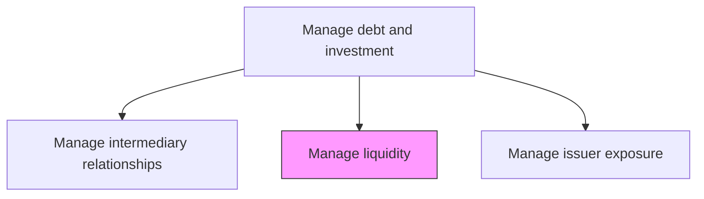
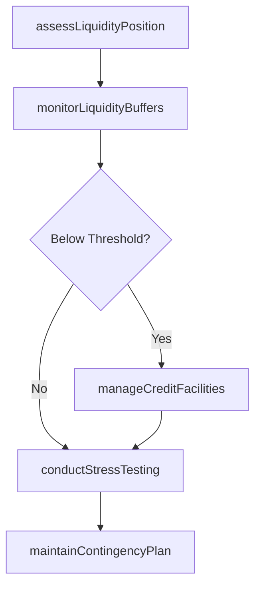

# Manage liquidity

> Business-as-Code definition for liquidity management. Models the monitoring and optimization of organizational liquidity through cash positioning, credit facility management, and contingency planning to ensure the ability to meet all financial obligations.

## Overview

Liquidity management ensures the organization maintains sufficient cash and cash-equivalent reserves to meet all financial obligations as they come due, including operating expenditures, debt maturities, and contingent commitments. This process involves continuous monitoring of liquidity ratios, managing revolving credit facility utilization, and conducting stress tests under adverse market conditions. Effective liquidity management balances the cost of holding excess reserves against the risk of being unable to fund critical operations, while maintaining compliance with regulatory liquidity requirements such as the liquidity coverage ratio.

## Process Hierarchy



## GraphDL

```yaml
manage:
  object: Liquidity
  actor: LiquidityManager
  result: LiquidityPosition
```

## Actions

| Action | Description |
|--------|-------------|
| assessLiquidityPosition | Calculate current liquidity ratio and available funding sources |
| monitorLiquidityBuffers | Track liquidity reserves against minimum thresholds |
| manageCreditFacilities | Monitor utilization and availability of revolving credit facilities |
| conductStressTesting | Model liquidity positions under adverse market scenarios |
| maintainContingencyPlan | Update liquidity contingency funding plan for crisis scenarios |

## Events

| Event | Description |
|-------|-------------|
| liquidityPositionAssessed | Current liquidity ratio and funding availability calculated |
| liquidityBuffersMonitored | Reserve levels checked against minimum thresholds |
| creditFacilitiesManaged | Credit facility utilization and availability updated |
| stressTestingConducted | Adverse scenario liquidity modeling completed |
| contingencyPlanMaintained | Liquidity contingency funding plan updated |

## Searches

| Search | Description |
|--------|-------------|
| getLiquidityPosition | Retrieve current liquidity position and ratios |
| getCreditFacilityStatus | Query utilization and availability of credit facilities |
| getStressTestResults | Retrieve liquidity stress test results by scenario |

## Process Flow



## RACI Matrix

| Activity | Responsible | Accountable | Consulted | Informed |
|----------|-------------|-------------|-----------|----------|
| assessLiquidityPosition | LiquidityManager | Treasurer | CashManager | CFO |
| monitorLiquidityBuffers | LiquidityManager | Treasurer | Controller | CashManager |
| manageCreditFacilities | LiquidityManager | Treasurer | BankingRelationshipManager | CFO |
| conductStressTesting | LiquidityManager | Treasurer | RiskManager | CFO |
| maintainContingencyPlan | LiquidityManager | Treasurer | CFO | Board |

## Related Processes

| Process | Relationship |
|---------|-------------|
| 9.7.5.1 Establish investment policy | Upstream - policy defines minimum liquidity requirements |
| 9.7.3 Manage cash | Parallel - cash positions are a key liquidity component |
| 9.7.2 Create internal funding program | Supporting - funding programs provide liquidity backstop |
| 9.7.5.5 Process debt and investment transactions | Downstream - liquidity levels constrain investment decisions |

## Related Departments

| Department | Role |
|-----------|------|
| Treasury | Manages organizational liquidity |
| Risk Management | Supports stress testing and scenario analysis |
| Finance | Provides financial projections for liquidity planning |

## Related Occupations

| Occupation | Involvement |
|-----------|-------------|
| Liquidity Manager | Monitors and optimizes organizational liquidity |
| Risk Manager | Conducts liquidity stress testing |

## KPIs

| KPI | Description | Unit |
|-----|-------------|------|
| Current Ratio | Current assets divided by current liabilities | Ratio |
| Quick Ratio | Liquid assets divided by current liabilities | Ratio |
| Available Credit Headroom | Undrawn committed credit facility capacity | USD |
| Days Cash on Hand | Number of days operating expenses covered by current cash | Days |

## Usage

```typescript
import { manageLiquidity } from '@headlessly/manage-liquidity'

const liquidity = manageLiquidity()

const position = await liquidity.assessLiquidityPosition({
  date: '2025-03-15',
  includeContingent: true,
  stressScenarios: ['base', 'adverse', 'severe']
})

// Monitor credit facility utilization against thresholds
const facilities = await liquidity.manageCreditFacilities({
  facilityType: 'revolving-credit',
  alertThreshold: 0.75,
  includeCommittedOnly: true
})
```
