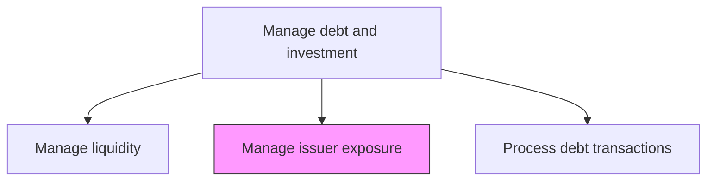
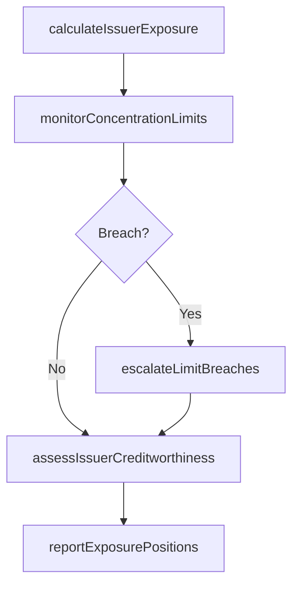

# Manage issuer exposure

> Business-as-Code definition for issuer exposure management. Models the monitoring and control of credit concentration risk across investment counterparties, debt issuers, and financial institutions to prevent excessive single-name or sector exposure.

## Overview

Issuer exposure management involves monitoring and controlling credit concentration risk across investment counterparties, debt issuers, and financial institutions to prevent excessive single-name or sector exposure. Treasury teams compute real-time exposure across all instruments, track positions against policy-defined concentration limits, and assess the creditworthiness of each counterparty. When limit breaches occur, the process triggers escalation workflows that require immediate remediation through position reduction or limit exception approval from senior management.

## Process Hierarchy



## GraphDL

```yaml
manage:
  object: Issuer Exposure
  actor: CreditExposureAnalyst
  result: ExposureReport
```

## Actions

| Action | Description |
|--------|-------------|
| calculateIssuerExposure | Compute current exposure to each issuer across all instruments |
| monitorConcentrationLimits | Track exposure against policy concentration limits by issuer and sector |
| assessIssuerCreditworthiness | Evaluate credit quality of investment counterparties and issuers |
| escalateLimitBreaches | Report and remediate situations where exposure exceeds approved limits |
| reportExposurePositions | Generate exposure reports for treasury and risk management review |

## Events

| Event | Description |
|-------|-------------|
| issuerExposureCalculated | Current exposure computed across all instruments |
| concentrationLimitsMonitored | Exposure checked against policy limits |
| issuerCreditworthinessAssessed | Counterparty credit quality evaluated |
| limitBreachEscalated | Exposure limit violation reported and remediation initiated |
| exposurePositionsReported | Exposure reports delivered to management |

## Searches

| Search | Description |
|--------|-------------|
| getIssuerExposure | Retrieve current exposure by issuer or counterparty |
| getConcentrationReport | Query exposure concentration by sector or geography |
| getLimitBreachHistory | List historical concentration limit breaches |

## Process Flow



## RACI Matrix

| Activity | Responsible | Accountable | Consulted | Informed |
|----------|-------------|-------------|-----------|----------|
| calculateIssuerExposure | CreditExposureAnalyst | Treasurer | RiskManager | CFO |
| monitorConcentrationLimits | CreditExposureAnalyst | Treasurer | InvestmentPolicyManager | CFO |
| assessIssuerCreditworthiness | CreditExposureAnalyst | RiskManager | ExternalRatingAgency | Treasurer |
| escalateLimitBreaches | CreditExposureAnalyst | Treasurer | CFO | Board |

## Related Processes

| Process | Relationship |
|---------|-------------|
| 9.7.5.1 Establish investment policy | Upstream - policy defines concentration limits |
| 9.7.5.5 Process debt and investment transactions | Parallel - transactions change exposure positions |
| 9.7.5.2 Manage financial intermediary relationships | Parallel - intermediary counterparty exposure tracked |
| 9.7.6 Monitor and execute risk and hedging | Supporting - exposure risk feeds hedging decisions |

## Related Departments

| Department | Role |
|-----------|------|
| Treasury | Monitors and manages issuer exposure |
| Risk Management | Provides credit analysis and risk frameworks |
| Finance | Consumes exposure reports for financial reporting |

## Related Occupations

| Occupation | Involvement |
|-----------|-------------|
| Credit Exposure Analyst | Monitors and reports issuer concentration risk |
| Risk Manager | Sets and enforces concentration limit frameworks |

## KPIs

| KPI | Description | Unit |
|-----|-------------|------|
| Largest Single-Name Exposure | Highest individual issuer exposure as percentage of portfolio | % |
| Limit Breach Frequency | Number of concentration limit breaches per quarter | Count |
| Average Credit Rating | Weighted average credit rating of investment portfolio | Rating |

## Usage

```typescript
import { manageIssuerExposure } from '@headlessly/manage-issuer-exposure'

const exposure = manageIssuerExposure()

const report = await exposure.calculateIssuerExposure({
  asOfDate: '2025-03-15',
  groupBy: 'issuer',
  includeDerivatives: true
})

// Monitor concentration limits and flag breaches
const breaches = await exposure.monitorConcentrationLimits({
  asOfDate: '2025-03-15',
  limitTypes: ['single-name', 'sector', 'geography'],
  thresholdAlert: 0.90
})
```
