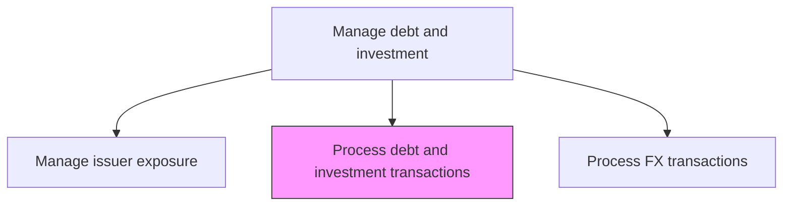
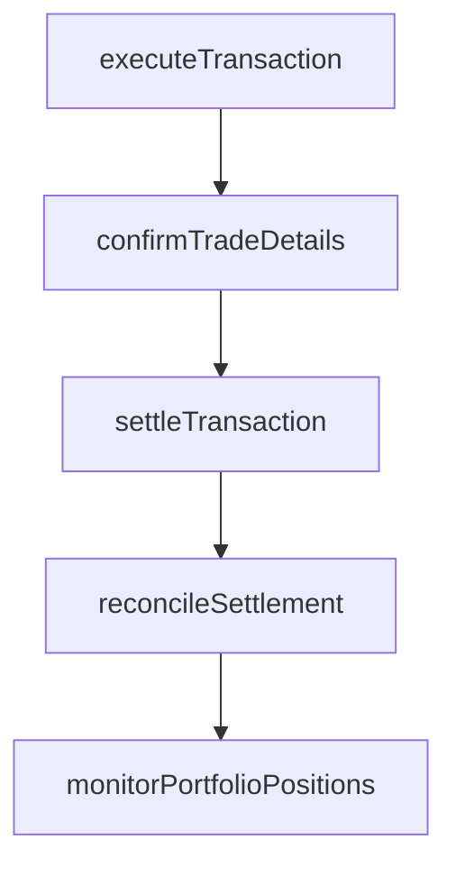

# Process and oversee debt and investment transactions

> Business-as-Code definition for debt and investment transaction processing. Models the execution, settlement, and oversight of borrowing drawdowns, bond purchases, money market placements, and other treasury investment and debt transactions.

## Overview

Processing and overseeing debt and investment transactions encompasses the full trade lifecycle from order execution through settlement, confirmation, and reconciliation. This includes borrowing drawdowns, bond purchases and sales, money market placements, and other treasury investment activities. Each transaction requires counterparty confirmation of trade terms, timely settlement on value date, and post-settlement reconciliation against custodian records. Continuous portfolio position monitoring ensures treasury maintains accurate visibility into holdings, maturities, and yield performance.

## Process Hierarchy



## GraphDL

```yaml
process:
  object: And Oversee Debt And Investment Transactions
  actor: TreasuryDealer
  result: TransactionConfirmation
```

## Actions

| Action | Description |
|--------|-------------|
| executeTransaction | Place orders for debt drawdowns or investment purchases with counterparties |
| confirmTradeDetails | Verify trade terms, amounts, and settlement instructions with counterparties |
| settleTransaction | Process payment and delivery for completed transactions |
| reconcileSettlement | Match internal records against custodian and counterparty confirmations |
| monitorPortfolioPositions | Track debt and investment portfolio positions after settlement |

## Events

| Event | Description |
|-------|-------------|
| transactionExecuted | Debt or investment order placed with counterparty |
| tradeDetailsConfirmed | Trade terms verified with counterparty |
| transactionSettled | Payment and delivery processed for transaction |
| settlementReconciled | Internal records matched against confirmations |
| portfolioPositionsMonitored | Portfolio positions updated after settlement |

## Searches

| Search | Description |
|--------|-------------|
| getOpenTransactions | List pending debt and investment transactions |
| getPortfolioPositions | Retrieve current debt and investment portfolio holdings |
| getSettlementStatus | Query settlement status for recent transactions |

## Process Flow



## RACI Matrix

| Activity | Responsible | Accountable | Consulted | Informed |
|----------|-------------|-------------|-----------|----------|
| executeTransaction | TreasuryDealer | Treasurer | IntermediaryRelationshipManager | CFO |
| confirmTradeDetails | TreasuryOperationsAnalyst | TreasuryDealer | Counterparty | Treasurer |
| settleTransaction | TreasuryOperationsAnalyst | TreasuryDealer | Custodian | Treasurer |
| reconcileSettlement | TreasuryOperationsAnalyst | TreasuryDealer | Controller | Treasurer |

## Related Processes

| Process | Relationship |
|---------|-------------|
| 9.7.5.2 Manage financial intermediary relationships | Upstream - intermediaries execute transactions |
| 9.7.5.4 Manage issuer exposure | Downstream - transactions change exposure positions |
| 9.7.5.7 Produce debt and investment reports | Downstream - transactions feed reporting |
| 9.7.5.1 Establish investment policy | Upstream - policy constrains permissible transaction types |

## Related Departments

| Department | Role |
|-----------|------|
| Treasury | Executes and oversees debt and investment transactions |
| Operations | Processes settlement and reconciliation |
| Accounting | Records transaction entries in the general ledger |

## Related Occupations

| Occupation | Involvement |
|-----------|-------------|
| Treasury Dealer | Executes debt and investment transactions |
| Treasury Operations Analyst | Processes settlements and reconciliations |

## KPIs

| KPI | Description | Unit |
|-----|-------------|------|
| Trade Execution Quality | Percentage of trades executed at or better than benchmark pricing | % |
| Settlement Failure Rate | Percentage of transactions failing to settle on value date | % |
| Reconciliation Timeliness | Percentage of settlements reconciled within one business day | % |

## Usage

```typescript
import { processAndOverseeDebtAndInvestmentTransactions } from '@headlessly/process-and-oversee-debt-and-investment-transactions'

const trading = processAndOverseeDebtAndInvestmentTransactions()

const trade = await trading.executeTransaction({
  type: 'investment',
  instrument: 'US-Treasury-Note',
  amount: 10000000,
  maturity: '2027-03-15',
  yieldTarget: 4.25
})

// Reconcile settled transactions against custodian records
const reconciliation = await trading.reconcileSettlement({
  settlementDate: '2025-03-17',
  custodianId: 'BNY-MELLON',
  matchTolerance: 0.01
})
```
